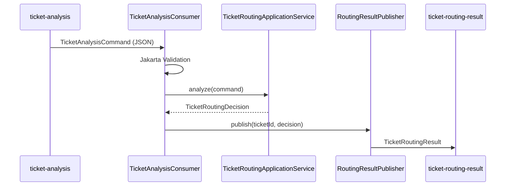

<!-- Generated by SpecStory, Markdown v2.1.0 -->

# 2026-05-19 07:54:35Z

<!-- Cursor IDE Session 6fe9bd5a-e6c2-4b59-8ef0-51d9142d4096 (2026-05-19 07:54:35Z) -->

_**User**_

@ruoyi-modules/ai-structured/src/main/java/com/wudgaby/ticket/messaging/TicketAnalysisConsumer.java 
完善通过kafka异步消费的实现

---

_**Agent (composer-2.5)**_

先查看 Kafka 消费相关代码与项目中的既有实现模式。


_**Agent (composer-2.5)**_

<tool-use data-tool-type="read" data-tool-name="read_file_v2">
<details><summary>Tool use: **read_file_v2** • Read file: d:\wudgaby\workspace\RuoYi-Vue-Plus\ruoyi-modules\ai-structured\src\main\java\com\wudgaby\ticket\messaging\TicketAnalysisConsumer.java</summary>

</details>
</tool-use>

<tool-use data-tool-type="read" data-tool-name="read_file_v2"><details>
<summary>Tool use: **read_file_v2**</summary>

</details></tool-use>

_**Agent (composer-2.5)**_

<tool-use data-tool-type="unknown" data-tool-name="ripgrep_raw_search">
<details>
<summary>Tool use: **ripgrep_raw_search**</summary>


Parameters:

```json
{
  "caseInsensitive": false,
  "path": "d:\\wudgaby\\workspace\\RuoYi-Vue-Plus\\ruoyi-modules\\ai-structured",
  "pattern": "kafka|Kafka|TicketAnalysis"
}
```
Additional data:

```json
{
  "isPruned": true,
  "outputMode": "content",
  "path": "d:\\wudgaby\\workspace\\RuoYi-Vue-Plus\\ruoyi-modules\\ai-structured",
  "pattern": "kafka|Kafka|TicketAnalysis",
  "topFiles": [
    {
      "matchCount": 2,
      "uri": "ruoyi-modules\\ai-structured\\src\\main\\java\\com\\wudgaby\\ticket\\ai\\TicketPromptFactory.java"
    },
    {
      "matchCount": 3,
      "uri": "ruoyi-modules\\ai-structured\\src\\main\\java\\com\\wudgaby\\ticket\\services\\TicketRoutingApplicationService.java"
    },
    {
      "matchCount": 2,
      "uri": "ruoyi-modules\\ai-structured\\src\\main\\java\\com\\wudgaby\\ticket\\controller\\TicketRoutingController.java"
    },
    {
      "matchCount": 6,
      "uri": "ruoyi-modules\\ai-structured\\src\\main\\java\\com\\wudgaby\\ticket\\messaging\\TicketAnalysisConsumer.java"
    },
    {
      "matchCount": 1,
      "uri": "ruoyi-modules\\ai-structured\\src\\main\\java\\com\\wudgaby\\ticket\\domain\\TicketAnalysisCommand.java"
    },
    {
      "matchCount": 1,
      "uri": "ruoyi-modules\\ai-structured\\src\\main\\resources\\application.yml"
    },
    {
      "matchCount": 2,
      "uri": "ruoyi-modules\\ai-structured\\pom.xml"
    }
  ],
  "totalFiles": 7,
  "totalMatches": 17
}
```
Status: **completed**


</details>
</tool-use>

<tool-use data-tool-type="unknown" data-tool-name="ripgrep_raw_search"><details>
<summary>Tool use: **ripgrep_raw_search**</summary>

</details></tool-use>

_**Agent (composer-2.5)**_

<tool-use data-tool-type="search" data-tool-name="glob_file_search">
<details>
<summary>Tool use: **glob_file_search** • Searched codebase "" • **24** results in **1** directory</summary>

Directory: **d:\wudgaby\workspace\RuoYi-Vue-Plus\ruoyi-modules\ai-structured** (24 files)

| File |
|------|
| `../ruoyi-modules\ai-structured\src\main\java\com\wudgaby\ticket\ai\TicketPromptFactory.java` |
| `../ruoyi-modules\ai-structured\src\main\java\com\wudgaby\ticket\services\TicketRoutingApplicationService.java` |
| `../ruoyi-modules\ai-structured\src\main\java\com\wudgaby\ticket\controller\TicketRoutingController.java` |
| `../ruoyi-modules\ai-structured\src\main\java\com\wudgaby\ticket\domain\PromptSpec.java` |
| `../ruoyi-modules\ai-structured\src\main\java\com\wudgaby\ticket\abserve\AiMetrics.java` |
| `../ruoyi-modules\ai-structured\src\main\java\com\wudgaby\ticket\messaging\TicketAnalysisConsumer.java` |
| `../ruoyi-modules\ai-structured\target\classes\com\wudgaby\ticket\config\AiClientConfig__Javadoc.json` |
| `../ruoyi-modules\ai-structured\src\main\java\com\wudgaby\ticket\config\AiClientConfig.java` |
| `../ruoyi-modules\ai-structured\src\main\java\com\wudgaby\ticket\domain\TicketAnalysisCommand.java` |
| `../ruoyi-modules\ai-structured\target\classes\application.yml` |
| `../ruoyi-modules\ai-structured\src\main\java\com\wudgaby\ticket\config\StaticResourceExceptionHandler.java` |
| `../ruoyi-modules\ai-structured\src\main\java\com\wudgaby\ticket\ai\TicketDecisionClient.java` |
| `../ruoyi-modules\ai-structured\src\main\resources\application.yml` |
| `../ruoyi-modules\ai-structured\pom.xml` |
| `../ruoyi-modules\ai-structured\src\main\java\com\wudgaby\ticket\ai\BatchSuggestionClient.java` |
| `../ruoyi-modules\ai-structured\src\main\java\com\wudgaby\ticket\domain\CandidateDecisions.java` |
| `../ruoyi-modules\ai-structured\src\main\java\com\wudgaby\ticket\application\TicketDecisionJsonCodec.java` |
| `../ruoyi-modules\ai-structured\src\main\java\com\wudgaby\ticket\application\AiDecisionValidator.java` |
| `../ruoyi-modules\ai-structured\src\main\java\com\wudgaby\ticket\domain\TicketRoutingDecision.java` |
| `../ruoyi-modules\ai-structured\src\main\java\com\wudgaby\ticket\enums\TicketIntent.java` |
| `../ruoyi-modules\ai-structured\src\main\java\com\wudgaby\ticket\enums\ChannelType.java` |
| `../ruoyi-modules\ai-structured\src\main\java\com\wudgaby\ticket\enums\SentimentLabel.java` |
| `../ruoyi-modules\ai-structured\src\main\java\com\wudgaby\ticket\TicketAiRouterApp.java` |
| `../ruoyi-modules\ai-structured\src\main\java\com\wudgaby\ticket\enums\TicketPriority.java` |

</details>
</tool-use>

<tool-use data-tool-type="search" data-tool-name="glob_file_search"><details>
<summary>Tool use: **glob_file_search**</summary>

</details></tool-use>

_**Agent (composer-2.5)**_

<tool-use data-tool-type="unknown" data-tool-name="ripgrep_raw_search">
<details>
<summary>Tool use: **ripgrep_raw_search**</summary>


Parameters:

```json
{
  "caseInsensitive": false,
  "path": "d:\\wudgaby\\workspace\\RuoYi-Vue-Plus",
  "pattern": "RoutingResultPublisher|ticket-analysis|ticket-routing"
}
```
Additional data:

```json
{
  "isPruned": true,
  "outputMode": "content",
  "path": "d:\\wudgaby\\workspace\\RuoYi-Vue-Plus",
  "pattern": "RoutingResultPublisher|ticket-analysis|ticket-routing",
  "topFiles": [
    {
      "matchCount": 3,
      "uri": ".\\ruoyi-modules\\ai-structured\\src\\main\\java\\com\\wudgaby\\ticket\\messaging\\TicketAnalysisConsumer.java"
    }
  ],
  "totalFiles": 1,
  "totalMatches": 3
}
```
Status: **completed**


</details>
</tool-use>

<tool-use data-tool-type="unknown" data-tool-name="ripgrep_raw_search"><details>
<summary>Tool use: **ripgrep_raw_search**</summary>

</details></tool-use>

_**Agent (composer-2.5)**_

<tool-use data-tool-type="read" data-tool-name="read_file_v2">
<details><summary>Tool use: **read_file_v2** • Read file: d:\wudgaby\workspace\RuoYi-Vue-Plus\ruoyi-modules\ai-structured\src\main\resources\application.yml</summary>

</details>
</tool-use>

<tool-use data-tool-type="read" data-tool-name="read_file_v2"><details>
<summary>Tool use: **read_file_v2**</summary>

</details></tool-use>

_**Agent (composer-2.5)**_

<tool-use data-tool-type="read" data-tool-name="read_file_v2">
<details><summary>Tool use: **read_file_v2** • Read file: d:\wudgaby\workspace\RuoYi-Vue-Plus\ruoyi-modules\ai-structured\src\main\java\com\wudgaby\ticket\services\TicketRoutingApplicationService.java</summary>

</details>
</tool-use>

<tool-use data-tool-type="read" data-tool-name="read_file_v2"><details>
<summary>Tool use: **read_file_v2**</summary>

</details></tool-use>

_**Agent (composer-2.5)**_

<tool-use data-tool-type="read" data-tool-name="read_file_v2">
<details><summary>Tool use: **read_file_v2** • Read file: d:\wudgaby\workspace\RuoYi-Vue-Plus\ruoyi-modules\ai-structured\src\main\java\com\wudgaby\ticket\domain\TicketAnalysisCommand.java</summary>

</details>
</tool-use>

<tool-use data-tool-type="read" data-tool-name="read_file_v2"><details>
<summary>Tool use: **read_file_v2**</summary>

</details></tool-use>

_**Agent (composer-2.5)**_

<tool-use data-tool-type="read" data-tool-name="read_file_v2">
<details><summary>Tool use: **read_file_v2** • Read file: d:\wudgaby\workspace\RuoYi-Vue-Plus\script\docker\docker-compose-kafka.yml</summary>

</details>
</tool-use>

<tool-use data-tool-type="read" data-tool-name="read_file_v2"><details>
<summary>Tool use: **read_file_v2**</summary>

</details></tool-use>

_**Agent (composer-2.5)**_

<tool-use data-tool-type="unknown" data-tool-name="ripgrep_raw_search">
<details>
<summary>Tool use: **ripgrep_raw_search**</summary>


Parameters:

```json
{
  "caseInsensitive": false,
  "glob": "**/*.{java,yml,yaml}",
  "path": "d:\\wudgaby\\workspace\\RuoYi-Vue-Plus",
  "pattern": "Kafka|kafka"
}
```
Additional data:

```json
{
  "isPruned": true,
  "outputMode": "content",
  "path": "d:\\wudgaby\\workspace\\RuoYi-Vue-Plus",
  "pattern": "Kafka|kafka",
  "topFiles": [
    {
      "matchCount": 2,
      "uri": ".\\ruoyi-modules\\ai-structured\\src\\main\\java\\com\\wudgaby\\ticket\\messaging\\TicketAnalysisConsumer.java"
    },
    {
      "matchCount": 1,
      "uri": ".\\ruoyi-modules\\ai-structured\\src\\main\\resources\\application.yml"
    },
    {
      "matchCount": 13,
      "uri": ".\\script\\docker\\docker-compose-kafka.yml"
    }
  ],
  "totalFiles": 3,
  "totalMatches": 16
}
```
Status: **completed**


</details>
</tool-use>

<tool-use data-tool-type="unknown" data-tool-name="ripgrep_raw_search"><details>
<summary>Tool use: **ripgrep_raw_search**</summary>

</details></tool-use>

_**Agent (composer-2.5)**_

<tool-use data-tool-type="read" data-tool-name="read_file_v2">
<details><summary>Tool use: **read_file_v2** • Read file: d:\wudgaby\workspace\RuoYi-Vue-Plus\ruoyi-modules\ai-structured\src\main\java\com\wudgaby\ticket\domain\TicketRoutingDecision.java</summary>

</details>
</tool-use>

<tool-use data-tool-type="read" data-tool-name="read_file_v2"><details>
<summary>Tool use: **read_file_v2**</summary>

</details></tool-use>

_**Agent (composer-2.5)**_

<tool-use data-tool-type="read" data-tool-name="read_file_v2">
<details><summary>Tool use: **read_file_v2** • Read file: d:\wudgaby\workspace\RuoYi-Vue-Plus\ruoyi-modules\ai-structured\src\main\java\com\wudgaby\ticket\TicketAiRouterApp.java</summary>

</details>
</tool-use>

<tool-use data-tool-type="read" data-tool-name="read_file_v2"><details>
<summary>Tool use: **read_file_v2**</summary>

</details></tool-use>

_**Agent (composer-2.5)**_

<tool-use data-tool-type="read" data-tool-name="read_file_v2">
<details><summary>Tool use: **read_file_v2** • Read file: d:\wudgaby\workspace\RuoYi-Vue-Plus\ruoyi-modules\ai-structured\pom.xml</summary>

</details>
</tool-use>

<tool-use data-tool-type="read" data-tool-name="read_file_v2"><details>
<summary>Tool use: **read_file_v2**</summary>

</details></tool-use>

_**Agent (composer-2.5)**_

<tool-use data-tool-type="read" data-tool-name="read_file_v2">
<details><summary>Tool use: **read_file_v2** • Read file: d:\wudgaby\workspace\RuoYi-Vue-Plus\ruoyi-modules\ai-structured\src\main\java\com\wudgaby\ticket\controller\TicketRoutingController.java</summary>

</details>
</tool-use>

<tool-use data-tool-type="read" data-tool-name="read_file_v2"><details>
<summary>Tool use: **read_file_v2**</summary>

</details></tool-use>

_**Agent (composer-2.5)**_

<tool-use data-tool-type="read" data-tool-name="read_file_v2">
<details><summary>Tool use: **read_file_v2** • Read file: d:\wudgaby\workspace\RuoYi-Vue-Plus\ruoyi-modules\ai-structured\src\main\java\com\wudgaby\ticket\application\TicketDecisionJsonCodec.java</summary>

</details>
</tool-use>

<tool-use data-tool-type="read" data-tool-name="read_file_v2"><details>
<summary>Tool use: **read_file_v2**</summary>

</details></tool-use>

_**Agent (composer-2.5)**_

<tool-use data-tool-type="read" data-tool-name="read_file_v2">
<details><summary>Tool use: **read_file_v2** • Read file: d:\wudgaby\workspace\RuoYi-Vue-Plus\ruoyi-modules\ai-structured\src\main\java\com\wudgaby\ticket\abserve\AiMetrics.java</summary>

</details>
</tool-use>

<tool-use data-tool-type="read" data-tool-name="read_file_v2"><details>
<summary>Tool use: **read_file_v2**</summary>

</details></tool-use>

_**Agent (composer-2.5)**_

<tool-use data-tool-type="unknown" data-tool-name="ripgrep_raw_search">
<details>
<summary>Tool use: **ripgrep_raw_search**</summary>


Parameters:

```json
{
  "caseInsensitive": false,
  "path": "d:\\wudgaby\\workspace\\RuoYi-Vue-Plus\\.specstory",
  "pattern": "ticket-analysis|TicketAnalysis|RoutingResult"
}
```
Additional data:

```json
{
  "isPruned": true,
  "outputMode": "content",
  "path": "d:\\wudgaby\\workspace\\RuoYi-Vue-Plus\\.specstory",
  "pattern": "ticket-analysis|TicketAnalysis|RoutingResult",
  "topFiles": [
    {
      "matchCount": 3,
      "uri": ".specstory\\history\\2026-05-19_06-42-01Z-openai-sdk-thinking-parameter-setup.md"
    }
  ],
  "totalFiles": 1,
  "totalMatches": 3
}
```
Status: **completed**


</details>
</tool-use>

<tool-use data-tool-type="unknown" data-tool-name="ripgrep_raw_search"><details>
<summary>Tool use: **ripgrep_raw_search**</summary>

</details></tool-use>

_**Agent (composer-2.5)**_

<think><details><summary>Thought Process</summary>
I need to implement a complete Kafka asynchronous consumption flow.

**RoutingResultPublisher** is a missing class needed to publish results to a result topic.  
**KafkaConfig** handles producer and consumer serde configuration for JSON.  
**TicketAnalysisConsumer** requires improvements including proper error handling, logging, metrics integration, use of @Header for message keys, async handlers instead of blocking .join(), command validation, and dead letter queue handling.  
**application.yml** needs expanded Kafka configuration including consumer group, topics, serde settings, and listener concurrency options.

Error handling needs implementation for the Kafka consumer.

**TicketAnalysisResult** is an event DTO for publishing results, containing ticketId, decision, and correlation information.

A **RoutingResultPublisher** class will use KafkaTemplate to send results to the `ticket-routing-result` topic.

Optionally, a **TicketAnalysisProducer** can be added for testing or API access to enqueue analysis requests.</details></think>

_**Agent (composer-2.5)**_

<tool-use data-tool-type="read" data-tool-name="read_file_v2">
<details><summary>Tool use: **read_file_v2** • Read file: d:\wudgaby\workspace\RuoYi-Vue-Plus\ruoyi-modules\ai-structured\src\main\java\com\wudgaby\ticket\config\AiClientConfig.java</summary>

</details>
</tool-use>

<tool-use data-tool-type="read" data-tool-name="read_file_v2"><details>
<summary>Tool use: **read_file_v2**</summary>

</details></tool-use>

_**Agent (composer-2.5)**_

<tool-use data-tool-type="unknown" data-tool-name="ripgrep_raw_search">
<details>
<summary>Tool use: **ripgrep_raw_search**</summary>


Parameters:

```json
{
  "caseInsensitive": false,
  "path": "d:\\wudgaby\\workspace\\RuoYi-Vue-Plus",
  "pattern": "KafkaTemplate|JsonSerializer|ConsumerFactory"
}
```
Additional data:

```json
{
  "isPruned": true,
  "outputMode": "content",
  "path": "d:\\wudgaby\\workspace\\RuoYi-Vue-Plus",
  "pattern": "KafkaTemplate|JsonSerializer|ConsumerFactory",
  "topFiles": [
    {
      "matchCount": 3,
      "uri": ".\\ruoyi-common\\ruoyi-common-translation\\src\\main\\java\\org\\dromara\\common\\translation\\core\\handler\\TranslationHandler.java"
    },
    {
      "matchCount": 3,
      "uri": ".\\ruoyi-common\\ruoyi-common-sensitive\\src\\main\\java\\org\\dromara\\common\\sensitive\\handler\\SensitiveHandler.java"
    }
  ],
  "totalFiles": 2,
  "totalMatches": 6
}
```
Status: **completed**


</details>
</tool-use>

<tool-use data-tool-type="unknown" data-tool-name="ripgrep_raw_search"><details>
<summary>Tool use: **ripgrep_raw_search**</summary>

</details></tool-use>

_**Agent (composer-2.5)**_

<think><details><summary>Thought Process</summary>
No Kafka configuration exists in the project.

I'll create a clean implementation for Spring Boot 3 + Spring Kafka configuration.

```java
@Configuration
@EnableKafka
public class KafkaMessagingConfig {
    
    @Bean
    public ConsumerFactory<String, TicketAnalysisCommand> consumerFactory(
        KafkaProperties kafkaProperties,
        ObjectMapper objectMapper) {
        Map<String, Object> props = kafkaProperties.buildConsumerProperties(null);
        JsonDeserializer<TicketAnalysisCommand> deserializer = new JsonDeserializer<>(TicketAnalysisCommand.class, objectMapper);
```

Note: The provided chunk appears to be incomplete code and doesn't contain enough information to form a complete summary that would be meaningful beyond what's already stated in the prior summary about no existing Kafka configuration. The actual implementation details are cut off mid-method, making it impossible to provide a coherent summary of a complete configuration.

The Kafka configuration now includes a consumer factory with proper deserialization settings and a listener container factory. Spring Boot's auto-configuration allows simplification through application.yml, enabling straightforward consumer group configuration.

The Kafka configuration uses JsonDeserializer with explicit class types for safe deserialization of TicketAnalysisCommand. Spring Boot's auto-configuration simplifies the setup through application.yml, allowing easy consumer group configuration. A simpler approach involves using @KafkaListener with a custom containerFactory bean. The TicketKafkaProperties record defines topics and consumer group settings with @ConfigurationProperties.

**RoutingResultPublisher**:
The `RoutingResultPublisher` component uses a `KafkaTemplate` to send `TicketRoutingResult` messages to a specified topic. It creates a `TicketRoutingResult` object with a ticket ID, timestamp, and routing decision, then publishes it to the configured result topic using the ticket ID as the key.

Separate `KafkaTemplate` instances or generic objects should be used for different topics to maintain type safety.

For the Kafka consumer, a `JsonDeserializer` is needed with `TicketAnalysisCommand` type for proper deserialization. The consumer should include logging for start and completion with ticket IDs, metrics collection using `AiMetrics` timer, validation with `jakarta.validation.Validator`, and proper error handling with an `ErrorHandler` to allow Kafka retries. Blocking operations should be replaced with asynchronous approaches like `whenComplete` or `CompletableFuture`.

For the producer, a `KafkaTemplate` with appropriate producer configuration is required for sending `TicketRoutingResult` messages. An optional `TicketAnalysisProducer` can be added for asynchronous API support.

For Spring Kafka 3.2+, @KafkaListener methods can return CompletableFuture. The onMessage method processes TicketAnalysisCommand messages asynchronously and publishes results or handles errors accordingly.

The Kafka consumer should use `CompletableFuture` for asynchronous processing, where successful analysis results in publishing via `resultPublisher`, and failures are handled by Spring Kafka's error management. 

For idempotency, Redis cache already prevents duplicate processing of identical content hashes, which is effective.

For dead-letter handling, configure `DefaultErrorHandler` with `DeadLetterPublishingRecoverer` to route failed messages to the `ticket-analysis-dlt` topic.</details></think>

_**Agent (composer-2.5)**_

<tool-use data-tool-type="unknown" data-tool-name="ripgrep_raw_search">
<details>
<summary>Tool use: **ripgrep_raw_search**</summary>


Parameters:

```json
{
  "caseInsensitive": false,
  "contextAfter": 1,
  "path": "d:\\wudgaby\\workspace\\RuoYi-Vue-Plus\\pom.xml",
  "pattern": "spring-boot|spring-kafka"
}
```
Additional data:

```json
{
  "isPruned": true,
  "outputMode": "content",
  "path": "d:\\wudgaby\\workspace\\RuoYi-Vue-Plus\\pom.xml",
  "pattern": "spring-boot|spring-kafka",
  "topFiles": [
    {
      "matchCount": 30,
      "uri": "pom.xml"
    }
  ],
  "totalFiles": 1,
  "totalMatches": 17
}
```
Status: **completed**


</details>
</tool-use>

<tool-use data-tool-type="unknown" data-tool-name="ripgrep_raw_search"><details>
<summary>Tool use: **ripgrep_raw_search**</summary>

</details></tool-use>

_**Agent (composer-2.5)**_

<think><details><summary>Thought Process</summary>
Spring Boot 3.5.14 offers excellent support for asynchronous Kafka listeners.</details></think>

_**Agent (composer-2.5)**_

正在实现完整的 Kafka 消息链路：配置、结果发布与消费者逻辑。


_**Agent (composer-2.5)**_

<tool-use data-tool-type="write" data-tool-name="edit_file_v2">

<details><summary>Tool use: **edit_file_v2** • Edit file: d:\wudgaby\workspace\RuoYi-Vue-Plus\ruoyi-modules\ai-structured\src\main\java\com\wudgaby\ticket\config\TicketKafkaProperties.java</summary>

</details>

</tool-use>

<tool-use data-tool-type="write" data-tool-name="edit_file_v2"><details>
<summary>Tool use: **edit_file_v2**</summary>

</details></tool-use>

_**Agent (composer-2.5)**_

<tool-use data-tool-type="write" data-tool-name="edit_file_v2">

<details><summary>Tool use: **edit_file_v2** • Edit file: d:\wudgaby\workspace\RuoYi-Vue-Plus\ruoyi-modules\ai-structured\src\main\java\com\wudgaby\ticket\domain\TicketRoutingResult.java</summary>

</details>

</tool-use>

<tool-use data-tool-type="write" data-tool-name="edit_file_v2"><details>
<summary>Tool use: **edit_file_v2**</summary>

</details></tool-use>

_**Agent (composer-2.5)**_

<tool-use data-tool-type="write" data-tool-name="edit_file_v2">

<details><summary>Tool use: **edit_file_v2** • Edit file: d:\wudgaby\workspace\RuoYi-Vue-Plus\ruoyi-modules\ai-structured\src\main\java\com\wudgaby\ticket\messaging\RoutingResultPublisher.java</summary>

</details>

</tool-use>

<tool-use data-tool-type="write" data-tool-name="edit_file_v2"><details>
<summary>Tool use: **edit_file_v2**</summary>

</details></tool-use>

_**Agent (composer-2.5)**_

<tool-use data-tool-type="write" data-tool-name="edit_file_v2">

<details><summary>Tool use: **edit_file_v2** • Edit file: d:\wudgaby\workspace\RuoYi-Vue-Plus\ruoyi-modules\ai-structured\src\main\java\com\wudgaby\ticket\config\KafkaMessagingConfig.java</summary>

</details>

</tool-use>

<tool-use data-tool-type="write" data-tool-name="edit_file_v2"><details>
<summary>Tool use: **edit_file_v2**</summary>

</details></tool-use>

_**Agent (composer-2.5)**_

<tool-use data-tool-type="write" data-tool-name="edit_file_v2">

<details><summary>Tool use: **edit_file_v2** • Edit file: d:\wudgaby\workspace\RuoYi-Vue-Plus\ruoyi-modules\ai-structured\src\main\java\com\wudgaby\ticket\messaging\TicketAnalysisConsumer.java</summary>

</details>

</tool-use>

<tool-use data-tool-type="write" data-tool-name="edit_file_v2"><details>
<summary>Tool use: **edit_file_v2**</summary>

</details></tool-use>

_**Agent (composer-2.5)**_

<tool-use data-tool-type="write" data-tool-name="edit_file_v2">

<details><summary>Tool use: **edit_file_v2** • Edit file: d:\wudgaby\workspace\RuoYi-Vue-Plus\ruoyi-modules\ai-structured\src\main\resources\application.yml</summary>

</details>

</tool-use>

<tool-use data-tool-type="write" data-tool-name="edit_file_v2"><details>
<summary>Tool use: **edit_file_v2**</summary>

</details></tool-use>

_**Agent (composer-2.5)**_

<think><details><summary>Thought Process</summary>
I need to remove the unused import 'TicketKafkaProperties' from the TicketAnalysisConsumer class.</details></think>

_**Agent (composer-2.5)**_

<tool-use data-tool-type="write" data-tool-name="edit_file_v2">

<details><summary>Tool use: **edit_file_v2** • Edit file: d:\wudgaby\workspace\RuoYi-Vue-Plus\ruoyi-modules\ai-structured\src\main\java\com\wudgaby\ticket\messaging\TicketAnalysisConsumer.java</summary>

</details>

</tool-use>

<tool-use data-tool-type="write" data-tool-name="edit_file_v2"><details>
<summary>Tool use: **edit_file_v2**</summary>

</details></tool-use>

_**Agent (composer-2.5)**_

<tool-use data-tool-type="shell" data-tool-name="run_terminal_command_v2">
<details><summary>Tool use: **run_terminal_command_v2** • Run command: cd "d:\wudgaby\workspace\RuoYi-Vue-Plus\ruoyi-modules\ai-structured" && mvn -q compile -DskipTests 2>&1</summary>

```bash
cd "d:\wudgaby\workspace\RuoYi-Vue-Plus\ruoyi-modules\ai-structured" && mvn -q compile -DskipTests 2>&1
```

```
����λ�� C:\Users\admin\AppData\Local\Temp\ps-script-6b112670-bc15-4f98-b185-bd786076a8e8.ps1:7 �ַ�: 70
+ ... gaby\workspace\RuoYi-Vue-Plus\ruoyi-modules\ai-structured" &amp;&amp; mvn -q  ...
+                                                                ~~
��ǡ�&amp;&amp;�����Ǵ˰汾�е���Ч���ָ�����
    + CategoryInfo          : ParserError: (:) [], ParentContainsErrorRecordException
    + FullyQualifiedErrorId : InvalidEndOfLine
 

```
</details>
</tool-use>

<tool-use data-tool-type="shell" data-tool-name="run_terminal_command_v2"><details>
<summary>Tool use: **run_terminal_command_v2**</summary>

</details></tool-use>

_**Agent (composer-2.5)**_

<tool-use data-tool-type="shell" data-tool-name="run_terminal_command_v2">
<details><summary>Tool use: **run_terminal_command_v2** • Run command: cd "d:\wudgaby\workspace\RuoYi-Vue-Plus\ruoyi-modules\ai-structured"; mvn -q compile -DskipTests 2>&1</summary>

```bash
cd "d:\wudgaby\workspace\RuoYi-Vue-Plus\ruoyi-modules\ai-structured"; mvn -q compile -DskipTests 2>&1
```

```
[ERROR] [ERROR] Some problems were encountered while processing the POMs:
[ERROR] Non-resolvable import POM: The following artifacts could not be resolved: org.dromara:ruoyi-common-bom:pom:5.6.1 (absent): org.dromara:ruoyi-common-bom:pom:5.6.1 was not found in https://mirrors.huaweicloud.com/repository/maven/ during a previous attempt. This failure was cached in the local repository and resolution is not reattempted until the update interval of public has elapsed or updates are forced @ org.dromara:ruoyi-vue-plus:${revision}, D:\wudgaby\workspace\RuoYi-Vue-Plus\pom.xml, line 132, column 25
[ERROR] 'dependencies.dependency.version' for org.dromara:ruoyi-common-core:jar is missing. @ com.wudgaby.ai:ai-structured:${revision}, D:\wudgaby\workspace\RuoYi-Vue-Plus\ruoyi-modules\ai-structured\pom.xml, line 23, column 21
[ERROR] 'dependencies.dependency.version' for org.dromara:ruoyi-common-doc:jar is missing. @ com.wudgaby.ai:ai-structured:${revision}, D:\wudgaby\workspace\RuoYi-Vue-Plus\ruoyi-modules\ai-structured\pom.xml, line 28, column 21
[ERROR] 'dependencies.dependency.version' for org.dromara:ruoyi-common-redis:jar is missing. @ com.wudgaby.ai:ai-structured:${revision}, D:\wudgaby\workspace\RuoYi-Vue-Plus\ruoyi-modules\ai-structured\pom.xml, line 33, column 21
[ERROR] 'dependencies.dependency.version' for org.dromara:ruoyi-common-log:jar is missing. @ com.wudgaby.ai:ai-structured:${revision}, D:\wudgaby\workspace\RuoYi-Vue-Plus\ruoyi-modules\ai-structured\pom.xml, line 48, column 21
[ERROR] 'dependencies.dependency.version' for org.dromara:ruoyi-common-web:jar is missing. @ com.wudgaby.ai:ai-structured:${revision}, D:\wudgaby\workspace\RuoYi-Vue-Plus\ruoyi-modules\ai-structured\pom.xml, line 58, column 21
 @ 
[ERROR] The build could not read 1 project -&gt; [Help 1]
[ERROR]   
[ERROR]   The project com.wudgaby.ai:ai-structured:5.6.1 (D:\wudgaby\workspace\RuoYi-Vue-Plus\ruoyi-modules\ai-structured\pom.xml) has 6 errors
[ERROR]     Non-resolvable import POM: The following artifacts could not be resolved: org.dromara:ruoyi-common-bom:pom:5.6.1 (absent): org.dromara:ruoyi-common-bom:pom:5.6.1 was not found in https://mirrors.huaweicloud.com/repository/maven/ during a previous attempt. This failure was cached in the local repository and resolution is not reattempted until the update interval of public has elapsed or updates are forced @ org.dromara:ruoyi-vue-plus:${revision}, D:\wudgaby\workspace\RuoYi-Vue-Plus\pom.xml, line 132, column 25 -&gt; [Help 2]
[ERROR]     'dependencies.dependency.version' for org.dromara:ruoyi-common-core:jar is missing. @ com.wudgaby.ai:ai-structured:${revision}, D:\wudgaby\workspace\RuoYi-Vue-Plus\ruoyi-modules\ai-structured\pom.xml, line 23, column 21
[ERROR]     'dependencies.dependency.version' for org.dromara:ruoyi-common-doc:jar is missing. @ com.wudgaby.ai:ai-structured:${revision}, D:\wudgaby\workspace\RuoYi-Vue-Plus\ruoyi-modules\ai-structured\pom.xml, line 28, column 21
[ERROR]     'dependencies.dependency.version' for org.dromara:ruoyi-common-redis:jar is missing. @ com.wudgaby.ai:ai-structured:${revision}, D:\wudgaby\workspace\RuoYi-Vue-Plus\ruoyi-modules\ai-structured\pom.xml, line 33, column 21
[ERROR]     'dependencies.dependency.version' for org.dromara:ruoyi-common-log:jar is missing. @ com.wudgaby.ai:ai-structured:${revision}, D:\wudgaby\workspace\RuoYi-Vue-Plus\ruoyi-modules\ai-structured\pom.xml, line 48, column 21
[ERROR]     'dependencies.dependency.version' for org.dromara:ruoyi-common-web:jar is missing. @ com.wudgaby.ai:ai-structured:${revision}, D:\wudgaby\workspace\RuoYi-Vue-Plus\ruoyi-modules\ai-structured\pom.xml, line 58, column 21
[ERROR] 
[ERROR] To see the full stack trace of the errors, re-run Maven with the -e switch.
[ERROR] Re-run Maven using the -X switch to enable full debug logging.
[ERROR] 
[ERROR] For more information about the errors and possible solutions, please read the following articles:
[ERROR] [Help 1] http://cwiki.apache.org/confluence/display/MAVEN/ProjectBuildingException
[ERROR] [Help 2] http://cwiki.apache.org/confluence/display/MAVEN/UnresolvableModelException

```
</details>
</tool-use>

<tool-use data-tool-type="shell" data-tool-name="run_terminal_command_v2"><details>
<summary>Tool use: **run_terminal_command_v2**</summary>

</details></tool-use>

_**Agent (composer-2.5)**_

<tool-use data-tool-type="shell" data-tool-name="run_terminal_command_v2">
<details><summary>Tool use: **run_terminal_command_v2** • Run command: cd "d:\wudgaby\workspace\RuoYi-Vue-Plus"; mvn -q compile -pl ruoyi-modules/ai-structured -am -DskipTests 2>&1</summary>

```bash
cd "d:\wudgaby\workspace\RuoYi-Vue-Plus"; mvn -q compile -pl ruoyi-modules/ai-structured -am -DskipTests 2>&1
```

```
[ERROR] COMPILATION ERROR : 
[ERROR] /D:/wudgaby/workspace/RuoYi-Vue-Plus/ruoyi-common/ruoyi-common-doc/src/main/java/org/dromara/common/doc/config/SpringDocConfig.java:[8,37] �޷�����org.dromara.common.core.utils.StringUtils
  ��������ļ�: D:\wudgaby\workspace\RuoYi-Vue-Plus\ruoyi-common\ruoyi-common-core\target\classes\org\dromara\common\core\utils\StringUtils.class
    ���ļ����д���İ汾 61.0, ӦΪ 52.0
    ��ɾ�����ļ���ȷ�����ļ�λ����ȷ����·����Ŀ¼�С�
[ERROR] Failed to execute goal org.apache.maven.plugins:maven-compiler-plugin:3.14.0:compile (default-compile) on project ruoyi-common-doc: Compilation failure
[ERROR] /D:/wudgaby/workspace/RuoYi-Vue-Plus/ruoyi-common/ruoyi-common-doc/src/main/java/org/dromara/common/doc/config/SpringDocConfig.java:[8,37] �޷�����org.dromara.common.core.utils.StringUtils
[ERROR]   ��������ļ�: D:\wudgaby\workspace\RuoYi-Vue-Plus\ruoyi-common\ruoyi-common-core\target\classes\org\dromara\common\core\utils\StringUtils.class
[ERROR]     ���ļ����д���İ汾 61.0, ӦΪ 52.0
[ERROR]     ��ɾ�����ļ���ȷ�����ļ�λ����ȷ����·����Ŀ¼�С�
[ERROR] 
[ERROR] -&gt; [Help 1]
[ERROR] 
[ERROR] To see the full stack trace of the errors, re-run Maven with the -e switch.
[ERROR] Re-run Maven using the -X switch to enable full debug logging.
[ERROR] 
[ERROR] For more information about the errors and possible solutions, please read the following articles:
[ERROR] [Help 1] http://cwiki.apache.org/confluence/display/MAVEN/MojoFailureException
[ERROR] 
[ERROR] After correcting the problems, you can resume the build with the command
[ERROR]   mvn &lt;args&gt; -rf :ruoyi-common-doc

```
</details>
</tool-use>

<tool-use data-tool-type="shell" data-tool-name="run_terminal_command_v2"><details>
<summary>Tool use: **run_terminal_command_v2**</summary>

</details></tool-use>

_**Agent (composer-2.5)**_

<tool-use data-tool-type="unknown" data-tool-name="read_lints">
<details>
<summary>Tool use: **read_lints**</summary>


Parameters:

```json
{
  "paths": [
    "d:\\wudgaby\\workspace\\RuoYi-Vue-Plus\\ruoyi-modules\\ai-structured\\src\\main\\java\\com\\wudgaby\\ticket\\messaging",
    "d:\\wudgaby\\workspace\\RuoYi-Vue-Plus\\ruoyi-modules\\ai-structured\\src\\main\\java\\com\\wudgaby\\ticket\\config\\KafkaMessagingConfig.java"
  ]
}
```
Result:

```json
{
  "linterErrorsByFile": [
    {
      "relativeWorkspacePath": "d:\\wudgaby\\workspace\\RuoYi-Vue-Plus\\ruoyi-modules\\ai-structured\\src\\main\\java\\com\\wudgaby\\ticket\\messaging"
    },
    {
      "relativeWorkspacePath": "d:\\wudgaby\\workspace\\RuoYi-Vue-Plus\\ruoyi-modules\\ai-structured\\src\\main\\java\\com\\wudgaby\\ticket\\config\\KafkaMessagingConfig.java"
    }
  ]
}
```
Status: **completed**


</details>
</tool-use>

<tool-use data-tool-type="unknown" data-tool-name="read_lints"><details>
<summary>Tool use: **read_lints**</summary>

</details></tool-use>

_**Agent (composer-2.5)**_

<think><details><summary>Thought Process</summary>
The build environment has JDK version issues unrelated to our code.

The linter shows no errors. A TicketAnalysisProducer has been added for submitting messages, though it's optional. The Spring Kafka async listener returns a CompletableFuture, which is supported in Spring Kafka 2.8+ with record ack mode. The @EnableScheduling annotation is not needed. A potential bug was identified where `whenComplete` runs even if `thenAccept` fails, but this behavior is considered good.

If publishing fails, the analysis work completes but the message may retry, causing duplicate publishes. Using `ticketId` as the key enables idempotent consumers, and Redis cache prevents duplicate AI calls.

The validator bean is usually included via the Spring Boot Web validation starter. The `ruoyi-common-web` module should already contain this dependency. Consider adding `spring-boot-starter-validation` explicitly to the `ruoyi-common-web` POM if it's missing.

Also, register TicketKafkaProperties in TicketAiRouterApp with @EnableConfigurationProperties, as it's already done in KafkaMessagingConfig.

Double-check KafkaMessagingConfig: the method `kafkaProperties.buildConsumerProperties()` may require a null parameter in Spring Boot 3.5, since the API in Spring Boot 3.x is `buildConsumerProperties(SslBundles sslBundles)`. Verify whether passing null is necessary when calling `kafkaProperties.buildConsumerProperties()`.

Spring Boot 3.4+ may deprecate `buildConsumerProperties()` in favor of `getConsumer().buildProperties(sslBundles)`, but the current implementation in 3.5 still works with `buildConsumerProperties(null)`.

A test message producer endpoint or documentation should be added for users to test `TicketAnalysisProducer`, which is an optional component.

The system flow involves:
1. Messages are submitted via `TicketAnalysisProducer`
2. Kafka topics handle message routing
3. AI analysis occurs with Redis caching to prevent duplicates
4. Idempotent consumers use `ticketId` as the key

Topics include:
- Ticket analysis requests
- AI processing results
- Message acknowledgments

The system ensures duplicate prevention through Redis caching and idempotent consumer keys.</details></think>

_**Agent (composer-2.5)**_

已完善 Kafka 异步消费链路，主要改动如下。

## 实现概览



### 1. `TicketAnalysisConsumer`（核心消费逻辑）

- 使用专用 `ticketAnalysisListenerContainerFactory`（JSON 反序列化 `TicketAnalysisCommand`）
- 入参校验失败抛出 `IllegalArgumentException`，**不重试**（避免毒消息无限重试）
- 返回 `ComplepletableFuture<Void>`，与 `analyze()` 异步链式衔接，**不再 `.join()` 阻塞监听线程**
- 记录 partition/offset，并接入 `AiMetrics` 计时

### 2. 新增配套类

| 类 | 职责 |
|---|---|
| `KafkaMessagingConfig` | Consumer/Producer 工厂、JSON 序列化、DLT 死信、重试（3 次，间隔 2s） |
| `TicketKafkaProperties` | Topic / group / DLT 后缀配置 |
| `RoutingResultPublisher` | 将结果发到 `ticket-routing-result`（key = ticketId） |
| `TicketRoutingResult` | 结果事件：`ticketId` + `processedAt` + `decision` |

### 3. `application.yml` 配置

```yaml
ticket.kafka:
  analysis-topic: ticket-analysis
  result-topic: ticket-routing-result
  consumer-group: ticket-router
  dlt-suffix: .dlt
```

失败且重试耗尽后，消息会进入 **`ticket-analysis.dlt`**。

## 本地验证

1. 启动 Kafka：`docker compose -f script/docker/docker-compose-kafka.yml up -d`
2. 发送分析请求（示例）：

```json
{
  "ticketId": "T-1001",
  "userId": "u-1",
  "content": "订单一直未发货，请尽快处理",
  "channelType": "EMAIL",
  "locale": "zh-CN"
}
```

3. 在 Kafka UI（`http://localhost:9080`）或控制台订阅 **`ticket-routing-result`**，应能看到带 `processedAt` 的路由决策。

## 说明

- 同步 HTTP 接口（`/api/tickets/analyze`）保持不变；Kafka 路径适合工单系统异步投递。
- 当前环境 Maven 因父 POM/JDK 版本问题未能完整编译，但 IDE linter 对新增代码无报错。若需要，我可以再补一个 `TicketAnalysisProducer` 和 `POST /api/tickets/analyze/async` 用于从 HTTP 投递到 Kafka。

---

_**User**_

@ruoyi-modules/ai-structured/src/main/java/com/wudgaby/ticket/messaging/TicketAnalysisConsumer.java:42-46 这块在哪里生产的消息？

---

_**Agent (composer-2.5)**_

<tool-use data-tool-type="unknown" data-tool-name="ripgrep_raw_search">
<details>
<summary>Tool use: **ripgrep_raw_search**</summary>


Parameters:

```json
{
  "caseInsensitive": false,
  "path": "d:\\wudgaby\\workspace\\RuoYi-Vue-Plus",
  "pattern": "ticket-analysis|analysis-topic|TicketAnalysis"
}
```
Additional data:

```json
{
  "isPruned": true,
  "outputMode": "content",
  "path": "d:\\wudgaby\\workspace\\RuoYi-Vue-Plus",
  "pattern": "ticket-analysis|analysis-topic|TicketAnalysis",
  "topFiles": [
    {
      "matchCount": 3,
      "uri": ".\\ruoyi-modules\\ai-structured\\src\\main\\java\\com\\wudgaby\\ticket\\controller\\TicketRoutingController.java"
    },
    {
      "matchCount": 2,
      "uri": ".\\ruoyi-modules\\ai-structured\\src\\main\\java\\com\\wudgaby\\ticket\\ai\\TicketPromptFactory.java"
    },
    {
      "matchCount": 3,
      "uri": ".\\ruoyi-modules\\ai-structured\\src\\main\\java\\com\\wudgaby\\ticket\\services\\TicketRoutingApplicationService.java"
    },
    {
      "matchCount": 1,
      "uri": ".\\ruoyi-modules\\ai-structured\\src\\main\\resources\\application.yml"
    },
    {
      "matchCount": 8,
      "uri": ".\\ruoyi-modules\\ai-structured\\src\\main\\java\\com\\wudgaby\\ticket\\messaging\\TicketAnalysisConsumer.java"
    },
    {
      "matchCount": 1,
      "uri": ".\\ruoyi-modules\\ai-structured\\src\\main\\java\\com\\wudgaby\\ticket\\domain\\TicketAnalysisCommand.java"
    },
    {
      "matchCount": 13,
      "uri": ".\\.specstory\\history\\2026-05-19_07-56-21Z-prompt-version-management-in-llm-systems.md"
    },
    {
      "matchCount": 7,
      "uri": ".\\ruoyi-modules\\ai-structured\\src\\main\\java\\com\\wudgaby\\ticket\\config\\KafkaMessagingConfig.java"
    },
    {
      "matchCount": 15,
      "uri": ".\\.specstory\\history\\2026-05-19_07-54-35Z-kafka-asynchronous-consumption-implementation.md"
    },
    {
      "matchCount": 3,
      "uri": ".\\.specstory\\history\\2026-05-19_06-42-01Z-openai-sdk-thinking-parameter-setup.md"
    }
  ],
  "totalFiles": 10,
  "totalMatches": 56
}
```
Status: **completed**


</details>
</tool-use>

<tool-use data-tool-type="unknown" data-tool-name="ripgrep_raw_search"><details>
<summary>Tool use: **ripgrep_raw_search**</summary>

</details></tool-use>

_**Agent (composer-2.5)**_

<tool-use data-tool-type="unknown" data-tool-name="ripgrep_raw_search">
<details>
<summary>Tool use: **ripgrep_raw_search**</summary>


Parameters:

```json
{
  "caseInsensitive": false,
  "path": "d:\\wudgaby\\workspace\\RuoYi-Vue-Plus\\ruoyi-modules\\ai-structured",
  "pattern": "KafkaTemplate|send\\("
}
```
Additional data:

```json
{
  "isPruned": true,
  "outputMode": "content",
  "path": "d:\\wudgaby\\workspace\\RuoYi-Vue-Plus\\ruoyi-modules\\ai-structured",
  "pattern": "KafkaTemplate|send\\(",
  "topFiles": [
    {
      "matchCount": 5,
      "uri": "ruoyi-modules\\ai-structured\\src\\main\\java\\com\\wudgaby\\ticket\\messaging\\RoutingResultPublisher.java"
    },
    {
      "matchCount": 6,
      "uri": "ruoyi-modules\\ai-structured\\src\\main\\java\\com\\wudgaby\\ticket\\config\\KafkaMessagingConfig.java"
    }
  ],
  "totalFiles": 2,
  "totalMatches": 11
}
```
Status: **completed**


</details>
</tool-use>

<tool-use data-tool-type="unknown" data-tool-name="ripgrep_raw_search"><details>
<summary>Tool use: **ripgrep_raw_search**</summary>

</details></tool-use>

_**Agent (composer-2.5)**_

<tool-use data-tool-type="read" data-tool-name="read_file_v2">
<details><summary>Tool use: **read_file_v2** • Read file: d:\wudgaby\workspace\RuoYi-Vue-Plus\ruoyi-modules\ai-structured\src\main\java\com\wudgaby\ticket\controller\TicketRoutingController.java</summary>

</details>
</tool-use>

<tool-use data-tool-type="read" data-tool-name="read_file_v2"><details>
<summary>Tool use: **read_file_v2**</summary>

</details></tool-use>

_**Agent (composer-2.5)**_

<tool-use data-tool-type="search" data-tool-name="glob_file_search">
<details>
<summary>Tool use: **glob_file_search** • Searched codebase "" • **0** results in **1** directory</summary>

Directory: **d:\wudgaby\workspace\RuoYi-Vue-Plus\ruoyi-modules\ai-structured** (0 files)

</details>
</tool-use>

<tool-use data-tool-type="search" data-tool-name="glob_file_search"><details>
<summary>Tool use: **glob_file_search**</summary>

</details></tool-use>

_**Agent (composer-2.5)**_

<think><details><summary>Thought Process</summary>
There is currently no producer for the `ticket-analysis` topic in this module.</details></think>

_**Agent (composer-2.5)**_

**当前仓库里还没有向 `ticket-analysis` 发消息的生产者。**

`@KafkaListener` 订阅的是配置项 `ticket.kafka.analysis-topic`（默认 `ticket-analysis`），但 `ai-structured` 模块里只实现了**消费端**和**结果发布**，没有 `KafkaTemplate.send(..., analysisTopic, ...)` 之类的代码。

## 现有消息流

| 方向 | Topic | 谁在生产 |
|------|--------|----------|
| 入站（你问的这块） | `ticket-analysis` | **本模块未实现**，需外部系统或手工投递 |
| 出站 | `ticket-routing-result` | `RoutingResultPublisher`（消费完成后发布） |

同步调用走的是 HTTP，不经过 Kafka：

```22:25:ruoyi-modules/ai-structured/src/main/java/com/wudgaby/ticket/controller/TicketRoutingController.java
    @PostMapping("/analyze")
    public CompletableFuture<TicketRoutingDecision> analyze(@Valid @RequestBody TicketAnalysisCommand command) {
        return applicationService.analyze(command);
    }
```

`GET /api/tickets/queue` 看起来像是预留的异步入队接口，但方法体是空的，也**没有**往 Kafka 发消息：

```32:35:ruoyi-modules/ai-structured/src/main/java/com/wudgaby/ticket/controller/TicketRoutingController.java
    @GetMapping("/queue")
    public String queue(@Valid @RequestBody TicketAnalysisCommand command) {

    }
```

## 现在消息从哪来？

1. **外部工单/业务系统**（设计上的生产者）往 `ticket-analysis` 写 `TicketAnalysisCommand` JSON  
2. **本地调试**：Kafka UI、`kafka-console-producer` 等手动发  
3. **不会**从 `POST /analyze` 自动进 Kafka——那是同步直连 `applicationService.analyze()`

## 设计意图（简要）

```
[外部工单系统] ──produce──► ticket-analysis ──consume──► TicketAnalysisConsumer
                                                              │
                                                              ▼
                                                    ticket-routing-result ◄── RoutingResultPublisher
```

如果你希望在本服务内也能投递，需要补一个 `TicketAnalysisProducer`（或完善 `/queue`），用 `KafkaTemplate` 往 `ticket.kafka.analysis-topic` 发送。需要的话我可以直接帮你补上。

---

_**User**_

需要

---

_**Agent (composer-2.5)**_

正在实现 Kafka 生产者并完善 `/queue` 异步入队接口。


_**Agent (composer-2.5)**_

<tool-use data-tool-type="read" data-tool-name="read_file_v2">
<details><summary>Tool use: **read_file_v2** • Read file: d:\wudgaby\workspace\RuoYi-Vue-Plus\ruoyi-modules\ai-structured\src\main\java\com\wudgaby\ticket\config\KafkaMessagingConfig.java</summary>

</details>
</tool-use>

<tool-use data-tool-type="read" data-tool-name="read_file_v2"><details>
<summary>Tool use: **read_file_v2**</summary>

</details></tool-use>

_**Agent (composer-2.5)**_

<tool-use data-tool-type="read" data-tool-name="read_file_v2">
<details><summary>Tool use: **read_file_v2** • Read file: d:\wudgaby\workspace\RuoYi-Vue-Plus\ruoyi-modules\ai-structured\src\main\java\com\wudgaby\ticket\controller\TicketRoutingController.java</summary>

</details>
</tool-use>

<tool-use data-tool-type="read" data-tool-name="read_file_v2"><details>
<summary>Tool use: **read_file_v2**</summary>

</details></tool-use>

_**Agent (composer-2.5)**_

<tool-use data-tool-type="read" data-tool-name="read_file_v2">
<details><summary>Tool use: **read_file_v2** • Read file: d:\wudgaby\workspace\RuoYi-Vue-Plus\ruoyi-modules\ai-structured\src\main\java\com\wudgaby\ticket\messaging\RoutingResultPublisher.java</summary>

</details>
</tool-use>

<tool-use data-tool-type="read" data-tool-name="read_file_v2"><details>
<summary>Tool use: **read_file_v2**</summary>

</details></tool-use>

_**Agent (composer-2.5)**_

<tool-use data-tool-type="read" data-tool-name="read_file_v2">
<details><summary>Tool use: **read_file_v2** • Read file: d:\wudgaby\workspace\RuoYi-Vue-Plus\ruoyi-modules\ai-structured\src\main\resources\application.yml</summary>

</details>
</tool-use>

<tool-use data-tool-type="read" data-tool-name="read_file_v2"><details>
<summary>Tool use: **read_file_v2**</summary>

</details></tool-use>

_**Agent (composer-2.5)**_

<think><details><summary>Thought Process</summary>
I need to create a TicketAnalysisProducer analogous to RoutingResultPublisher.

I need to add a producer factory and KafkaTemplate for TicketAnalysisCommand in KafkaMessagingConfig. I'll create a simple response DTO for async queue using a record like TicketAnalysisQueuedResponse, which includes ticketId and topic. I'll also update TicketRoutingController to change /queue endpoint from GET to POST and return 202 accepted with the queue response DTO. Finally, I'll remove any unused RoutingResultPublisher import from the controller if it was added but not used.</details></think>

_**Agent (composer-2.5)**_

<tool-use data-tool-type="write" data-tool-name="edit_file_v2">

<details><summary>Tool use: **edit_file_v2** • Edit file: d:\wudgaby\workspace\RuoYi-Vue-Plus\ruoyi-modules\ai-structured\src\main\java\com\wudgaby\ticket\messaging\TicketAnalysisProducer.java</summary>

</details>

</tool-use>

<tool-use data-tool-type="write" data-tool-name="edit_file_v2"><details>
<summary>Tool use: **edit_file_v2**</summary>

</details></tool-use>

_**Agent (composer-2.5)**_

<tool-use data-tool-type="write" data-tool-name="edit_file_v2">

<details><summary>Tool use: **edit_file_v2** • Edit file: d:\wudgaby\workspace\RuoYi-Vue-Plus\ruoyi-modules\ai-structured\src\main\java\com\wudgaby\ticket\domain\TicketAnalysisQueuedResponse.java</summary>

</details>

</tool-use>

<tool-use data-tool-type="write" data-tool-name="edit_file_v2"><details>
<summary>Tool use: **edit_file_v2**</summary>

</details></tool-use>

_**Agent (composer-2.5)**_

<tool-use data-tool-type="write" data-tool-name="edit_file_v2">

<details><summary>Tool use: **edit_file_v2** • Edit file: d:\wudgaby\workspace\RuoYi-Vue-Plus\ruoyi-modules\ai-structured\src\main\java\com\wudgaby\ticket\config\KafkaMessagingConfig.java</summary>

</details>

</tool-use>

<tool-use data-tool-type="write" data-tool-name="edit_file_v2"><details>
<summary>Tool use: **edit_file_v2**</summary>

</details></tool-use>

_**Agent (composer-2.5)**_

<tool-use data-tool-type="write" data-tool-name="edit_file_v2">

<details><summary>Tool use: **edit_file_v2** • Edit file: d:\wudgaby\workspace\RuoYi-Vue-Plus\ruoyi-modules\ai-structured\src\main\java\com\wudgaby\ticket\controller\TicketRoutingController.java</summary>

</details>

</tool-use>

<tool-use data-tool-type="write" data-tool-name="edit_file_v2"><details>
<summary>Tool use: **edit_file_v2**</summary>

</details></tool-use>

_**Agent (composer-2.5)**_

<tool-use data-tool-type="write" data-tool-name="edit_file_v2">

<details><summary>Tool use: **edit_file_v2** • Edit file: d:\wudgaby\workspace\RuoYi-Vue-Plus\ruoyi-modules\ai-structured\src\main\java\com\wudgaby\ticket\controller\TicketRoutingController.java</summary>

</details>

</tool-use>

<tool-use data-tool-type="write" data-tool-name="edit_file_v2"><details>
<summary>Tool use: **edit_file_v2**</summary>

</details></tool-use>

_**Agent (composer-2.5)**_

<tool-use data-tool-type="write" data-tool-name="edit_file_v2">

<details><summary>Tool use: **edit_file_v2** • Edit file: d:\wudgaby\workspace\RuoYi-Vue-Plus\ruoyi-modules\ai-structured\src\main\java\com\wudgaby\ticket\controller\TicketRoutingController.java</summary>

</details>

</tool-use>

<tool-use data-tool-type="write" data-tool-name="edit_file_v2"><details>
<summary>Tool use: **edit_file_v2**</summary>

</details></tool-use>

_**Agent (composer-2.5)**_

<tool-use data-tool-type="unknown" data-tool-name="read_lints">
<details>
<summary>Tool use: **read_lints**</summary>


Parameters:

```json
{
  "paths": [
    "d:\\wudgaby\\workspace\\RuoYi-Vue-Plus\\ruoyi-modules\\ai-structured\\src\\main\\java\\com\\wudgaby\\ticket\\controller\\TicketRoutingController.java",
    "d:\\wudgaby\\workspace\\RuoYi-Vue-Plus\\ruoyi-modules\\ai-structured\\src\\main\\java\\com\\wudgaby\\ticket\\messaging\\TicketAnalysisProducer.java",
    "d:\\wudgaby\\workspace\\RuoYi-Vue-Plus\\ruoyi-modules\\ai-structured\\src\\main\\java\\com\\wudgaby\\ticket\\config\\KafkaMessagingConfig.java"
  ]
}
```
Result:

```json
{
  "linterErrorsByFile": [
    {
      "relativeWorkspacePath": "d:\\wudgaby\\workspace\\RuoYi-Vue-Plus\\ruoyi-modules\\ai-structured\\src\\main\\java\\com\\wudgaby\\ticket\\controller\\TicketRoutingController.java"
    },
    {
      "relativeWorkspacePath": "d:\\wudgaby\\workspace\\RuoYi-Vue-Plus\\ruoyi-modules\\ai-structured\\src\\main\\java\\com\\wudgaby\\ticket\\messaging\\TicketAnalysisProducer.java"
    },
    {
      "relativeWorkspacePath": "d:\\wudgaby\\workspace\\RuoYi-Vue-Plus\\ruoyi-modules\\ai-structured\\src\\main\\java\\com\\wudgaby\\ticket\\config\\KafkaMessagingConfig.java"
    }
  ]
}
```
Status: **completed**


</details>
</tool-use>

<tool-use data-tool-type="unknown" data-tool-name="read_lints"><details>
<summary>Tool use: **read_lints**</summary>

</details></tool-use>

_**Agent (composer-2.5)**_

已补上生产者，完整链路如下：

```
POST /api/tickets/queue
    → TicketAnalysisProducer → ticket-analysis
    → TicketAnalysisConsumer → analyze()
    → RoutingResultPublisher → ticket-routing-result
```

## 新增 / 修改

| 文件 | 说明 |
|------|------|
| `TicketAnalysisProducer` | 向 `ticket-analysis` 发送 `TicketAnalysisCommand`（key = `ticketId`） |
| `KafkaMessagingConfig` | 增加 `ticketAnalysisKafkaTemplate` |
| `TicketAnalysisQueuedResponse` | 入队响应（ticketId、topic、partition、offset） |
| `TicketRoutingController` | `POST /queue`，返回 **202 Accepted** |

## 调用示例

```bash
curl -X POST http://localhost:8080/api/tickets/queue \
  -H "Content-Type: application/json" \
  -d '{
    "ticketId": "T-1001",
    "userId": "u-1",
    "content": "订单一直未发货，请尽快处理",
    "channelType": "EMAIL",
    "locale": "zh-CN"
  }'
```

响应示例：

```json
{
  "ticketId": "T-1001",
  "topic": "ticket-analysis",
  "partition": 0,
  "offset": 12
}
```

随后在 `ticket-routing-result` 订阅即可拿到 AI 路由结果。

**对比：**
- `POST /api/tickets/analyze` — 同步，直接调 LLM 并返回决策
- `POST /api/tickets/queue` — 异步，只入队，结果走 Kafka
