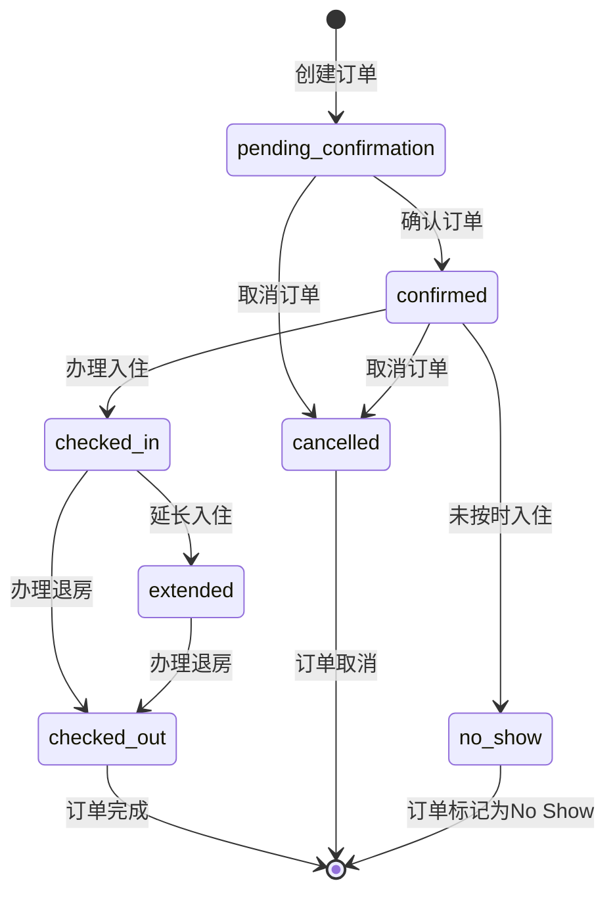
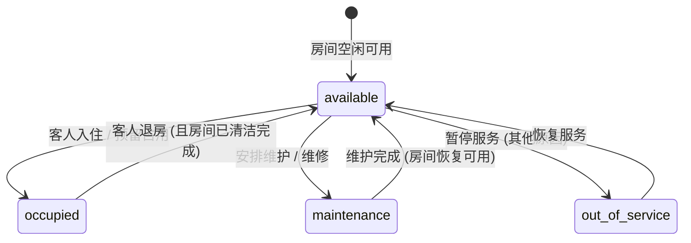
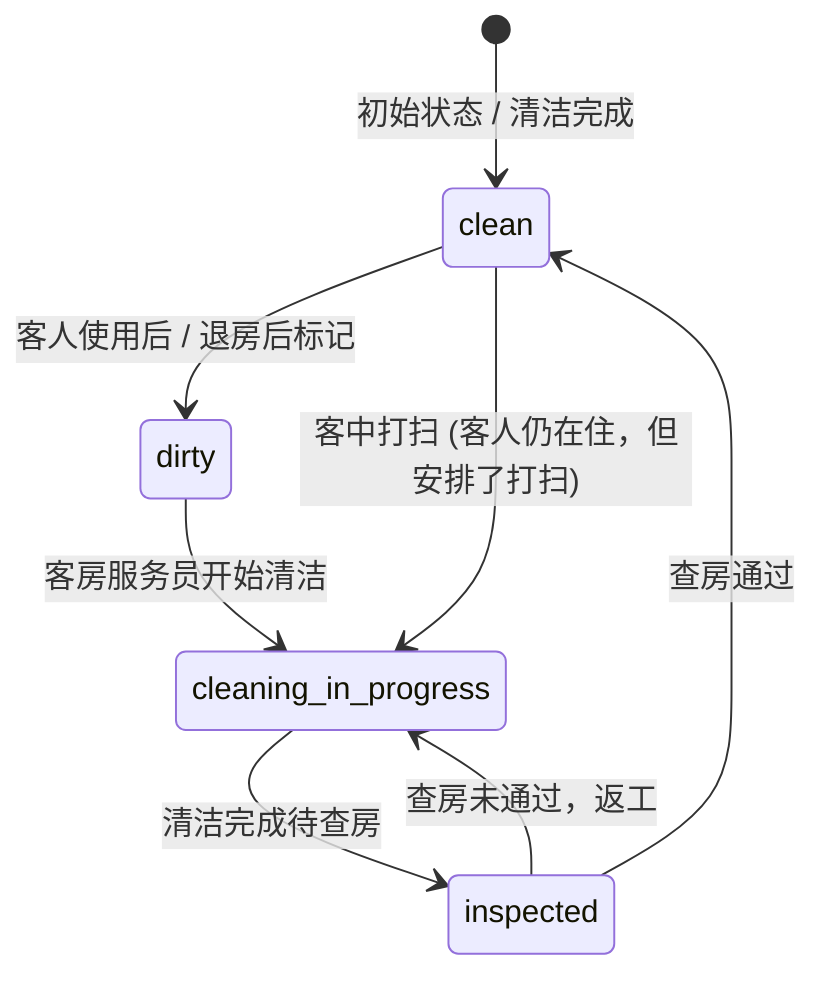
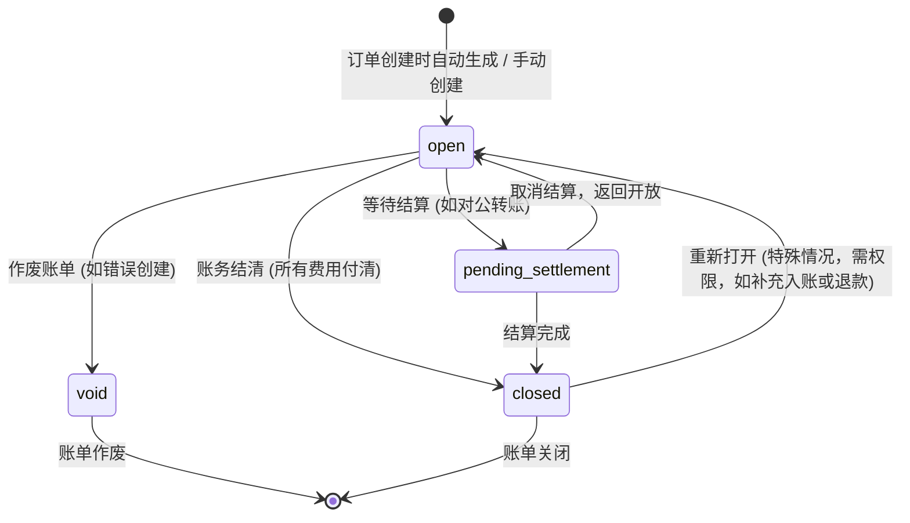

## 云宿居 PMS 系统 - PMS核心数据模型 (最终版 v_ry_final_4.0)

**快速导航：**
- [1. 引言](#1-引言)
- [2. PMS 核心E-R图 (最终版 - 简化)](#2-pms-核心er图-最终版---简化)
- [3. 表结构定义](#3-表结构定义)
  - [3.1 SaaS平台与系统基础表 (源自若依)](#31-saas平台与系统基础表-源自若依)
  - [3.2 PMS核心业务表](#32-pms核心业务表)
  - [3.3 公共数据模型 (PMS相关)](#33-公共数据模型-pms相关)
- [4. 主要业务实体状态流转](#4-主要业务实体状态流转)
- [5. 核心业务枚举值定义 (PMS主要部分)](#5-核心业务枚举值定义-pms主要部分)
- [6. 索引命名与规范建议](#6-索引命名与规范建议)

## 1. 引言

### 1.1 文档目的与范围
本文档详细定义了"云宿居"民宿 Property Management System (PMS) 的数据库逻辑模型，并与其依赖的若依框架的基础表（如租户、用户、部门等）进行了整合。本文档旨在为数据库的物理实现和后端开发提供具体指导。

**核心原则：**
1.  若依框架的基础实体（用户、租户、角色、部门等）及其字段规范固定不变。
2.  PMS新增的核心业务表主键统一采用 `BIGINT` 自增ID。
3.  **PMS业务表只关联部门(`dept_id`)，不直接关联租户(`tenant_id`)。部门代表实际的门店/分店，通过部门可以查询到其所属租户信息。** 这使得"一个租户下有多个门店"的业务模型更加清晰，同时减少数据冗余。
4.  **特例：`pms_tenant_settings`和`pms_mp_settings`表保留tenant_id字段，通过dept_id为NULL来表示租户全局设置，通过具体的dept_id值表示部门/门店特定设置。**
5.  PMS业务表中的枚举字段，统一使用 `VARCHAR(50)` 存储描述性字符串以增强可读性和扩展性。这与若依常用的 `CHAR(1)` 枚举在交互时需注意API层面的适配。

### 1.2 命名与设计约定 (PMS新增表部分)
*   **表命名:** `pms_` (PMS核心业务表)，`cmn_` (公共模块)。若依表使用其原生 `sys_` 前缀。
*   **字段命名:** `snake_case` (小写下划线)。
*   **主键 (PK):**
    *   PMS核心业务实体: **`BIGINT` AUTO_INCREMENT**。
    *   日志类高频写入表: `BIGINT` AUTO_INCREMENT。
*   **部门ID `dept_id`:** `bigint(20)` (同 `sys_dept.dept_id`)，在PMS业务表中非空，用于标识数据归属于哪个门店。
*   **外键 (FK):** 类型与关联表主键一致。`COMMENT '关联 table_name.column_name'`。
*   **通用审计字段 (对齐若依):**
    *   `create_by` (BIGINT(20) NULLABLE, COMMENT '创建者，关联 sys_user.user_id')
    *   `create_time` (DATETIME NULLABLE, COMMENT '创建时间')
    *   `update_by` (BIGINT(20) NULLABLE, COMMENT '更新者，关联 sys_user.user_id')
    *   `update_time` (DATETIME NULLABLE, COMMENT '更新时间')
    *   `create_dept_id` (BIGINT(20) NULLABLE, COMMENT '创建记录的操作员所属部门，关联 sys_dept.dept_id')
*   **软删除策略 (对齐若依):**
    *   `del_flag` (CHAR(1) DEFAULT '0' NOT NULL, COMMENT '删除标志（0代表存在 1代表删除）')。
*   **状态与枚举字段 (PMS优化):**
    *   PMS业务表中的枚举字段，统一使用 `VARCHAR(50)` 存储描述性枚举字符串。

## 2. PMS 核心E-R图 (最终版 - 简化)

```mermaid
erDiagram
    %% --- 若依基础表 (关键部分) ---
    sys_tenant {
        varchar(20) tenant_id PK "租户编号 (业务主键)"
        bigint id "物理主键, 若依内部使用"
        varchar(255) company_name "企业/民宿名称"
    }

    sys_dept {
        bigint dept_id PK "部门ID"
        varchar(20) tenant_id FK "关联 sys_tenant.tenant_id"
        varchar(30) dept_name "部门名称"
    }

    sys_user {
        bigint user_id PK "用户ID (PMS员工)"
        varchar(20) tenant_id FK "用户初始归属租户"
        bigint dept_id FK "用户所属部门"
        varchar(30) user_name "用户名, 全局唯一"
    }

    sys_role {
        bigint role_id PK "角色ID"
        varchar(20) tenant_id FK "角色定义所属租户 (或平台)"
        varchar(30) role_name "角色名称"
    }
    
    %% --- Common Contact Table ---
    cmn_contacts {
        BIGINT contact_id PK "联系人ID (自增)"
        BIGINT dept_id FK "所属部门ID"
        VARCHAR(255) full_name "姓名"
    }

    %% --- PMS Core Business Tables (主键改为BIGINT) ---
    pms_room_types {
        BIGINT room_type_id PK "房型ID (自增)"
        BIGINT dept_id FK "部门ID"
        VARCHAR(255) name "房型名称"
    }

    pms_room_rooms {
        BIGINT room_id PK "房间ID (自增)"
        BIGINT dept_id FK "部门ID"
        BIGINT room_type_id FK "房型ID"
        VARCHAR(255) room_number "房间号"
        VARCHAR(50) room_status "物理状态"
        VARCHAR(50) cleaning_status "清洁状态"
    }
    
    pms_room_locks {
        BIGINT lock_id PK "锁定ID (自增)"
        BIGINT dept_id FK "部门ID"
        BIGINT room_id FK "房间ID"
    }

    pms_core_orders {
        BIGINT order_id PK "订单ID (自增)"
        BIGINT dept_id FK "部门ID"
        BIGINT contact_id FK "联系人ID"
        BIGINT room_type_id FK "房型ID"
        BIGINT pms_room_id FK "房间ID(可空)"
        VARCHAR(50) order_status "订单状态"
        VARCHAR(50) order_source "订单来源"
    }
    
    pms_core_order_items {
        BIGINT order_item_id PK "订单项ID (自增)"
        BIGINT order_id FK "订单ID"
        BIGINT dept_id FK "部门ID"
        VARCHAR(50) product_type "产品类型"
    }

    pms_core_channels {
        BIGINT channel_id PK "渠道ID (自增)"
        BIGINT dept_id FK "部门ID(可空)"
        VARCHAR(50) channel_type "渠道类型"
    }
    
    pms_finance_folios {
        BIGINT folio_id PK "账单ID (自增)"
        BIGINT dept_id FK "部门ID"
        BIGINT order_id FK "订单ID(UNIQUE)"
        VARCHAR(50) folio_status "账单状态"
    }

    pms_finance_transactions {
        BIGINT transaction_id PK "交易ID (自增)"
        BIGINT folio_id FK "账单ID"
        BIGINT dept_id FK "部门ID"
        VARCHAR(50) transaction_type "交易类型"
    }
    
    pms_finance_payment_methods {
        BIGINT payment_method_id PK "支付方式ID (自增)"
        BIGINT dept_id FK "部门ID"
        VARCHAR(50) method_type "支付方式类型"
    }

    pms_finance_extra_charge_items {
        BIGINT item_id PK "附加费用项ID (自增)"
        BIGINT dept_id FK "部门ID"
    }

    pms_room_pricing_rules {
        BIGINT rule_id PK "价格规则ID (自增)"
        BIGINT dept_id FK "部门ID"
        BIGINT room_type_id FK "房型ID(可空)"
    }
    
    pms_tenant_settings {
        BIGINT setting_id PK "设置ID (自增)"
        BIGINT dept_id FK "部门ID"
        VARCHAR(100) setting_group "设置分组"
        VARCHAR(100) setting_key "设置键名"
    }
    
    pms_mp_settings {
        BIGINT setting_id PK "小程序设置ID (自增)"
        BIGINT dept_id FK "部门ID"
        VARCHAR(100) setting_key "设置键名"
    }

    pms_tenant_user_devices {
        BIGINT id PK "设备记录ID (自增)"
        BIGINT user_id FK "用户ID"
    }
    
    cmn_contact_tags {
        BIGINT tag_id PK "标签ID (自增)"
        BIGINT dept_id FK "部门ID"
    }
    
    cmn_contact_tag_relations {
        BIGINT relation_id PK "关联ID (自增)"
        BIGINT contact_id FK "联系人ID"
        BIGINT tag_id FK "标签ID"
    }

    %% --- 若依基础表关联 ---
    sys_tenant ||--o{ sys_dept : "包含门店/部门"
    sys_tenant ||--o{ sys_user : "的主要租户"
    sys_tenant ||--o{ sys_role : "定义角色归属"

    sys_dept ||--o{ sys_user : "员工属于门店"
    
    %% --- PMS 表关联到若依基础表 ---
    sys_dept ||--o{ pms_room_types : "定义房型"
    sys_dept ||--o{ pms_room_rooms : "拥有房间"
    sys_dept ||--o{ pms_core_orders : "拥有订单"
    sys_dept ||--o{ cmn_contacts : "拥有联系人"
    sys_dept ||--o{ pms_tenant_settings : "拥有PMS配置"
    sys_dept ||--o{ pms_mp_settings : "拥有小程序配置"
    sys_dept ||--o{ cmn_contact_tags : "定义联系人标签"
    
    sys_user ||--o{ pms_tenant_user_devices : "注册设备"
    
    %% --- PMS 内部表关联 ---
    pms_room_types ||--o{ pms_room_rooms : "有具体房间"
    pms_room_types ||--o{ pms_core_orders : "被预订类型"
    pms_room_types o|--o{ pms_room_pricing_rules : "规则适用房型"

    pms_room_rooms ||--o{ pms_room_locks : "可被锁定"
    pms_room_rooms o|--o{ pms_core_orders : "被分配房间"
    pms_room_rooms o|--o{ pms_core_order_items : "关联房晚项目"
    
    pms_core_orders ||--o{ pms_core_order_items : "包含项目"
    pms_core_orders ||--|| pms_finance_folios : "生成账单"
    cmn_contacts o|--o{ pms_core_orders : "是主要联系人"
    pms_core_channels o|--o{ pms_core_orders : "是来源渠道"
    
    pms_finance_folios ||--o{ pms_finance_transactions : "记录交易"
    pms_finance_payment_methods o|--o{ pms_finance_transactions : "使用支付方式"
    pms_finance_extra_charge_items o|--o{ pms_core_order_items : "可以是附加项"

    cmn_contacts ||--o{ cmn_contact_tag_relations : "关联标签"
    cmn_contact_tags ||--o{ cmn_contact_tag_relations : "被应用于"
```

*注：E-R图中部分表的字段为简化表示，详细字段请参照下文。*

## 3. 表结构定义

### 3.1 SaaS平台与系统基础表 (源自若依)
这些表结构直接采用或参考附件 `ry_vue_5.X - 副本.txt` 中的定义，关键表包括：
*   `sys_tenant`: 租户表 (业务主键 `tenant_id varchar(20)`)
*   `sys_dept`: 部门表 (主键 `dept_id bigint(20)`)，在本系统中将作为门店/分店使用
*   `sys_user`: 用户信息表 (主键 `user_id bigint(20)`)
*   `sys_role`: 角色信息表 (主键 `role_id bigint(20)`)
*   `sys_user_role`: 用户角色关联表
*   `sys_config`: 参数配置表
*   `sys_logininfor`: 系统访问记录（登录日志）
*   `sys_dict_type`, `sys_dict_data`: 字典表 (PMS枚举值优先在PMS表中使用 `VARCHAR(50)`，但若依系统本身的字典可按其规范使用)

**PMS系统将直接使用或关联这些若依表中的记录，例如PMS订单的 `dept_id` 将关联到 `sys_dept.dept_id`，`create_by` 将关联到 `sys_user.user_id`。部门进一步通过 `sys_dept.tenant_id` 关联到租户。**

### 3.2 PMS核心业务表

#### 3.2.1 `pms_room_types` - 房型表
*   业务描述: 存储各部门(门店)定义的房型信息。
*   主键: `room_type_id` (BIGINT AUTO_INCREMENT)
*   字段定义:
    *   `room_type_id` (BIGINT, PK, AUTO_INCREMENT, NOT NULL, COMMENT '房型唯一ID'): 主键。
    *   `dept_id` (BIGINT(20), NOT NULL, COMMENT '部门ID(门店), 关联 sys_dept.dept_id')。
    *   `name` (VARCHAR(255), NOT NULL, COMMENT '房型名称 (例如: 豪华大床房)')。
    *   `default_price` (DECIMAL(10,2), NOT NULL, COMMENT '房型默认价格 (每晚)')。
    *   `capacity` (INT, NOT NULL, COMMENT '标准入住人数')。
    *   `amenities` (JSON, NULLABLE, COMMENT '房型设施标签。JSON数组，例如 [\"wifi\", \"空调\"]')。
    *   `description` (TEXT, NULLABLE, COMMENT '房型描述')。
    *   `images_json` (JSON, NULLABLE, COMMENT '房型图片。JSON数组')。
    *   `sort_order` (INT, DEFAULT 0, COMMENT '显示排序值')。
    *   `status` (VARCHAR(50), NOT NULL, DEFAULT 'active', COMMENT '状态。枚举: active (启用), inactive (禁用)')。
    *   `create_by` (BIGINT(20), NULLABLE, COMMENT '创建者ID, 关联 sys_user.user_id')。
    *   `create_time` (DATETIME, NULLABLE, COMMENT '创建时间')。
    *   `update_by` (BIGINT(20), NULLABLE, COMMENT '更新者ID, 关联 sys_user.user_id')。
    *   `update_time` (DATETIME, NULLABLE, COMMENT '更新时间')。
    *   `create_dept_id` (BIGINT(20), NULLABLE, COMMENT '创建部门ID, 关联 sys_dept.dept_id')。
    *   `del_flag` (CHAR(1), NOT NULL, DEFAULT '0', COMMENT '删除标志（0存在 1删除）')。
*   索引: `idx_pms_rt_dept_name` (dept_id, name), `idx_pms_rt_dept_status` (dept_id, status)

#### 3.2.2 `pms_room_rooms` - 房间表
*   业务描述: 存储各部门(门店)的具体房间信息。
*   主键: `room_id` (BIGINT AUTO_INCREMENT)
*   字段定义:
    *   `room_id` (BIGINT, PK, AUTO_INCREMENT, NOT NULL, COMMENT '房间唯一ID')。
    *   `dept_id` (BIGINT(20), NOT NULL, COMMENT '部门ID(门店), 关联 sys_dept.dept_id')。
    *   `room_type_id` (BIGINT, FK, NOT NULL, COMMENT '所属房型ID, 关联 pms_room_types.room_type_id')。
    *   `room_number` (VARCHAR(50), NOT NULL, COMMENT '房间号 (在门店内应唯一)')。
    *   `floor` (VARCHAR(50), NULLABLE, COMMENT '楼层')。
    *   `room_status` (VARCHAR(50), NOT NULL, DEFAULT 'available', COMMENT '物理状态。枚举: available (可用), occupied (占用中), maintenance (维护中), out_of_service (停用服务)')。
    *   `cleaning_status` (VARCHAR(50), NOT NULL, DEFAULT 'clean', COMMENT '清洁状态。枚举: clean (已清洁), dirty (待清洁), cleaning_in_progress (清洁中), inspected (已查房)')。
    *   `description` (TEXT, NULLABLE, COMMENT '房间描述或备注')。
    *   `status` (VARCHAR(50), NOT NULL, DEFAULT 'active', COMMENT '记录状态。枚举: active (启用), inactive (禁用)')。
    *   `create_by` (BIGINT(20), NULLABLE, COMMENT '创建者ID, 关联 sys_user.user_id')。
    *   `create_time` (DATETIME, NULLABLE, COMMENT '创建时间')。
    *   `update_by` (BIGINT(20), NULLABLE, COMMENT '更新者ID, 关联 sys_user.user_id')。
    *   `update_time` (DATETIME, NULLABLE, COMMENT '更新时间')。
    *   `create_dept_id` (BIGINT(20), NULLABLE, COMMENT '创建部门ID, 关联 sys_dept.dept_id')。
    *   `del_flag` (CHAR(1), NOT NULL, DEFAULT '0', COMMENT '删除标志（0存在 1删除）')。
*   唯一约束: `unq_pms_r_dept_room_number` (dept_id, room_number, del_flag)
*   索引: `idx_pms_r_dept_rt` (dept_id, room_type_id), `idx_pms_r_dept_room_status` (dept_id, room_status), `idx_pms_r_dept_cleaning_status` (dept_id, cleaning_status)

#### 3.2.3 `pms_room_locks` - 房间锁定记录表
*   业务描述: 记录房间因维护、手动操作等原因被锁定的情况。
*   主键: `lock_id` (BIGINT AUTO_INCREMENT)
*   字段定义:
    *   `lock_id` (BIGINT, PK, AUTO_INCREMENT, NOT NULL, COMMENT '锁定记录唯一ID')。
    *   `dept_id` (BIGINT(20), NOT NULL, COMMENT '部门ID, 关联 sys_dept.dept_id')。
    *   `room_id` (BIGINT, FK, NOT NULL, COMMENT '被锁定的房间ID, 关联 pms_room_rooms.room_id')。
    *   `start_datetime` (DATETIME, NOT NULL, COMMENT '锁定开始时间')。
    *   `end_datetime` (DATETIME, NOT NULL, COMMENT '锁定结束时间')。
    *   `reason` (TEXT, NULLABLE, COMMENT '锁定原因')。
    *   `lock_type` (VARCHAR(50), NOT NULL, DEFAULT 'manual_lock', COMMENT '锁定类型。枚举: manual_lock (手动锁定), maintenance (维护), auto_block (自动锁定), staff_use (员工自用)')。
    *   `create_by` (BIGINT(20), NULLABLE, COMMENT '创建者ID, 关联 sys_user.user_id')。
    *   `create_time` (DATETIME, NULLABLE, COMMENT '创建时间')。
    *   `update_by` (BIGINT(20), NULLABLE, COMMENT '更新者ID, 关联 sys_user.user_id')。
    *   `update_time` (DATETIME, NULLABLE, COMMENT '更新时间')。
    *   `create_dept_id` (BIGINT(20), NULLABLE, COMMENT '创建部门ID, 关联 sys_dept.dept_id')。
    *   `del_flag` (CHAR(1), NOT NULL, DEFAULT '0', COMMENT '删除标志（0存在 1删除）')。
*   索引: `idx_pms_rl_tenant_dept_room_time` (tenant_id, dept_id, room_id, start_datetime, end_datetime), `idx_pms_rl_tenant_dept_lock_type` (tenant_id, dept_id, lock_type)

#### 3.2.4 `pms_core_orders` - 核心订单表
*   业务描述: 存储所有来源的预订订单核心信息。
*   主键: `order_id` (BIGINT AUTO_INCREMENT)
*   字段定义:
    *   `order_id` (BIGINT, PK, AUTO_INCREMENT, NOT NULL, COMMENT '订单唯一ID')。
    *   `dept_id` (BIGINT(20), NOT NULL, COMMENT '部门ID, 关联 sys_dept.dept_id')。
    *   `contact_id` (BIGINT, FK, NULLABLE, COMMENT '主要联系人ID, 关联 cmn_contacts.contact_id')。
    *   `primary_contact_name` (VARCHAR(100), NOT NULL, COMMENT '主要联系人姓名 (冗余)')。
    *   `primary_contact_phone` (VARCHAR(50), NOT NULL, COMMENT '主要联系人电话 (冗余)')。
    *   `pms_room_id` (BIGINT, FK, NULLABLE, COMMENT '分配的房间ID, 关联 pms_room_rooms.room_id, 入住时分配')。
    *   `room_type_id` (BIGINT, FK, NOT NULL, COMMENT '预订的房型ID, 关联 pms_room_types.room_type_id')。
    *   `channel_id` (BIGINT, FK, NULLABLE, COMMENT '订单来源渠道ID, 关联 pms_core_channels.channel_id')。
    *   `check_in_date` (DATE, NOT NULL, COMMENT '计划入住日期')。
    *   `check_out_date` (DATE, NOT NULL, COMMENT '计划离店日期')。
    *   `num_adults` (INT, NOT NULL, DEFAULT 1, COMMENT '成人数')。
    *   `num_children` (INT, DEFAULT 0, COMMENT '儿童数')。
    *   `estimated_arrival_time` (TIME, NULLABLE, COMMENT '预计抵达时间')。
    *   `total_amount` (DECIMAL(10,2), NOT NULL, COMMENT '订单总金额')。
    *   `paid_amount` (DECIMAL(10,2), DEFAULT 0.00, COMMENT '已付金额')。
    *   `due_amount` (DECIMAL(10,2), AS (`total_amount` - `paid_amount`)) STORED COMMENT '应付金额 (计算列)'。
    *   `currency` (VARCHAR(3), NOT NULL, DEFAULT 'CNY', COMMENT '货币代码')。
    *   `order_status` (VARCHAR(50), NOT NULL, COMMENT '订单状态。枚举: pending_confirmation, confirmed, checked_in, checked_out, cancelled, no_show, extended, waitlist')。
    *   `order_source` (VARCHAR(50), NOT NULL, COMMENT '订单来源。枚举: direct_walk_in, direct_phone, direct_website, direct_mall_h5, ota_channel_manager, travel_agency, corporate, other')。
    *   `notes` (TEXT, NULLABLE, COMMENT '订单备注')。
    *   `cancelled_at` (DATETIME, NULLABLE, COMMENT '取消时间')。
    *   `cancellation_reason` (TEXT, NULLABLE, COMMENT '取消原因')。
    *   `create_by` (BIGINT(20), NULLABLE, COMMENT '创建者ID, 关联 sys_user.user_id')。
    *   `create_time` (DATETIME, NULLABLE, COMMENT '创建时间')。
    *   `update_by` (BIGINT(20), NULLABLE, COMMENT '更新者ID, 关联 sys_user.user_id')。
    *   `update_time` (DATETIME, NULLABLE, COMMENT '更新时间')。
    *   `create_dept_id` (BIGINT(20), NULLABLE, COMMENT '创建部门ID, 关联 sys_dept.dept_id')。
    *   `del_flag` (CHAR(1), NOT NULL, DEFAULT '0', COMMENT '删除标志（0存在 1删除）')。
*   索引: `idx_pms_o_tenant_dept_status_dates` (tenant_id, dept_id, order_status, check_in_date, check_out_date), `idx_pms_o_tenant_dept_contact_phone` (tenant_id, dept_id, primary_contact_phone), `idx_pms_o_tenant_dept_source` (tenant_id, dept_id, order_source)

#### 3.2.5 `pms_core_order_items` - 核心订单项目表
*   业务描述: 记录订单中包含的具体商品或服务项目。
*   主键: `order_item_id` (BIGINT AUTO_INCREMENT)
*   字段定义:
    *   `order_item_id` (BIGINT, PK, AUTO_INCREMENT, NOT NULL, COMMENT '订单项目唯一ID')。
    *   `order_id` (BIGINT, FK, NOT NULL, COMMENT '所属订单ID, 关联 pms_core_orders.order_id')。
    *   `dept_id` (BIGINT(20), NOT NULL, COMMENT '部门ID, 关联 sys_dept.dept_id (冗余)')。
    *   `pms_room_id` (BIGINT, FK, NULLABLE, COMMENT '关联房间ID (如房晚项目), 关联 pms_room_rooms.room_id')。
    *   `product_id` (BIGINT, FK, NULLABLE, COMMENT '关联产品ID (多态), 如 pms_finance_extra_charge_items.item_id')。
    *   `product_type` (VARCHAR(50), NOT NULL, COMMENT '产品类型。枚举: room_night (房晚), extra_charge_item (附加收费项目), package_component (套餐子项), service_fee (服务费), discount_adjustment (折扣调整)')。
    *   `description` (VARCHAR(255), NOT NULL, COMMENT '项目描述 (例如: 豪华大床房住宿, 额外早餐)')。
    *   `quantity` (INT, NOT NULL, DEFAULT 1, COMMENT '数量')。
    *   `unit_price` (DECIMAL(10,2), NOT NULL, COMMENT '单价')。
    *   `total_price` (DECIMAL(10,2), AS (`quantity` * `unit_price`)) STORED COMMENT '总价 (计算列)'。
    *   `service_date` (DATE, NULLABLE, COMMENT '服务发生日期 (例如房晚对应的日期)')。
    *   `notes` (TEXT, NULLABLE, COMMENT '项目备注')。
    *   `create_by` (BIGINT(20), NULLABLE, COMMENT '创建者ID, 关联 sys_user.user_id')。
    *   `create_time` (DATETIME, NULLABLE, COMMENT '创建时间')。
    *   `update_by` (BIGINT(20), NULLABLE, COMMENT '更新者ID, 关联 sys_user.user_id')。
    *   `update_time` (DATETIME, NULLABLE, COMMENT '更新时间')。
    *   `create_dept_id` (BIGINT(20), NULLABLE, COMMENT '创建部门ID, 关联 sys_dept.dept_id')。
    *   `del_flag` (CHAR(1), NOT NULL, DEFAULT '0', COMMENT '删除标志（0存在 1删除）')。
*   索引: `idx_pms_oi_order_id` (order_id), `idx_pms_oi_tenant_dept_product_type` (tenant_id, dept_id, product_type)

#### 3.2.6 `pms_core_channels` - 订单来源渠道表
*   业务描述: 管理订单的来源渠道。
*   主键: `channel_id` (BIGINT AUTO_INCREMENT)
*   字段定义:
    *   `channel_id` (BIGINT, PK, AUTO_INCREMENT, NOT NULL, COMMENT '渠道唯一ID')。
    *   `dept_id` (BIGINT(20), NULLABLE, COMMENT '部门ID, 关联 sys_dept.dept_id, 若渠道归属特定部门')。
    *   `name` (VARCHAR(100), NOT NULL, COMMENT '渠道名称 (例如: 携程, 官网直订)')。
    *   `channel_type` (VARCHAR(50), NOT NULL, COMMENT '渠道类型。枚举: ota, direct_booking (官网/电话/前台), gds (全球分销系统), wholesaler (批发商), corporate (公司协议), internal_use (内部使用), other')。
    *   `description` (TEXT, NULLABLE, COMMENT '渠道描述')。
    *   `status` (VARCHAR(50), NOT NULL, DEFAULT 'active', COMMENT '状态。枚举: active (激活), inactive (停用), deprecated (弃用)')。
    *   `create_by` (BIGINT(20), NULLABLE, COMMENT '创建者ID, 关联 sys_user.user_id')。
    *   `create_time` (DATETIME, NULLABLE, COMMENT '创建时间')。
    *   `update_by` (BIGINT(20), NULLABLE, COMMENT '更新者ID, 关联 sys_user.user_id')。
    *   `update_time` (DATETIME, NULLABLE, COMMENT '更新时间')。
    *   `create_dept_id` (BIGINT(20), NULLABLE, COMMENT '创建部门ID, 关联 sys_dept.dept_id')。
    *   `del_flag` (CHAR(1), NOT NULL, DEFAULT '0', COMMENT '删除标志（0存在 1删除）')。
*   索引: `idx_pms_ch_tenant_dept_name` (tenant_id, dept_id, name), `idx_pms_ch_type` (channel_type), `idx_pms_ch_status` (status)

#### 3.2.7 `pms_finance_folios` - 客户账单(Folio)表
*   业务描述: 记录与订单关联的客户账单核心信息。
*   主键: `folio_id` (BIGINT AUTO_INCREMENT)
*   字段定义:
    *   `folio_id` (BIGINT, PK, AUTO_INCREMENT, NOT NULL, COMMENT '账单唯一ID')。
    *   `dept_id` (BIGINT(20), NOT NULL, COMMENT '部门ID, 关联 sys_dept.dept_id')。
    *   `order_id` (BIGINT, UNIQUE, FK, NOT NULL, COMMENT '关联的订单ID, 关联 pms_core_orders.order_id')。
    *   `total_charges` (DECIMAL(10,2), NOT NULL, DEFAULT 0.00, COMMENT '总应收费用')。
    *   `total_payments` (DECIMAL(10,2), NOT NULL, DEFAULT 0.00, COMMENT '总已收付款')。
    *   `total_refunds` (DECIMAL(10,2), NOT NULL, DEFAULT 0.00, COMMENT '总已退款')。
    *   `balance` (DECIMAL(10,2), AS (`total_charges` - `total_payments` + `total_refunds`)) STORED COMMENT '当前余额 (计算列)'。
    *   `folio_status` (VARCHAR(50), NOT NULL, DEFAULT 'open', COMMENT '账单状态。枚举: open (开放/未结清), closed (已结清/关闭), void (作废), pending_settlement (待结算)')。
    *   `notes` (TEXT, NULLABLE, COMMENT '账单备注')。
    *   `closed_at` (DATETIME, NULLABLE, COMMENT '账单关闭时间')。
    *   `create_by` (BIGINT(20), NULLABLE, COMMENT '创建者ID, 关联 sys_user.user_id')。
    *   `create_time` (DATETIME, NULLABLE, COMMENT '创建时间')。
    *   `update_by` (BIGINT(20), NULLABLE, COMMENT '更新者ID, 关联 sys_user.user_id')。
    *   `update_time` (DATETIME, NULLABLE, COMMENT '更新时间')。
    *   `create_dept_id` (BIGINT(20), NULLABLE, COMMENT '创建部门ID, 关联 sys_dept.dept_id')。
    *   `del_flag` (CHAR(1), NOT NULL, DEFAULT '0', COMMENT '删除标志（0存在 1删除）')。
*   索引: `idx_pms_f_tenant_dept_order_id` (tenant_id, dept_id, order_id), `idx_pms_f_tenant_dept_status` (tenant_id, dept_id, folio_status)

#### 3.2.8 `pms_finance_transactions` - 财务交易流水表
*   业务描述: 记录在Folio中的每一笔财务交易。
*   主键: `transaction_id` (BIGINT AUTO_INCREMENT)
*   字段定义:
    *   `transaction_id` (BIGINT, PK, AUTO_INCREMENT, NOT NULL, COMMENT '交易唯一ID')。
    *   `folio_id` (BIGINT, FK, NOT NULL, COMMENT '所属账单ID, 关联 pms_finance_folios.folio_id')。
    *   `dept_id` (BIGINT(20), NOT NULL, COMMENT '部门ID, 关联 sys_dept.dept_id (冗余)')。
    *   `transaction_type` (VARCHAR(50), NOT NULL, COMMENT '交易类型。枚举: charge (应收费用), payment (客人付款), refund (退款给客人), deposit (押金), deposit_refund (押金退还), adjustment_positive (正调整), adjustment_negative (负调整)')。
    *   `amount` (DECIMAL(10,2), NOT NULL, COMMENT '交易金额')。
    *   `description` (VARCHAR(255), NOT NULL, COMMENT '交易描述')。
    *   `payment_method_id` (BIGINT, FK, NULLABLE, COMMENT '支付方式ID, 关联 pms_finance_payment_methods.payment_method_id')。
    *   `payment_gateway_txn_id` (VARCHAR(255), NULLABLE, COMMENT '支付网关交易号')。
    *   `transaction_time` (DATETIME, NOT NULL, COMMENT '交易实际发生时间')。
    *   `related_order_item_id` (BIGINT, FK, NULLABLE, COMMENT '关联的订单项ID, 关联 pms_core_order_items.order_item_id')。
    *   `notes` (TEXT, NULLABLE, COMMENT '交易备注')。
    *   `is_void` (BOOLEAN, NOT NULL, DEFAULT FALSE, COMMENT '是否已作废冲销')。
    *   `voided_at` (DATETIME, NULLABLE, COMMENT '作废时间')。
    *   `voided_reason` (TEXT, NULLABLE, COMMENT '作废原因')。
    *   `create_by` (BIGINT(20), NULLABLE, COMMENT '创建者ID, 关联 sys_user.user_id')。
    *   `create_time` (DATETIME, NULLABLE, COMMENT '创建时间')。
    *   `update_by` (BIGINT(20), NULLABLE, COMMENT '更新者ID, 关联 sys_user.user_id')。
    *   `update_time` (DATETIME, NULLABLE, COMMENT '更新时间')。
    *   `create_dept_id` (BIGINT(20), NULLABLE, COMMENT '创建部门ID, 关联 sys_dept.dept_id')。
    *   `del_flag` (CHAR(1), NOT NULL, DEFAULT '0', COMMENT '删除标志（0存在 1删除）')。
*   索引: `idx_pms_ft_folio_id` (folio_id), `idx_pms_ft_tenant_dept_type_time` (tenant_id, dept_id, transaction_type, transaction_time), `idx_pms_ft_payment_gateway_txn_id` (payment_gateway_txn_id)

#### 3.2.9 `pms_finance_payment_methods` - 支付方式表
*   业务描述: 存储租户可定义的支付方式。
*   主键: `payment_method_id` (BIGINT AUTO_INCREMENT)
*   字段定义:
    *   `payment_method_id` (BIGINT, PK, AUTO_INCREMENT, NOT NULL, COMMENT '支付方式唯一ID')。
    *   `dept_id` (BIGINT(20), NULLABLE, COMMENT '部门ID, 关联 sys_dept.dept_id, 若支付方式归属特定部门')。
    *   `name` (VARCHAR(100), NOT NULL, COMMENT '支付方式名称 (例如: 现金, 微信支付)')。
    *   `method_type` (VARCHAR(50), NOT NULL, COMMENT '支付方式类型。枚举: cash, credit_card_visa, credit_card_mastercard, credit_card_amex, alipay, wechat_pay, bank_transfer, company_account, voucher, points, other_online_payment, mobile_payment, other')。
    *   `details_json` (JSON, NULLABLE, COMMENT '支付方式附加配置。例如支付网关参数等')。
    *   `status` (VARCHAR(50), NOT NULL, DEFAULT 'active', COMMENT '状态。枚举: active (激活), inactive (停用)')。
    *   `create_by` (BIGINT(20), NULLABLE, COMMENT '创建者ID, 关联 sys_user.user_id')。
    *   `create_time` (DATETIME, NULLABLE, COMMENT '创建时间')。
    *   `update_by` (BIGINT(20), NULLABLE, COMMENT '更新者ID, 关联 sys_user.user_id')。
    *   `update_time` (DATETIME, NULLABLE, COMMENT '更新时间')。
    *   `create_dept_id` (BIGINT(20), NULLABLE, COMMENT '创建部门ID, 关联 sys_dept.dept_id')。
    *   `del_flag` (CHAR(1), NOT NULL, DEFAULT '0', COMMENT '删除标志（0存在 1删除）')。
*   索引: `idx_pms_fpm_tenant_dept_name` (tenant_id, dept_id, name), `idx_pms_fpm_tenant_dept_type` (tenant_id, dept_id, method_type), `idx_pms_fpm_tenant_dept_status` (tenant_id, dept_id, status)

#### 3.2.10 `pms_finance_extra_charge_items` - 附加费用项目表
*   业务描述: 存储租户可预定义的附加消费项目，如额外早餐、加床费等。
*   主键: `item_id` (BIGINT AUTO_INCREMENT)
*   字段定义:
    *   `item_id` (BIGINT, PK, AUTO_INCREMENT, NOT NULL, COMMENT '附加费用项目唯一ID')。
    *   `dept_id` (BIGINT(20), NULLABLE, COMMENT '部门ID, 关联 sys_dept.dept_id, 若项目归属特定部门')。
    *   `name` (VARCHAR(255), NOT NULL, COMMENT '项目名称')。
    *   `default_price` (DECIMAL(10,2), NOT NULL, COMMENT '默认单价')。
    *   `category` (VARCHAR(100), NULLABLE, COMMENT '费用类别，如餐饮、服务、商品等')。
    *   `is_taxable` (BOOLEAN, NOT NULL, DEFAULT TRUE, COMMENT '是否应税')。
    *   `description` (TEXT, NULLABLE, COMMENT '项目描述')。
    *   `status` (VARCHAR(50), NOT NULL, DEFAULT 'active', COMMENT '状态。枚举: active (激活), inactive (停用)')。
    *   `create_by` (BIGINT(20), NULLABLE, COMMENT '创建者ID, 关联 sys_user.user_id')。
    *   `create_time` (DATETIME, NULLABLE, COMMENT '创建时间')。
    *   `update_by` (BIGINT(20), NULLABLE, COMMENT '更新者ID, 关联 sys_user.user_id')。
    *   `update_time` (DATETIME, NULLABLE, COMMENT '更新时间')。
    *   `create_dept_id` (BIGINT(20), NULLABLE, COMMENT '创建部门ID, 关联 sys_dept.dept_id')。
    *   `del_flag` (CHAR(1), NOT NULL, DEFAULT '0', COMMENT '删除标志（0存在 1删除）')。
*   索引: `idx_pms_feci_tenant_dept_name` (tenant_id, dept_id, name), `idx_pms_feci_tenant_dept_category` (tenant_id, dept_id, category), `idx_pms_feci_tenant_dept_status` (tenant_id, dept_id, status)

#### 3.2.11 `pms_room_pricing_rules` - 房间价格规则表
*   业务描述: 为特定房型在特定日期范围或特定条件下设置价格调整规则。
*   主键: `rule_id` (BIGINT AUTO_INCREMENT)
*   字段定义:
    *   `rule_id` (BIGINT, PK, AUTO_INCREMENT, NOT NULL, COMMENT '价格规则唯一ID')。
    *   `dept_id` (BIGINT(20), NULLABLE, COMMENT '部门ID, 关联 sys_dept.dept_id, 若规则归属特定部门')。
    *   `name` (VARCHAR(255), NOT NULL, COMMENT '规则名称 (例如: 周末特价, 连住优惠)')。
    *   `room_type_id` (BIGINT, FK, NULLABLE, COMMENT '适用的房型ID, 关联 pms_room_types.room_type_id, NULL表示适用于所有房型')。
    *   `date_range_start` (DATE, NULLABLE, COMMENT '规则适用开始日期')。
    *   `date_range_end` (DATE, NULLABLE, COMMENT '规则适用结束日期')。
    *   `days_of_week_json` (JSON, NULLABLE, COMMENT 'JSON数组，数字代表星期几, e.g., [1,2,7] (1-Mon, 7-Sun)')。
    *   `min_length_of_stay` (INT, NULLABLE, COMMENT '最小入住天数要求')。
    *   `max_length_of_stay` (INT, NULLABLE, COMMENT '最大入住天数限制')。
    *   `price_adjustment_type` (VARCHAR(50), NOT NULL, COMMENT '调整类型。枚举: fixed_amount_override (固定价格覆盖), percentage_discount_from_base (基价百分比折扣), fixed_amount_increase_on_base (基价固定金额上浮), fixed_amount_decrease_from_base (基价固定金额下调), set_to_value (设置为特定值)')。
    *   `adjustment_value` (DECIMAL(10,2), NOT NULL, COMMENT '调整值 (具体金额或百分比，如50.00或0.1代表10%)')。
    *   `priority` (INT, NOT NULL, DEFAULT 0, COMMENT '规则优先级，数字越大优先级越高')。
    *   `status` (VARCHAR(50), NOT NULL, DEFAULT 'active', COMMENT '状态。枚举: active (激活), inactive (停用), scheduled (计划中)')。
    *   `create_by` (BIGINT(20), NULLABLE, COMMENT '创建者ID, 关联 sys_user.user_id')。
    *   `create_time` (DATETIME, NULLABLE, COMMENT '创建时间')。
    *   `update_by` (BIGINT(20), NULLABLE, COMMENT '更新者ID, 关联 sys_user.user_id')。
    *   `update_time` (DATETIME, NULLABLE, COMMENT '更新时间')。
    *   `create_dept_id` (BIGINT(20), NULLABLE, COMMENT '创建部门ID, 关联 sys_dept.dept_id')。
    *   `del_flag` (CHAR(1), NOT NULL, DEFAULT '0', COMMENT '删除标志（0存在 1删除）')。
*   索引: `idx_pms_rpr_tenant_dept_dates` (tenant_id, dept_id, date_range_start, date_range_end), `idx_pms_rpr_tenant_dept_status_priority` (tenant_id, dept_id, status, priority)

#### 3.2.12 `pms_tenant_user_devices` - 租户用户设备表
*   业务描述: 用于存储租户用户（员工）登录过的设备信息，主要用于推送通知。
*   主键: `id` (BIGINT AUTO_INCREMENT)
*   字段定义:
    *   `id` (BIGINT, PK, AUTO_INCREMENT, NOT NULL, COMMENT '设备记录唯一ID')。
    *   `user_id` (BIGINT(20), FK, NOT NULL, COMMENT '关联的用户ID, 关联 sys_user.user_id')。
    *   `device_type` (VARCHAR(50), NOT NULL, COMMENT '设备类型，例如: ios_app, android_app, wechat_miniprogram, web_push_browser')。
    *   `device_token` (VARCHAR(512), NOT NULL, COMMENT '设备推送令牌')。
    *   `app_version` (VARCHAR(50), NULLABLE, COMMENT '客户端应用版本')。
    *   `last_login_at` (DATETIME, NOT NULL, COMMENT '此设备最后登录时间')。
    *   `status` (VARCHAR(50), NOT NULL, DEFAULT 'active', COMMENT '状态。枚举: active (激活), inactive (停用), token_expired (令牌过期)')。
    *   `create_time` (DATETIME, NOT NULL, COMMENT '记录创建时间')。
    *   `update_time` (DATETIME, NOT NULL, COMMENT '记录更新时间')。
*   唯一约束: `unq_pms_ud_user_device_token_type` (user_id, device_token, device_type)
*   索引: `idx_pms_ud_tenant_user_token` (tenant_id, user_id, device_token), `idx_pms_ud_user_status` (user_id, status)

#### 3.2.13 `pms_tenant_settings` - 租户级PMS特定设置表
*   业务描述: 存储租户或部门级别的PMS特定业务配置项。与若依的 `sys_config` 互补。
*   主键: `setting_id` (BIGINT AUTO_INCREMENT)
*   字段定义:
    *   `setting_id` (BIGINT, PK, AUTO_INCREMENT, NOT NULL, COMMENT '设置唯一ID')。
    *   `tenant_id` (VARCHAR(20), NOT NULL, COMMENT '租户编号, 关联 sys_tenant.tenant_id')。
    *   `dept_id` (BIGINT(20), NULLABLE, COMMENT '部门ID, 关联 sys_dept.dept_id, NULL表示租户全局PMS设置')。
    *   `setting_group` (VARCHAR(100), NOT NULL, COMMENT '设置分组，例如: pms_booking_rules, pms_financial_params, pms_ui_appearance')。
    *   `setting_key` (VARCHAR(100), NOT NULL, COMMENT '设置项的唯一键 (在tenant_id, dept_id, setting_group下唯一)')。
    *   `setting_value` (TEXT, NOT NULL, COMMENT '设置项的值 (根据需要可存储JSON字符串)')。
    *   `value_type` (VARCHAR(50), NOT NULL, DEFAULT 'string', COMMENT '值类型，如 string, integer, boolean, json，方便解析')。
    *   `description` (TEXT, NULLABLE, COMMENT '设置项描述')。
    *   `is_sensitive` (BOOLEAN, NOT NULL, DEFAULT FALSE, COMMENT '是否为敏感设置')。
    *   `create_by` (BIGINT(20), NULLABLE, COMMENT '创建者ID, 关联 sys_user.user_id')。
    *   `create_time` (DATETIME, NULLABLE, COMMENT '创建时间')。
    *   `update_by` (BIGINT(20), NULLABLE, COMMENT '更新者ID, 关联 sys_user.user_id')。
    *   `update_time` (DATETIME, NULLABLE, COMMENT '更新时间')。
    *   `create_dept_id` (BIGINT(20), NULLABLE, COMMENT '创建部门ID, 关联 sys_dept.dept_id')。
    *   `del_flag` (CHAR(1), NOT NULL, DEFAULT '0', COMMENT '删除标志（0存在 1删除）')。
*   唯一约束: `unq_pms_ts_tenant_dept_group_key` (tenant_id, dept_id, setting_group, setting_key, del_flag)
*   索引: `idx_pms_ts_tenant_dept_group_key` (tenant_id, dept_id, setting_group, setting_key)

#### 3.2.14 `pms_mp_settings` - 民宿管理小程序配置表
*   业务描述: 存储租户或部门级别针对民宿员工管理小程序的特定配置项。
*   主键: `setting_id` (BIGINT AUTO_INCREMENT)
*   字段定义:
    *   `setting_id` (BIGINT, PK, AUTO_INCREMENT, NOT NULL, COMMENT '小程序设置唯一ID')。
    *   `tenant_id` (VARCHAR(20), NOT NULL, COMMENT '租户编号, 关联 sys_tenant.tenant_id')。
    *   `dept_id` (BIGINT(20), NULLABLE, COMMENT '部门ID, 关联 sys_dept.dept_id, NULL表示租户全局小程序设置')。
    *   `setting_key` (VARCHAR(100), NOT NULL, COMMENT '小程序配置项的唯一键。例如: mp_theme_color, mp_enable_feature_xyz')。
    *   `setting_value` (TEXT, NOT NULL, COMMENT '配置项的值 (可存储JSON字符串)')。
    *   `value_type` (VARCHAR(50), NOT NULL, DEFAULT 'string', COMMENT '值类型，如 string, integer, boolean, json')。
    *   `description` (TEXT, NULLABLE, COMMENT '配置项描述')。
    *   `create_by` (BIGINT(20), NULLABLE, COMMENT '创建者ID, 关联 sys_user.user_id')。
    *   `create_time` (DATETIME, NULLABLE, COMMENT '创建时间')。
    *   `update_by` (BIGINT(20), NULLABLE, COMMENT '更新者ID, 关联 sys_user.user_id')。
    *   `update_time` (DATETIME, NULLABLE, COMMENT '更新时间')。
    *   `create_dept_id` (BIGINT(20), NULLABLE, COMMENT '创建部门ID, 关联 sys_dept.dept_id')。
    *   `del_flag` (CHAR(1), NOT NULL, DEFAULT '0', COMMENT '删除标志（0存在 1删除）')。
*   唯一约束: `unq_pms_mps_tenant_dept_key` (tenant_id, dept_id, setting_key, del_flag)
*   索引: `idx_pms_mps_tenant_dept_key` (tenant_id, dept_id, setting_key)

### 3.3 公共数据模型 (PMS相关)

#### 3.3.1 `cmn_contacts` - 联系人表
*   业务描述: 存储系统中所有类型的联系人信息，主要是PMS的住客。
*   主键: `contact_id` (BIGINT AUTO_INCREMENT)
*   字段定义:
    *   `contact_id` (BIGINT, PK, AUTO_INCREMENT, NOT NULL, COMMENT '联系人唯一ID')。
    *   `dept_id` (BIGINT(20), NULLABLE, COMMENT '部门ID, 关联 sys_dept.dept_id, 若联系人主要归属某部门')。
    *   `contact_type` (VARCHAR(50), NOT NULL, COMMENT '联系人类型。枚举: guest_individual (散客), guest_group_contact (团队联系人), corporate_contact (公司协议联系人), travel_agent_contact (旅行社联系人), company_profile (公司档案), supplier_contact (供应商联系人), employee_profile (员工档案关联), other (其他)')。
    *   `full_name` (VARCHAR(255), NULLABLE, COMMENT '姓名')。
    *   `phone_number` (VARCHAR(50), NULLABLE, COMMENT '主要联系电话')。
    *   `email` (VARCHAR(255), NULLABLE, COMMENT '电子邮件地址')。
    *   `wechat_openid` (VARCHAR(100), NULLABLE, COMMENT '微信OpenID (特定于单个微信公众号或小程序)')。
    *   `wechat_unionid` (VARCHAR(100), NULLABLE, COMMENT '微信UnionID (跨多个微信应用的用户唯一标识)')。
    *   `related_user_id` (BIGINT(20), FK, NULLABLE, COMMENT '关联的系统用户ID, 关联 sys_user.user_id, 如员工档案关联')。
    *   `gender` (VARCHAR(20), NULLABLE, COMMENT '性别。枚举: male (男), female (女), non_binary (非二元), prefer_not_to_say (不愿透露), unknown (未知)')。
    *   `date_of_birth` (DATE, NULLABLE, COMMENT '出生日期')。
    *   `id_type` (VARCHAR(50), NULLABLE, COMMENT '证件类型，如身份证、护照等。可关联sys_dict_data')。
    *   `id_number_encrypted` (VARCHAR(255), NULLABLE, COMMENT '证件号码 (加密存储)')。
    *   `nationality_country_code` (VARCHAR(10), NULLABLE, COMMENT '国籍代码 (ISO 3166-1 alpha-2)')。
    *   `preferred_language` (VARCHAR(10), NULLABLE, COMMENT '偏好语言代码 (e.g., en, zh-CN)')。
    *   `address_street` (VARCHAR(255), NULLABLE, COMMENT '街道地址')。
    *   `address_city` (VARCHAR(100), NULLABLE, COMMENT '城市')。
    *   `address_state_province` (VARCHAR(100), NULLABLE, COMMENT '省/州')。
    *   `address_postal_code` (VARCHAR(50), NULLABLE, COMMENT '邮政编码')。
    *   `address_country_code` (VARCHAR(10), NULLABLE, COMMENT '国家代码 (ISO 3166-1 alpha-2)')。
    *   `contact_status` (VARCHAR(50), NOT NULL, DEFAULT 'active', COMMENT '联系人状态。枚举: active (活跃), inactive (不活跃), prospect (潜在客户), blacklisted (黑名单), pending_verification (待验证), merged_duplicate (已合并重复)')。
    *   `remarks` (TEXT, NULLABLE, COMMENT '备注信息')。
    *   `create_by` (BIGINT(20), NULLABLE, COMMENT '创建者ID, 关联 sys_user.user_id')。
    *   `create_time` (DATETIME, NULLABLE, COMMENT '创建时间')。
    *   `update_by` (BIGINT(20), NULLABLE, COMMENT '更新者ID, 关联 sys_user.user_id')。
    *   `update_time` (DATETIME, NULLABLE, COMMENT '更新时间')。
    *   `create_dept_id` (BIGINT(20), NULLABLE, COMMENT '创建部门ID, 关联 sys_dept.dept_id')。
    *   `del_flag` (CHAR(1), NOT NULL, DEFAULT '0', COMMENT '删除标志（0存在 1删除）')。
*   唯一约束 (建议，考虑 `del_flag`):
    *   `unq_cmn_c_tenant_dept_phone` (tenant_id, dept_id, phone_number, del_flag) (如果电话在部门内唯一)
    *   `unq_cmn_c_tenant_dept_email` (tenant_id, dept_id, email, del_flag) (如果邮箱在部门内唯一)
*   索引: `idx_cmn_c_tenant_dept_fname` (tenant_id, dept_id, full_name), `idx_cmn_c_tenant_dept_status_type` (tenant_id, dept_id, contact_status, contact_type), `idx_cmn_c_related_user` (related_user_id)

#### 3.3.2 `cmn_contact_tags` - 联系人标签表
*   业务描述: 定义可用于分类和标记联系人的标签。
*   主键: `tag_id` (BIGINT AUTO_INCREMENT)
*   字段定义:
    *   `tag_id` (BIGINT, PK, AUTO_INCREMENT, NOT NULL, COMMENT '标签唯一ID')。
    *   `dept_id` (BIGINT(20), NULLABLE, COMMENT '部门ID, 关联 sys_dept.dept_id, 若标签归属特定部门或全局')。
    *   `name` (VARCHAR(100), NOT NULL, COMMENT '标签名称')。
    *   `color` (VARCHAR(20), NULLABLE, COMMENT '标签显示颜色，如十六进制色值 #FF5733')。
    *   `category` (VARCHAR(50), NULLABLE, COMMENT '标签分类，如兴趣、客户级别、来源等')。
    *   `description` (TEXT, NULLABLE, COMMENT '标签描述')。
    *   `is_system` (BOOLEAN, NOT NULL, DEFAULT FALSE, COMMENT '是否为系统预设标签 (不可删除)')。
    *   `sort_order` (INT, NOT NULL, DEFAULT 0, COMMENT '排序值')。
    *   `create_by` (BIGINT(20), NULLABLE, COMMENT '创建者ID, 关联 sys_user.user_id')。
    *   `create_time` (DATETIME, NULLABLE, COMMENT '创建时间')。
    *   `update_by` (BIGINT(20), NULLABLE, COMMENT '更新者ID, 关联 sys_user.user_id')。
    *   `update_time` (DATETIME, NULLABLE, COMMENT '更新时间')。
    *   `create_dept_id` (BIGINT(20), NULLABLE, COMMENT '创建部门ID, 关联 sys_dept.dept_id')。
    *   `del_flag` (CHAR(1), NOT NULL, DEFAULT '0', COMMENT '删除标志（0存在 1删除）')。
*   唯一约束: `unq_cmn_ct_tenant_dept_name_category` (tenant_id, dept_id, name, category, del_flag)
*   索引: `idx_cmn_ct_category` (category), `idx_cmn_ct_is_system` (is_system)

#### 3.3.3 `cmn_contact_tag_relations` - 联系人标签关联表
*   业务描述: 实现联系人与标签的多对多关系。
*   主键: `relation_id` (BIGINT AUTO_INCREMENT)
*   字段定义:
    *   `relation_id` (BIGINT, PK, AUTO_INCREMENT, NOT NULL, COMMENT '关联唯一ID')。
    *   `dept_id` (BIGINT(20), NOT NULL, COMMENT '部门ID, 关联 sys_dept.dept_id (冗余, 以联系人所属部门为准)')。
    *   `contact_id` (BIGINT, FK, NOT NULL, COMMENT '联系人ID, 关联 cmn_contacts.contact_id')。
    *   `tag_id` (BIGINT, FK, NOT NULL, COMMENT '标签ID, 关联 cmn_contact_tags.tag_id')。
    *   `create_by` (BIGINT(20), NULLABLE, COMMENT '创建者ID, 关联 sys_user.user_id')。
    *   `create_time` (DATETIME, NOT NULL, COMMENT '创建时间')。
*   唯一约束: `unq_cmn_ctr_tenant_dept_contact_tag` (tenant_id, dept_id, contact_id, tag_id)
*   索引: `idx_cmn_ctr_contact_id` (contact_id), `idx_cmn_ctr_tag_id` (tag_id)

## 4. 主要业务实体状态流转

#### 4.1 订单 (`pms_core_orders`) 状态流转

*   **订单状态 (`order_status` VARCHAR(50)) 枚举值示例:**
    *   `pending_confirmation` (待确认)
    *   `confirmed` (已确认)
    *   `checked_in` (已入住)
    *   `checked_out` (已退房)
    *   `cancelled` (已取消)
    *   `no_show` (未到店)
    *   `extended` (已延期)
    *   `waitlist` (等候名单)

#### 4.2 房间 (`pms_room_rooms`) 状态流转 (物理状态 & 清洁状态)

**物理状态 (`room_status` VARCHAR(50))**

*   **物理状态枚举值示例:**
    *   `available` (可用)
    *   `occupied` (占用中)
    *   `maintenance` (维护中)
    *   `out_of_service` (暂停服务)

**清洁状态 (`cleaning_status` VARCHAR(50))**

*   **清洁状态枚举值示例:**
    *   `clean` (已清洁)
    *   `dirty` (待清洁)
    *   `cleaning_in_progress` (清洁中)
    *   `inspected` (已查房/待检)

#### 4.3 账单 (`pms_finance_folios`) 状态流转

*   **账单状态 (`folio_status` VARCHAR(50)) 枚举值示例:**
    *   `open` (开放/未结清)
    *   `closed` (已结清/关闭)
    *   `void` (作废)
    *   `pending_settlement` (待结算)

## 5. 核心业务枚举值定义 (PMS主要部分)

以下列出PMS核心业务表中 `VARCHAR(50)` 类型枚举字段的建议值，具体值可根据业务细化调整。

*   **`pms_room_types.status`**: `active` (启用), `inactive` (禁用)
*   **`pms_room_rooms.room_status`**: `available` (可用), `occupied` (占用中), `maintenance` (维护中), `out_of_service` (暂停服务)
*   **`pms_room_rooms.cleaning_status`**: `clean` (已清洁), `dirty` (待清洁), `cleaning_in_progress` (清洁中), `inspected` (已查房/待检)
*   **`pms_room_rooms.status` (记录状态)**: `active` (启用), `inactive` (禁用)
*   **`pms_room_locks.lock_type`**: `manual_lock` (手动锁定), `maintenance` (维护), `auto_block` (自动锁定，如欠费), `staff_use` (员工自用), `cleaning_block` (清洁锁定)
*   **`pms_core_orders.order_status`**: `pending_confirmation` (待确认), `confirmed` (已确认), `checked_in` (已入住), `checked_out` (已退房), `cancelled` (已取消), `no_show` (未到店), `extended` (已延期), `waitlist` (等候名单), `provisional` (暂定预订)
*   **`pms_core_orders.order_source`**: `direct_walk_in` (现场步入), `direct_phone` (电话预订), `direct_website` (官网预订), `direct_mall_h5` (H5商城), `ota_channel_manager` (OTA渠道管理), `travel_agency` (旅行社), `corporate_account` (公司协议), `internal_booking` (内部预订), `other` (其他)
*   **`pms_core_order_items.product_type`**: `room_night` (房晚), `extra_charge_item` (附加收费项目), `package_component` (套餐子项), `service_fee` (服务费), `discount_adjustment` (折扣调整), `cancellation_fee` (取消费)
*   **`pms_core_channels.channel_type`**: `ota` (在线旅行社), `direct_booking` (直接预订-官网/电话/前台), `gds` (全球分销系统), `wholesaler` (批发商), `corporate` (公司协议), `internal_use` (内部使用), `meta_search` (元搜索), `other` (其他)
*   **`pms_core_channels.status`**: `active` (激活), `inactive` (停用), `deprecated` (弃用)
*   **`pms_finance_folios.folio_status`**: `open` (开放/未结清), `closed` (已结清/关闭), `void` (作废), `pending_settlement` (待结算)
*   **`pms_finance_transactions.transaction_type`**: `charge` (应收费用), `payment` (客人付款), `refund` (退款给客人), `deposit` (押金收款), `deposit_refund` (押金退还), `adjustment_positive` (正调整), `adjustment_negative` (负调整), `folio_transfer_out` (转出), `folio_transfer_in` (转入)
*   **`pms_finance_payment_methods.method_type`**: `cash` (现金), `credit_card_visa` (VISA卡), `credit_card_mastercard` (万事达卡), `credit_card_amex` (运通卡), `credit_card_unionpay` (银联卡), `alipay` (支付宝), `wechat_pay` (微信支付), `bank_transfer` (银行转账), `company_account` (公司账户/挂账), `voucher` (代金券), `points_redemption` (积分兑换), `other_online_payment` (其他在线支付), `mobile_payment` (其他移动支付), `other` (其他)
*   **`pms_finance_payment_methods.status`**: `active` (激活), `inactive` (停用)
*   **`pms_finance_extra_charge_items.status`**: `active` (激活), `inactive` (停用)
*   **`pms_room_pricing_rules.price_adjustment_type`**: `fixed_amount_override` (固定价格覆盖), `percentage_discount_from_base` (基价百分比折扣), `fixed_amount_increase_on_base` (基价固定金额上浮), `fixed_amount_decrease_from_base` (基价固定金额下调), `set_to_value` (设置为特定值)
*   **`pms_room_pricing_rules.status`**: `active` (激活), `inactive` (停用), `scheduled` (计划中/待生效)
*   **`pms_tenant_user_devices.status`**: `active` (激活), `inactive` (停用), `token_expired` (令牌过期)
*   **`cmn_contacts.contact_type`**: `guest_individual` (散客), `guest_group_contact` (团队联系人), `corporate_contact` (公司协议联系人), `travel_agent_contact` (旅行社联系人), `company_profile` (公司档案), `supplier_contact` (供应商联系人), `employee_profile` (员工档案关联), `other` (其他)
*   **`cmn_contacts.gender`**: `male` (男), `female` (女), `non_binary` (非二元性别), `prefer_not_to_say` (不愿透露), `unknown` (未知)
*   **`cmn_contacts.contact_status`**: `active` (活跃), `inactive` (不活跃), `prospect` (潜在客户), `blacklisted` (黑名单), `pending_verification` (待验证), `merged_duplicate` (已合并重复档案)

## 6. 索引命名与规范建议

*   **唯一索引：** `unq_[子系统前缀]_[表名简写]_[字段1]_[字段2]`，例如：`unq_pms_r_tdrn` 代表 `pms_room_rooms` 表上 `tenant_id, dept_id, room_number` 的唯一索引。
*   **普通索引：** `idx_[子系统前缀]_[表名简写]_[字段1]_[字段2]`，例如：`idx_pms_o_tds` 代表 `pms_core_orders` 表上 `tenant_id, dept_id, order_status` 的普通索引。
*   **租户和部门优先：** 对于所有包含 `tenant_id` 和 `dept_id` 的PMS业务表，查询相关的索引应优先考虑这两个字段，顺序通常为 `(tenant_id, dept_id, ...其他条件字段)`。
*   **覆盖索引：** 尽量设计覆盖索引以减少回表，提高查询性能。
*   **避免过多索引：** 每个表的索引数量不宜过多，以免影响写入性能。

---
**(文档末尾)**

**重要提示：**
*   本文档中的主键类型已统一为 `BIGINT AUTO_INCREMENT` (用于PMS新增业务表) 或遵循若依原有的 `BIGINT` (用于若依系统表)。
*   PMS业务表中的枚举字段统一为 `VARCHAR(50)`，这与若依的 `CHAR(1)` 不同，在系统集成和前端交互时，可能需要在API层或逻辑层进行适配和转换。
*   所有PMS业务表已添加 `dept_id` 字段，用于数据归属和统计。确保所有相关查询和业务逻辑都考虑到 `dept_id`。
*   审计字段和软删除标记已尽量对齐若依规范。

请仔细审查此最终方案，确保其满足所有业务需求和技术约束。