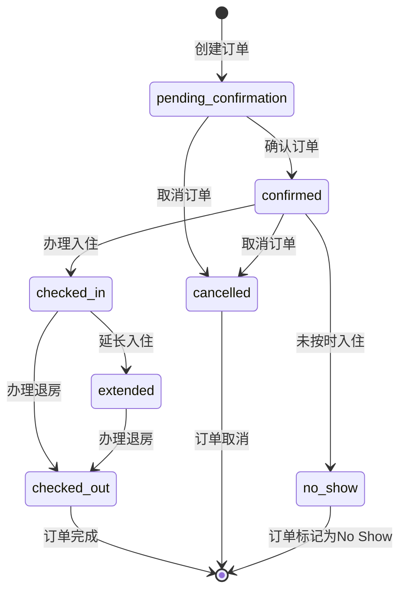
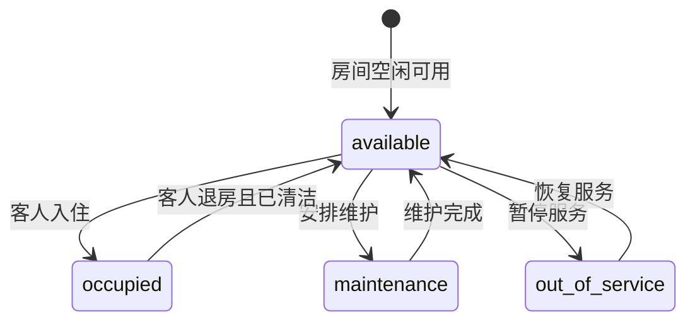
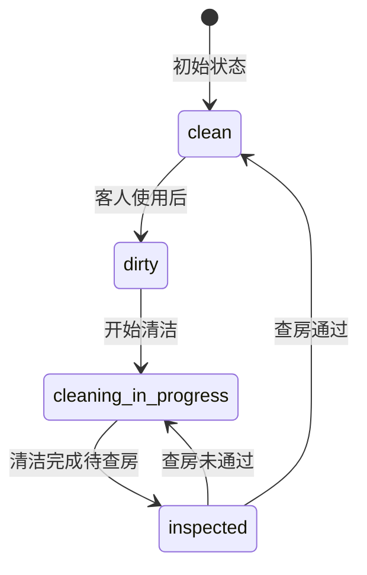
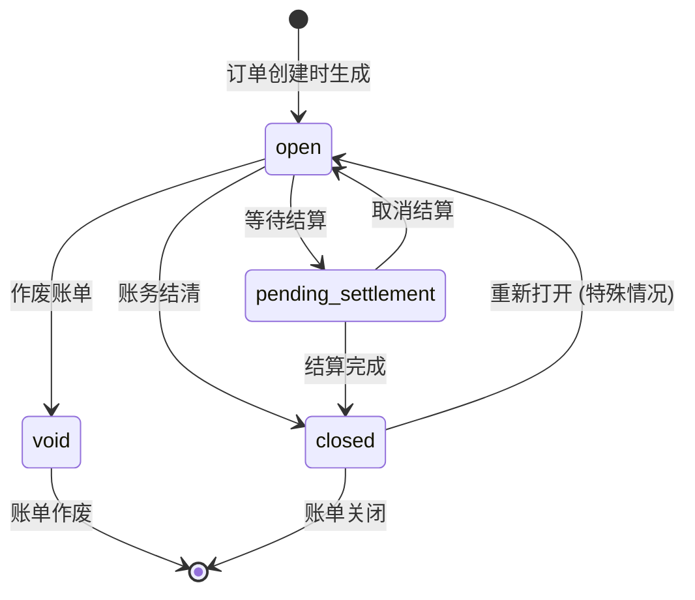

## 云宿居 PMS 系统 - PMS核心数据模型 (最终版 v5.7)

**快速导航：**
- [1. 引言](#1-引言)
- [2. PMS 核心E-R图 (最终版)](#2-pms-核心er图-最终版)
- [3. 表结构定义](#3-表结构定义)
  - [3.1 SaaS平台与系统基础表 (源自若依)](#31-saas平台与系统基础表-源自若依)
  - [3.2 客户管理表 (租户级共享/门店级)](#32-客户管理表-租户级共享门店级)
  - [3.3 房间管理表 (门店级隔离)](#33-房间管理表-门店级隔离)
  - [3.4 价格管理表 (门店级隔离)](#34-价格管理表-门店级隔离)
  - [3.5 订单管理表 (门店级隔离)](#35-订单管理表-门店级隔离)
  - [3.6 财务管理表 (门店级隔离)](#36-财务管理表-门店级隔离)
  - [3.7 合作方管理表 (全局共享/租户级)](#37-合作方管理表-全局共享租户级)
  - [3.8 系统配置表 (租户级/门店级)](#38-系统配置表-租户级门店级)
- [4. 主要业务实体状态流转](#4-主要业务实体状态流转)
- [5. 核心业务枚举值定义](#5-核心业务枚举值定义)
- [6. 数据权限控制与索引设计](#6-数据权限控制与索引设计)
- [7. 版本变更记录](#7-版本变更记录)

## 1. 引言

### 1.1 文档目的与范围
本文档详细定义了"云宿居"民宿 Property Management System (PMS) 的数据库逻辑模型，并与其依赖的若依框架的基础表（如租户、用户、部门等）进行了整合。本文档旨在为数据库的物理实现和后端开发提供具体指导。

**核心原则：**
1.  若依框架的基础实体（用户、租户、角色、部门等）及其字段规范固定不变。
2.  PMS新增的核心业务表主键统一采用 `BIGINT` 自增ID。
3.  **所有PMS业务表都包含 `tenant_id` 字段，支持标准多租户拦截器自动过滤。**
4.  **数据隔离层级:**
    - 租户级隔离：客户信息在租户内共享，使用 `tenant_id` 标准多租户拦截器
    - 门店级隔离：订单、房间、财务等核心业务数据按门店隔离，包含 `dept_id` 字段
    - 门店级共享：客户标签使用 `dept_id`，可设为NULL实现租户级共享
5.  **多租户拦截器排除原则：仅排除系统级全局表和特殊处理表**
6.  PMS业务表中的枚举字段，统一使用 `VARCHAR(50)` 存储描述性字符串以增强可读性和扩展性。

### 1.2 命名与设计约定
*   **表命名:** `pms_` (PMS核心业务表)。若依表使用其原生 `sys_` 前缀。
*   **字段命名:** `snake_case` (小写下划线)。
*   **主键 (PK):**
    *   PMS核心业务实体: `BIGINT AUTO_INCREMENT`。
    *   日志类高频写入表: `BIGINT AUTO_INCREMENT`。
*   **租户ID `tenant_id`:** `VARCHAR(20)` (同 `sys_tenant.tenant_id`)，在PMS业务表中非空。
*   **部门ID `dept_id`:** `BIGINT(20)` (同 `sys_dept.dept_id`)，在PMS业务表中通常非空（除非特定设计允许租户级数据），用于标识数据归属于哪个门店。
*   **外键 (FK):** 类型与关联表主键一致。`COMMENT '关联 table_name.column_name'`。
*   **通用审计字段 (对齐若依):**
    *   `create_by` (BIGINT(20) NULLABLE, COMMENT '创建者，关联 sys_user.user_id')
    *   `create_time` (DATETIME NULLABLE, COMMENT '创建时间')
    *   `update_by` (BIGINT(20) NULLABLE, COMMENT '更新者，关联 sys_user.user_id')
    *   `update_time` (DATETIME NULLABLE, COMMENT '更新时间')
    *   `create_dept` (BIGINT(20) NULLABLE, COMMENT '创建记录的操作员所属部门，关联 sys_dept.dept_id')
*   **软删除策略 (对齐若依):**
    *   `del_flag` (`CHAR(1) DEFAULT '0' NOT NULL`, COMMENT '删除标志（0代表存在 1代表删除）')。
*   **状态与枚举字段 (PMS优化):**
    *   PMS业务表中的枚举字段，统一使用 `VARCHAR(50)` 存储描述性枚举字符串。

## 2. PMS 核心E-R图 (最终版)

```mermaid
erDiagram
    %% --- 若依基础表 (关键部分) ---
    sys_tenant {}
    sys_dept {}
    sys_user {}

    %% --- 客户与合作方表 ---
    pms_customer_contacts {}
    pms_contact_tags {}
    pms_contact_tag_relations {}
    pms_suppliers {}
    pms_partners {}

    %% --- PMS Core Business Tables (门店级隔离) ---
    pms_room_types {}
    pms_room_rooms {}
    pms_room_locks {}
    pms_core_orders {}
    pms_order_status_history {}
    pms_order_guests {}
    pms_core_order_items {}
    pms_core_channels {}
    pms_finance_folios {}
    pms_finance_transactions {}
    pms_finance_payment_methods {}
    pms_finance_extra_charge_items {}
    pms_room_pricing_rules {}
    pms_pricing_calculations {}
    pms_special_date_pricing {}
    pms_room_inventory_snapshot {}
    
    %% --- 系统配置相关表 ---
    pms_tenant_settings {}
    pms_mp_settings {}
    pms_tenant_user_devices {}

    %% --- 若依基础表关联 ---
    sys_tenant ||--o{ sys_dept : "包含门店/部门"
    sys_tenant ||--o{ sys_user : "的主要租户"

    sys_dept ||--o{ sys_user : "员工属于门店"
    
    %% --- 客户相关表关联 ---
    sys_tenant ||--o{ pms_customer_contacts : "拥有客户联系人"
    pms_customer_contacts ||--o{ pms_contact_tag_relations : "联系人标签关联"
    pms_contact_tags ||--o{ pms_contact_tag_relations : "标签关联联系人"
    sys_tenant ||--o{ pms_contact_tags : "拥有标签"
    sys_dept ||--o{ pms_contact_tags : "门店级标签"
    
    %% --- 供应商合作伙伴关联 ---
    sys_tenant ||--o{ pms_suppliers : "拥有供应商"
    sys_tenant ||--o{ pms_partners : "拥有合作伙伴"
    
    %% --- PMS 表关联到若依基础表 ---
    sys_tenant ||--o{ pms_room_types : "定义房型"
    sys_tenant ||--o{ pms_core_orders : "拥有订单"
    sys_tenant ||--o{ pms_finance_folios : "拥有账单"
    
    sys_dept ||--o{ pms_room_types : "门店房型"
    sys_dept ||--o{ pms_room_rooms : "门店房间"
    sys_dept ||--o{ pms_core_orders : "门店订单"
    sys_dept ||--o{ pms_tenant_settings : "门店配置"
    sys_dept ||--o{ pms_mp_settings : "门店小程序配置"
    
    sys_user ||--o{ pms_tenant_user_devices : "注册设备"
    
    %% --- PMS 内部表关联 ---
    pms_room_types ||--o{ pms_room_rooms : "有具体房间"
    pms_room_types ||--o{ pms_core_orders : "被预订类型"
    pms_room_types o|--o{ pms_room_pricing_rules : "规则适用房型"
    pms_room_types ||--o{ pms_pricing_calculations : "价格计算记录"
    pms_room_types o|--o{ pms_special_date_pricing : "特殊日期价格"
    pms_room_types ||--o{ pms_room_inventory_snapshot : "库存快照"

    pms_room_rooms ||--o{ pms_room_locks : "可被锁定"
    pms_room_rooms o|--o{ pms_core_orders : "被分配房间"
    pms_room_rooms o|--o{ pms_core_order_items : "关联房晚项目"
    
    pms_core_orders ||--o{ pms_core_order_items : "包含项目"
    pms_core_orders ||--|| pms_finance_folios : "生成账单"
    pms_core_orders ||--o{ pms_order_status_history : "状态变更历史"
    pms_core_orders ||--o{ pms_order_guests : "入住客人信息"
    pms_customer_contacts o|--o{ pms_core_orders : "是主要客户"
    pms_core_channels o|--o{ pms_core_orders : "是来源渠道"
    pms_core_channels o|--o{ pms_pricing_calculations : "价格计算渠道"
    
    pms_finance_folios ||--o{ pms_finance_transactions : "记录交易"
    pms_finance_payment_methods o|--o{ pms_finance_transactions : "使用支付方式"
    pms_finance_extra_charge_items o|--o{ pms_core_order_items : "可以是附加项"
```



## 3. 表结构定义

### 3.1 SaaS平台与系统基础表 (源自若依)
这些表结构直接采用若依框架的定义，关键表包括：
*   `sys_tenant`: 租户表 (业务主键 `tenant_id varchar(20)`)
*   `sys_dept`: 部门表 (主键 `dept_id bigint(20)`)，在本系统中作为门店/分店使用
*   `sys_user`: 用户信息表 (主键 `user_id bigint(20)`)
*   `sys_role`: 角色信息表 (主键 `role_id bigint(20)`)
*   其他若依系统表按原规范使用

### 3.2 客户管理表 (租户级共享/门店级)

#### 3.2.1 `pms_customer_contacts` - 客户联系人表
*   业务描述: 存储租户级共享的客户联系人信息，包括个人客户、团队联系人、企业客户、会员等。
*   数据隔离: **租户级共享，使用标准多租户拦截器，租户内所有门店可见**
*   主键: `contact_id` (BIGINT AUTO_INCREMENT)
*   核心字段:
    *   `contact_id` - 联系人唯一ID
    *   `tenant_id` - 租户ID (多租户拦截器自动过滤)
    *   `contact_type` - 联系人类型 (individual_guest/group_leader/corporate_contact/vip_member/repeat_guest/marketing_tag/behavior_tag)
    *   `full_name` - 联系人姓名
    *   `phone_number` - 主要联系电话
    *   `email` - 电子邮件地址
    *   `wechat_openid` - 微信OpenID
    *   `wechat_unionid` - 微信UnionID
    *   `gender` - 性别
    *   `date_of_birth` - 出生日期
    *   `id_type` - 证件类型
    *   `id_number_encrypted` - 证件号码 (加密存储)
    *   `nationality_country_code` - 国籍代码
    *   `address_province` - 地址-省份
    *   `address_city` - 地址-城市
    *   `address_district` - 地址-区县
    *   `address_detail` - 地址-详细地址
    *   `postal_code` - 邮政编码
    *   `contact_status` - 联系人状态 (active/inactive/blacklisted/pending_verification)
    *   `member_level` - 会员等级
    *   `total_stays` - 总入住次数
    *   `total_amount` - 总消费金额 (DECIMAL(10,2))
    *   `last_stay_date` - 最后入住日期
    *   `remarks` - 备注信息
    *   `create_dept` - 创建部门 (BIGINT, 关联sys_dept.dept_id)
    *   `create_by` - 创建者 (BIGINT)
    *   `create_time` - 创建时间 (DATETIME)
    *   `update_by` - 更新者 (BIGINT)
    *   `update_time` - 更新时间 (DATETIME)
    *   `del_flag` - 删除标志 (CHAR(1) DEFAULT '0' NOT NULL)
*   索引设计:
    *   `idx_pms_cc_tenant` (tenant_id)
    *   `idx_pms_cc_tenant_name` (tenant_id, full_name)
    *   `idx_pms_cc_tenant_phone` (tenant_id, phone_number)
    *   `idx_pms_cc_tenant_status_type` (tenant_id, contact_status, contact_type)

#### 3.2.2 `pms_contact_tags` - 联系人标签表
*   业务描述: 存储客户联系人标签信息，支持门店级或租户级标签。
*   数据隔离: **使用标准多租户拦截器，dept_id为NULL时表示租户级标签**
*   主键: `tag_id` (BIGINT AUTO_INCREMENT)
*   核心字段:
    *   `tag_id` - 标签唯一ID
    *   `tenant_id` - 租户ID (多租户拦截器自动过滤)
    *   `dept_id` - 部门ID (NULL表示租户级标签，非NULL表示门店级标签)
    *   `name` - 标签名称
    *   `color` - 标签显示颜色
    *   `category` - 标签分类 (contact_level/contact_source/contact_preference/service_record/marketing_tag/behavior_tag)
    *   `description` - 标签描述
    *   `is_system` - 是否为系统预设标签
    *   `sort_order` - 排序值
    *   `create_dept` - 创建部门 (BIGINT, 关联sys_dept.dept_id)
    *   `create_by` - 创建者 (BIGINT)
    *   `create_time` - 创建时间 (DATETIME)
    *   `update_by` - 更新者 (BIGINT)
    *   `update_time` - 更新时间 (DATETIME)
    *   `del_flag` - 删除标志 (CHAR(1) DEFAULT '0' NOT NULL)
*   索引设计:
    *   `idx_pms_ct_tenant_dept` (tenant_id, dept_id)
    *   `idx_pms_ct_tenant_dept_name_category` (tenant_id, dept_id, name, category)
    *   `idx_pms_ct_category` (category)

#### 3.2.3 `pms_contact_tag_relations` - 联系人标签关联表
*   业务描述: 存储客户联系人与标签的关联关系。
*   数据隔离: **使用标准多租户拦截器**
*   主键: `relation_id` (BIGINT AUTO_INCREMENT)
*   核心字段:
    *   `relation_id` - 关联唯一ID
    *   `tenant_id` - 租户ID (多租户拦截器自动过滤)
    *   `contact_id` - 联系人ID (关联 pms_customer_contacts.contact_id)
    *   `tag_id` - 标签ID (关联 pms_contact_tags.tag_id)
    *   `create_dept` - 创建部门 (BIGINT, 关联sys_dept.dept_id)
    *   `create_by` - 创建者 (BIGINT)
    *   `create_time` - 创建时间 (DATETIME)
    *   `del_flag` - 删除标志 (CHAR(1) DEFAULT '0' NOT NULL)
*   索引设计:
    *   `idx_pms_ctr_tenant_contact` (tenant_id, contact_id)
    *   `idx_pms_ctr_tenant_tag` (tenant_id, tag_id)
    *   `idx_pms_ctr_contact_id` (contact_id)
    *   `idx_pms_ctr_tag_id` (tag_id)
    *   UNIQUE KEY `unq_pms_ctr_tenant_contact_tag` (tenant_id, contact_id, tag_id, del_flag)

### 3.3 房间管理表 (门店级隔离)

#### 3.3.1 `pms_room_types` - 房型表
*   业务描述: 存储各门店定义的房型信息。
*   数据隔离: 门店级隔离，使用多租户拦截器
*   主键: `room_type_id` (BIGINT AUTO_INCREMENT)
*   核心字段:
    *   `room_type_id` - 房型唯一ID
    *   `tenant_id` - 租户ID (多租户拦截器使用)
    *   `dept_id` - 部门ID (门店级权限控制, 关联 sys_dept.dept_id)
    *   `type_name` - 房型名称
    *   `type_code` - 房型代码
    *   `description` - 房型描述
    *   `standard_occupancy` - 标准入住人数
    *   `max_occupancy` - 最大入住人数
    *   `room_area` - 房间面积(平方米) (DECIMAL(8,2))
    *   `bed_configuration` - 床型配置
    *   `amenities` - 房间设施
    *   `default_price` - 默认价格 (DECIMAL(10,2))
    *   `status` - 房型状态 (active/inactive/maintenance)
    *   `sort_order` - 排序值
    *   `images` - 房型图片
    *   `create_dept`, `create_by`, `create_time`, `update_by`, `update_time`, `del_flag` -- 标准审计字段
*   索引设计:
    *   `idx_room_type_tenant` (tenant_id)
    *   `idx_room_type_dept` (dept_id)
    *   `idx_room_type_status` (status)
    *   `uk_room_type_code_dept` (type_code, dept_id, del_flag) -- 唯一约束

#### 3.3.2 `pms_room_rooms` - 房间表
*   业务描述: 存储各门店的具体房间信息。
*   数据隔离: 门店级隔离，使用多租户拦截器
*   主键: `room_id` (BIGINT AUTO_INCREMENT)
*   核心字段:
    *   `room_id` - 房间唯一ID
    *   `tenant_id` - 租户ID (多租户拦截器使用)
    *   `dept_id` - 部门ID (门店级权限控制, 关联 sys_dept.dept_id)
    *   `room_type_id` - 房型ID (关联 pms_room_types.room_type_id)
    *   `room_number` - 房间号
    *   `floor` - 楼层
    *   `room_status` - 房间物理状态 (available/occupied/maintenance/out_of_order)
    *   `cleaning_status` - 清洁状态 (clean/dirty/cleaning/inspecting)
    *   `description` - 房间描述
    *   `special_amenities` - 房间特殊设施
    *   `last_cleaning_time` - 最后清洁时间
    *   `last_maintenance_time` - 最后维护时间
    *   `status_remarks` - 房间状态备注
    *   `sort_order` - 排序值
    *   `create_dept`, `create_by`, `create_time`, `update_by`, `update_time`, `del_flag` -- 标准审计字段
*   索引设计:
    *   `idx_room_tenant` (tenant_id)
    *   `idx_room_dept` (dept_id)
    *   `idx_room_type` (room_type_id)
    *   `idx_room_status` (room_status)
    *   `idx_room_cleaning` (cleaning_status)
    *   `uk_room_number_dept` (room_number, dept_id, del_flag) -- 同门店房间号唯一
*   外键约束:
    *   `fk_room_room_type` FOREIGN KEY (room_type_id) REFERENCES pms_room_types(room_type_id)

#### 3.3.3 `pms_room_locks` - 房间锁定表
*   业务描述: 存储房间锁定记录，支持维护、清洁、管理等多种锁定类型。
*   数据隔离: 门店级隔离，使用多租户拦截器
*   主键: `lock_id` (BIGINT AUTO_INCREMENT)
*   核心字段:
    *   `lock_id` - 锁定记录唯一ID
    *   `tenant_id` - 租户ID (多租户拦截器使用)
    *   `dept_id` - 部门ID (门店级权限控制, 关联 sys_dept.dept_id)
    *   `room_id` - 房间ID (关联 pms_room_rooms.room_id)
    *   `lock_type` - 锁定类型 (maintenance/cleaning/management/malfunction)
    *   `lock_start_time` - 锁定开始时间
    *   `lock_end_time` - 锁定结束时间
    *   `lock_reason` - 锁定原因
    *   `lock_status` - 锁定状态 (active/unlocked/expired)
    *   `unlock_time` - 解锁时间
    *   `unlock_by` - 解锁操作人
    *   `unlock_reason` - 解锁原因
    *   `create_dept`, `create_by`, `create_time`, `update_by`, `update_time`, `del_flag` -- 标准审计字段
*   索引设计:
    *   `idx_room_lock_tenant` (tenant_id)
    *   `idx_room_lock_dept` (dept_id)
    *   `idx_room_lock_room` (room_id)
    *   `idx_room_lock_status` (lock_status)
    *   `idx_room_lock_time` (lock_start_time, lock_end_time)
*   外键约束:
    *   `fk_room_lock_room` FOREIGN KEY (room_id) REFERENCES pms_room_rooms(room_id)

### 3.4 价格管理表 (门店级隔离)

#### 3.4.1 `pms_room_pricing_rules` - 价格规则表
*   业务描述: 存储动态定价规则。
*   数据隔离: 门店级隔离 (dept_id可空表示租户级通用规则，具体以业务为准，当前ER图定义是门店级)
*   主键: `rule_id` (BIGINT AUTO_INCREMENT)
*   核心字段:
    *   `rule_id` - 价格规则唯一ID
    *   `tenant_id` - 租户ID
    *   `dept_id` - 部门ID (门店，可空，关联 sys_dept.dept_id)
    *   `name` - 规则名称
    *   `room_type_id` - 房型ID (可空, 关联 pms_room_types.room_type_id)
    *   `date_range_start` - 适用开始日期
    *   `date_range_end` - 适用结束日期
    *   `days_of_week_json` - 适用星期 (JSON, e.g., [1,2,7])
    *   `min_length_of_stay` - 最小入住天数
    *   `max_length_of_stay` - 最大入住天数
    *   `price_adjustment_type` - 调整类型
    *   `adjustment_value` - 调整值 (DECIMAL(10,2))
    *   `priority` - 规则优先级
    *   `status` - 状态 (active/inactive)
    *   `channel_restrictions_json` - 渠道限制 (JSON数组)
    *   `guest_count_min` - 最小客人数 (INT)
    *   `guest_count_max` - 最大客人数 (INT)
    *   `advance_booking_days_min` - 最小提前预订天数 (INT)
    *   `advance_booking_days_max` - 最大提前预订天数 (INT)
    *   `rule_description` - 规则描述 (VARCHAR(500))
    *   `is_combinable` - 是否可与其他规则叠加 (BOOLEAN, DEFAULT TRUE)
    *   `create_dept`, `create_by`, `create_time`, `update_by`, `update_time`, `del_flag` -- 标准审计字段
*   索引设计:
    *   `idx_pms_rpr_tenant_dept_status_priority` (tenant_id, dept_id, status, priority)
    *   `idx_pms_rpr_tenant_dept_rt_dates` (tenant_id, dept_id, room_type_id, date_range_start, date_range_end)
    *   `idx_pms_rpr_tenant_dept_combinable` (tenant_id, dept_id, is_combinable, status)

#### 3.4.2 `pms_pricing_calculations` - 价格计算历史表
*   业务描述: 记录每次价格计算的详细过程和结果，支持价格审计和趋势分析。
*   数据隔离: 门店级隔离，使用多租户拦截器
*   主键: `calculation_id` (BIGINT AUTO_INCREMENT)
*   核心字段:
    *   `calculation_id` - 计算记录唯一ID
    *   `tenant_id` - 租户ID
    *   `dept_id` - 部门ID (门店, 关联 sys_dept.dept_id)
    *   `room_type_id` - 房型ID (关联 pms_room_types.room_type_id)
    *   `check_in_date` - 入住日期 (DATE, 非空)
    *   `check_out_date` - 离店日期 (DATE, 非空)
    *   `base_price` - 基础价格 (DECIMAL(10,2), 非空)
    *   `final_price` - 最终价格 (DECIMAL(10,2), 非空)
    *   `applied_rules_json` - 应用的规则详情 (JSON)
    *   `calculation_time` - 计算时间 (DATETIME, 非空)
    *   `channel_id` - 渠道ID (BIGINT, 关联 pms_core_channels.channel_id)
    *   `guest_count` - 客人数量 (INT)
    *   `advance_booking_days` - 提前预订天数 (INT)
    *   `calculation_context` - 计算上下文 (JSON, 如促销活动、会员等级等)
*   索引设计:
    *   `idx_pms_pc_tenant_dept_rt_dates` (tenant_id, dept_id, room_type_id, check_in_date, check_out_date)
    *   `idx_pms_pc_calculation_time` (calculation_time)
    *   `idx_pms_pc_tenant_dept_channel` (tenant_id, dept_id, channel_id)
*   外键约束:
    *   `fk_pricing_calc_room_type` FOREIGN KEY (room_type_id) REFERENCES pms_room_types(room_type_id)

#### 3.4.3 `pms_special_date_pricing` - 特殊日期价格表
*   业务描述: 存储特殊日期（节假日、活动日等）的价格设置，具有高优先级。
*   数据隔离: 门店级隔离，使用多租户拦截器
*   主键: `special_date_id` (BIGINT AUTO_INCREMENT)
*   核心字段:
    *   `special_date_id` - 特殊日期唯一ID
    *   `tenant_id` - 租户ID
    *   `dept_id` - 部门ID (门店，可空表示租户级，关联 sys_dept.dept_id)
    *   `name` - 特殊日期名称 (VARCHAR(100), 非空)
    *   `date_type` - 日期类型 (VARCHAR(50), 如 holiday/festival/event/promotion)
    *   `specific_date` - 具体日期 (DATE, 可空)
    *   `date_range_start` - 日期范围开始 (DATE, 可空)
    *   `date_range_end` - 日期范围结束 (DATE, 可空)
    *   `room_type_id` - 房型ID (可空表示全部房型, 关联 pms_room_types.room_type_id)
    *   `price_adjustment_type` - 调整类型 (VARCHAR(50), 非空)
    *   `adjustment_value` - 调整值 (DECIMAL(10,2), 非空)
    *   `fixed_price` - 固定价格 (DECIMAL(10,2), 可空)
    *   `priority` - 优先级 (INT, DEFAULT 100)
    *   `status` - 状态 (VARCHAR(50), DEFAULT 'active')
    *   `description` - 描述 (VARCHAR(500))
    *   `is_recurring_yearly` - 是否每年重复 (TINYINT, DEFAULT 0)
    *   `min_length_of_stay` - 最小入住天数 (INT, 可空)
    *   `max_length_of_stay` - 最大入住天数 (INT, 可空)
    *   `channel_restrictions_json` - 渠道限制 (JSON数组)
    *   `create_dept`, `create_by`, `create_time`, `update_by`, `update_time`, `del_flag` -- 标准审计字段
*   索引设计:
    *   `idx_pms_sdp_tenant_dept_date` (tenant_id, dept_id, specific_date)
    *   `idx_pms_sdp_tenant_dept_rt` (tenant_id, dept_id, room_type_id)
    *   `idx_pms_sdp_tenant_dept_type_status` (tenant_id, dept_id, date_type, status)
    *   `idx_pms_sdp_date_range` (specific_date, status)
*   外键约束:
    *   `fk_special_date_room_type` FOREIGN KEY (room_type_id) REFERENCES pms_room_types(room_type_id)

### 3.5 订单管理表 (门店级隔离)

#### 3.5.1 `pms_core_orders` - 核心订单表
*   业务描述: 存储客户预订的核心订单信息，包括预订详情、客户信息、房间分配、订单状态等。
*   数据隔离: **门店级隔离，包含 `dept_id` 字段**
*   主键: `order_id` (BIGINT AUTO_INCREMENT)
*   核心字段:
    *   `order_id` - 订单唯一ID
    *   `tenant_id` - 租户ID (多租户拦截器自动过滤)
    *   `dept_id` - 部门ID (门店)
    *   `contact_id` - 联系人ID (关联 pms_customer_contacts.contact_id)
    *   `pms_room_id` - 分配的房间ID (关联 pms_room_rooms.room_id)
    *   `room_type_id` - 预订的房型ID (关联 pms_room_types.room_type_id)
    *   `channel_id` - 订单来源渠道ID (关联 pms_core_channels.channel_id)
    *   `check_in_date` - 计划入住日期
    *   `check_out_date` - 计划离店日期
    *   `num_adults` - 成人数
    *   `num_children` - 儿童数
    *   `total_amount` - 订单总金额 (DECIMAL(10,2))
    *   `paid_amount` - 已付金额 (DECIMAL(10,2))
    *   `order_status` - 订单状态
    *   `order_source` - 订单来源
    *   `notes` - 订单备注
    *   `actual_check_in_time` - 实际入住时间
    *   `actual_check_out_time` - 实际退房时间
    *   `confirmed_time` - 订单确认时间
    *   `cancelled_time` - 订单取消时间
    *   `expected_arrival_time` - 预计到达时间
    *   `special_requests` - 特殊要求
    *   `create_dept` - 创建部门 (BIGINT)
    *   `create_by` - 创建者 (BIGINT)
    *   `create_time` - 创建时间 (DATETIME)
    *   `update_by` - 更新者 (BIGINT)
    *   `update_time` - 更新时间 (DATETIME)
    *   `del_flag` - 删除标志 (CHAR(1) DEFAULT '0' NOT NULL)
*   索引设计:
    *   `idx_pms_o_tenant_dept` (tenant_id, dept_id)
    *   `idx_pms_o_tenant_dept_status` (tenant_id, dept_id, order_status)
    *   `idx_pms_o_tenant_dept_dates` (tenant_id, dept_id, check_in_date, check_out_date)
    *   `idx_pms_o_tenant_dept_contact` (tenant_id, dept_id, contact_id)
    *   `idx_pms_o_tenant_dept_room_dates` (tenant_id, dept_id, pms_room_id, check_in_date, check_out_date)

#### 3.5.2 `pms_order_guests` - 订单入住客人表
*   业务描述: 记录订单的实际入住客人信息，支持多人入住登记，与客户档案灵活关联。
*   数据隔离: **门店级隔离，包含 `dept_id` 字段**
*   主键: `guest_id` (BIGINT AUTO_INCREMENT)
*   核心字段:
    *   `guest_id` - 客人记录唯一ID
    *   `tenant_id` - 租户ID (多租户拦截器自动过滤)
    *   `order_id` - 订单ID (关联 pms_core_orders.order_id)
    *   `dept_id` - 部门ID (门店)
    *   `contact_id` - 关联客户联系人ID (关联 pms_customer_contacts.contact_id，可空)
    *   `guest_type` - 客人类型 (primary/additional)
    *   `is_primary_contact` - 是否为订单主联系人 (TINYINT(1) DEFAULT '0')
    *   `full_name` - 客人姓名
    *   `id_type` - 证件类型
    *   `id_number_encrypted` - 证件号码(加密)
    *   `phone_number` - 联系电话
    *   `age_group` - 年龄组 (adult/child/infant)
    *   `create_time` - 创建时间 (DATETIME)
    *   `create_by` - 创建者 (BIGINT)
    *   `del_flag` - 删除标志 (CHAR(1) DEFAULT '0' NOT NULL)
*   业务规则:
    *   每个订单必须有且仅有一个 `guest_type='primary'` 的主客人
    *   主客人的 `contact_id` 应与订单的 `contact_id` 保持一致
    *   同行客人可选择关联现有客户档案或不关联
    *   客人信息变更时可选择同步更新客户档案
*   索引设计:
    *   `idx_pms_og_tenant_order` (tenant_id, order_id)
    *   `idx_pms_og_tenant_dept` (tenant_id, dept_id)
    *   `idx_pms_og_order_guest_type` (order_id, guest_type)
    *   `idx_pms_og_tenant_contact` (tenant_id, contact_id)
    *   `idx_pms_og_order_primary` (order_id, is_primary_contact)

#### 3.5.3 `pms_order_status_history` - 订单状态变更历史表
*   业务描述: 记录订单状态的每次变更历史，支持操作审计和状态追踪。
*   数据隔离: 门店级隔离，使用多租户拦截器
*   主键: `history_id` (BIGINT AUTO_INCREMENT)
*   核心字段:
    *   `history_id` - 历史记录唯一ID
    *   `tenant_id` - 租户ID
    *   `order_id` - 订单ID (关联 pms_core_orders.order_id)
    *   `dept_id` - 部门ID (门店, 关联 sys_dept.dept_id)
    *   `from_status` - 原状态 (VARCHAR(50), 可空)
    *   `to_status` - 新状态 (VARCHAR(50), 非空)
    *   `change_reason` - 状态变更原因 (VARCHAR(500))
    *   `change_time` - 变更时间 (DATETIME, 非空)
    *   `change_by` - 操作人 (BIGINT, 关联 sys_user.user_id)
    *   `notes` - 备注 (TEXT)
    *   `del_flag` - 删除标志 (CHAR(1) DEFAULT '0' NOT NULL)
*   索引设计:
    *   `idx_pms_osh_tenant_order` (tenant_id, order_id)
    *   `idx_pms_osh_tenant_dept_time` (tenant_id, dept_id, change_time)
    *   `idx_pms_osh_order_time` (order_id, change_time)
*   外键约束:
    *   `fk_order_status_history_order` FOREIGN KEY (order_id) REFERENCES pms_core_orders(order_id)

#### 3.5.4 `pms_core_order_items` - 订单项目表
*   业务描述: 存储订单中的具体项目，如房费、附加服务等。
*   数据隔离: 门店级隔离，使用多租户拦截器
*   主键: `order_item_id` (BIGINT AUTO_INCREMENT)
*   核心字段:
    *   `order_item_id` - 订单项唯一ID
    *   `tenant_id` - 租户ID
    *   `order_id` - 所属订单ID (关联 pms_core_orders.order_id)
    *   `dept_id` - 部门ID (门店, 关联 sys_dept.dept_id)
    *   `pms_room_id` - 关联房间ID (可空, 如房晚项目, 关联 pms_room_rooms.room_id)
    *   `product_id` - 产品ID (可空, 如关联 pms_finance_extra_charge_items.item_id)
    *   `product_type` - 产品类型 (room_fee/extra_service/package_item)
    *   `description` - 项目描述
    *   `quantity` - 数量
    *   `unit_price` - 单价 (DECIMAL(10,2))
    *   `service_date` - 服务日期 (针对非房晚类项目)
    *   `notes` - 项目备注
    *   `create_dept`, `create_by`, `create_time`, `update_by`, `update_time`, `del_flag` -- 标准审计字段
*   索引设计:
    *   `idx_pms_oi_tenant_order` (tenant_id, order_id)
    *   `idx_pms_oi_tenant_dept_product` (tenant_id, dept_id, product_type, product_id)

#### 3.5.5 `pms_core_channels` - 订单渠道表
*   业务描述: 存储订单来源渠道信息。
*   数据隔离: 门店级隔离 (dept_id可空表示租户级通用渠道)
*   主键: `channel_id` (BIGINT AUTO_INCREMENT)
*   核心字段:
    *   `channel_id` - 渠道唯一ID
    *   `tenant_id` - 租户ID
    *   `dept_id` - 部门ID (门店，可空，关联 sys_dept.dept_id)
    *   `name` - 渠道名称
    *   `channel_type` - 渠道类型
    *   `description` - 渠道描述
    *   `status` - 状态 (active/inactive)
    *   `create_dept`, `create_by`, `create_time`, `update_by`, `update_time`, `del_flag` -- 标准审计字段
*   索引设计:
    *   `idx_pms_ch_tenant_dept_status` (tenant_id, dept_id, status)
    *   `idx_pms_ch_tenant_dept_type` (tenant_id, dept_id, channel_type)

#### 3.5.6 `pms_room_inventory_snapshot` - 房型库存快照表
*   业务描述: 存储房型库存的快照数据，用于快速查询可用性和性能优化。
*   数据隔离: 门店级隔离，使用多租户拦截器
*   主键: `snapshot_id` (BIGINT AUTO_INCREMENT)
*   核心字段:
    *   `snapshot_id` - 快照唯一ID
    *   `tenant_id` - 租户ID
    *   `dept_id` - 部门ID (门店, 关联 sys_dept.dept_id)
    *   `room_type_id` - 房型ID (关联 pms_room_types.room_type_id)
    *   `snapshot_date` - 快照日期 (DATE, 非空)
    *   `total_rooms` - 总房间数 (INT, 非空)
    *   `available_rooms` - 可用房间数 (INT, 非空)
    *   `occupied_rooms` - 已占用房间数 (INT, 非空)
    *   `maintenance_rooms` - 维护中房间数 (INT, 非空)
    *   `locked_rooms` - 锁定房间数 (INT, 非空)
    *   `last_updated` - 最后更新时间 (DATETIME, 非空)
*   索引设计:
    *   `unq_pms_ris_tenant_dept_rt_date` (tenant_id, dept_id, room_type_id, snapshot_date) -- 唯一约束
    *   `idx_pms_ris_tenant_dept_date` (tenant_id, dept_id, snapshot_date)
    *   `idx_pms_ris_last_updated` (last_updated)
*   外键约束:
    *   `fk_room_inventory_room_type` FOREIGN KEY (room_type_id) REFERENCES pms_room_types(room_type_id)

### 3.6 财务管理表 (门店级隔离)

#### 3.6.1 `pms_finance_folios` - 客户账单表
*   业务描述: 存储客户在店期间的所有费用和支付记录。
*   数据隔离: 门店级隔离，使用多租户拦截器
*   主键: `folio_id` (BIGINT AUTO_INCREMENT)
*   核心字段:
    *   `folio_id` - 账单唯一ID
    *   `tenant_id` - 租户ID
    *   `dept_id` - 部门ID (门店, 关联 sys_dept.dept_id)
    *   `order_id` - 关联订单ID (UNIQUE, 关联 pms_core_orders.order_id)
    *   `total_charges` - 总应收费用 (DECIMAL(10,2))
    *   `total_payments` - 总已收付款 (DECIMAL(10,2))
    *   `total_refunds` - 总已退款 (DECIMAL(10,2))
    *   `balance` AS (`total_charges` - `total_payments` + `total_refunds`) COMMENT '计算列：余额'
    *   `folio_status` - 账单状态
    *   `notes` - 账单备注
    *   `closed_at` - 账单关闭时间
    *   `create_dept`, `create_by`, `create_time`, `update_by`, `update_time`, `del_flag` -- 标准审计字段
*   索引设计:
    *   `idx_pms_ff_tenant_dept_order` (tenant_id, dept_id, order_id)
    *   `idx_pms_ff_tenant_dept_status` (tenant_id, dept_id, folio_status)

#### 3.6.2 `pms_finance_transactions` - 财务交易流水表
*   业务描述: 记录每一笔财务交易明细。
*   数据隔离: 门店级隔离，使用多租户拦截器
*   主键: `transaction_id` (BIGINT AUTO_INCREMENT)
*   核心字段:
    *   `transaction_id` - 交易唯一ID
    *   `tenant_id` - 租户ID
    *   `folio_id` - 所属账单ID (关联 pms_finance_folios.folio_id)
    *   `dept_id` - 部门ID (门店, 关联 sys_dept.dept_id)
    *   `transaction_type` - 交易类型
    *   `amount` - 交易金额 (DECIMAL(10,2))
    *   `description` - 交易描述
    *   `payment_method_id` - 支付方式ID (关联 pms_finance_payment_methods.payment_method_id)
    *   `payment_gateway_txn_id` - 支付网关交易号
    *   `transaction_time` - 交易时间
    *   `related_order_item_id` - 关联订单项ID (可空, 关联 pms_core_order_items.order_item_id)
    *   `notes` - 交易备注
    *   `is_void` - 是否已作废 (BOOLEAN)
    *   `create_dept`, `create_by`, `create_time`, `update_by`, `update_time`, `del_flag` -- 标准审计字段
*   索引设计:
    *   `idx_pms_ft_tenant_folio` (tenant_id, folio_id)
    *   `idx_pms_ft_tenant_dept_type_time` (tenant_id, dept_id, transaction_type, transaction_time)

#### 3.6.3 `pms_finance_payment_methods` - 支付方式表
*   业务描述: 存储系统支持的支付方式。
*   数据隔离: 门店级隔离 (dept_id可空表示租户级通用支付方式)
*   主键: `payment_method_id` (BIGINT AUTO_INCREMENT)
*   核心字段:
    *   `payment_method_id` - 支付方式唯一ID
    *   `tenant_id` - 租户ID
    *   `dept_id` - 部门ID (门店，可空，关联 sys_dept.dept_id)
    *   `name` - 支付方式名称
    *   `method_type` - 支付方式类型
    *   `details_json` - 附加配置 (JSON, 如银行账号，终端号等)
    *   `status` - 状态 (active/inactive)
    *   `create_dept`, `create_by`, `create_time`, `update_by`, `update_time`, `del_flag` -- 标准审计字段
*   索引设计:
    *   `idx_pms_fpm_tenant_dept_status` (tenant_id, dept_id, status)
    *   `idx_pms_fpm_tenant_dept_type` (tenant_id, dept_id, method_type)

#### 3.6.4 `pms_finance_extra_charge_items` - 附加费用项目表
*   业务描述: 存储可供订单选择的附加费用项目。
*   数据隔离: 门店级隔离 (dept_id可空表示租户级通用项目)
*   主键: `item_id` (BIGINT AUTO_INCREMENT)
*   核心字段:
    *   `item_id` - 附加费用项唯一ID
    *   `tenant_id` - 租户ID
    *   `dept_id` - 部门ID (门店，可空，关联 sys_dept.dept_id)
    *   `name` - 项目名称
    *   `default_price` - 默认单价 (DECIMAL(10,2))
    *   `category` - 费用类别
    *   `is_taxable` - 是否应税 (BOOLEAN)
    *   `description` - 项目描述
    *   `status` - 状态 (active/inactive)
    *   `create_dept`, `create_by`, `create_time`, `update_by`, `update_time`, `del_flag` -- 标准审计字段
*   索引设计:
    *   `idx_pms_feci_tenant_dept_status` (tenant_id, dept_id, status)
    *   `idx_pms_feci_tenant_dept_category` (tenant_id, dept_id, category)

### 3.7 合作方管理表 (全局共享/租户级)

#### 3.7.1 `pms_suppliers` - 供应商表
*   业务描述: 存储供应商信息，如清洁、维护、物料等供应商。
*   数据隔离: **支持全局共享 (tenant_id IS NULL) 和租户级隔离 (tenant_id IS NOT NULL)**。已从多租户拦截器排除，业务层处理。
*   主键: `supplier_id` (BIGINT AUTO_INCREMENT)
*   核心字段:
    *   `supplier_id` - 供应商唯一ID
    *   `tenant_id` - 租户ID (可空，NULL表示全局供应商)
    *   `supplier_type` - 供应商类型
    *   `company_name` - 公司名称
    *   `contact_person` - 联系人姓名
    *   `phone_number` - 联系电话
    *   `email` - 邮箱地址
    *   `business_scope` - 业务范围描述
    *   `service_area` - 服务区域
    *   `contract_info` - 合同信息
    *   `status` - 供应商状态 (active/inactive)
    *   `create_dept`, `create_by`, `create_time`, `update_by`, `update_time`, `del_flag` -- 标准审计字段 (对于全局数据，create_dept可能为NULL)
*   索引设计:
    *   `idx_pms_s_tenant_type` (tenant_id, supplier_type)
    *   `idx_pms_s_tenant_name` (tenant_id, company_name)
    *   `idx_pms_s_tenant_status` (tenant_id, status)

#### 3.7.2 `pms_partners` - 合作伙伴表
*   业务描述: 存储合作伙伴信息，如旅行社、代理商等，支持佣金设置。
*   数据隔离: **支持全局共享 (tenant_id IS NULL) 和租户级隔离 (tenant_id IS NOT NULL)**。已从多租户拦截器排除，业务层处理。
*   主键: `partner_id` (BIGINT AUTO_INCREMENT)
*   核心字段:
    *   `partner_id` - 合作伙伴唯一ID
    *   `tenant_id` - 租户ID (可空，NULL表示全局合作伙伴)
    *   `partner_type` - 合作伙伴类型
    *   `company_name` - 公司名称
    *   `contact_person` - 联系人姓名
    *   `phone_number` - 联系电话
    *   `email` - 邮箱地址
    *   `website_url` - 网站地址
    *   `commission_rate` - 佣金比例 (DECIMAL(5,2), 如 5.50 表示5.5%)
    *   `payment_terms` - 付款条件
    *   `cooperation_level` - 合作等级
    *   `contract_start_date` - 合同开始日期
    *   `contract_end_date` - 合同结束日期
    *   `status` - 合作伙伴状态 (active/inactive)
    *   `create_dept`, `create_by`, `create_time`, `update_by`, `update_time`, `del_flag` -- 标准审计字段 (对于全局数据，create_dept可能为NULL)
*   索引设计:
    *   `idx_pms_p_tenant_type` (tenant_id, partner_type)
    *   `idx_pms_p_tenant_name` (tenant_id, company_name)
    *   `idx_pms_p_tenant_status` (tenant_id, status)

### 3.8 系统配置表 (租户级/门店级)

#### 3.8.1 `pms_tenant_settings` - 租户/门店配置表
*   业务描述: 存储租户级或门店级的各项配置参数。
*   数据隔离: **通过dept_id区分。dept_id为NULL表示租户级配置，非NULL表示特定门店的配置。** 标准多租户拦截器处理tenant_id。
*   主键: `setting_id` (BIGINT AUTO_INCREMENT)
*   核心字段:
    *   `setting_id` - 设置唯一ID
    *   `tenant_id` - 租户ID
    *   `dept_id` - 部门ID (门店，NULL=租户级，关联 sys_dept.dept_id)
    *   `setting_group` - 设置分组 (e.g., booking_rules, finance_params)
    *   `setting_key` - 设置键名 (e.g., max_advance_booking_days)
    *   `setting_value` - 设置值 (TEXT)
    *   `value_type` - 值类型 (string/integer/boolean/json)
    *   `description` - 设置描述
    *   `is_sensitive` - 是否敏感设置 (BOOLEAN)
    *   `create_dept`, `create_by`, `create_time`, `update_by`, `update_time`, `del_flag` -- 标准审计字段
*   索引设计:
    *   `unq_pms_ts_tenant_dept_group_key` (tenant_id, dept_id, setting_group, setting_key, del_flag)
    *   `idx_pms_ts_tenant_dept_group` (tenant_id, dept_id, setting_group)

#### 3.8.2 `pms_mp_settings` - 小程序配置表
*   业务描述: 存储小程序相关的配置。
*   数据隔离: **通过dept_id区分。dept_id为NULL表示租户级通用小程序配置，非NULL表示特定门店的小程序配置。** 标准多租户拦截器处理tenant_id。
*   主键: `setting_id` (BIGINT AUTO_INCREMENT)
*   核心字段:
    *   `setting_id` - 小程序设置唯一ID
    *   `tenant_id` - 租户ID
    *   `dept_id` - 部门ID (门店，NULL=租户级，关联 sys_dept.dept_id)
    *   `setting_key` - 设置键名 (e.g., theme_color, app_id)
    *   `setting_value` - 设置值 (TEXT)
    *   `value_type` - 值类型 (string/integer/boolean/json)
    *   `description` - 设置描述
    *   `create_dept`, `create_by`, `create_time`, `update_by`, `update_time`, `del_flag` -- 标准审计字段
*   索引设计:
    *   `unq_pms_mps_tenant_dept_key` (tenant_id, dept_id, setting_key, del_flag)

#### 3.8.3 `pms_tenant_user_devices` - 用户设备表
*   业务描述: 存储用户登录过的设备信息，用于消息推送等。
*   数据隔离: **租户用户级别，通过user_id关联，间接关联到租户。** 标准多租户拦截器处理tenant_id。
*   主键: `id` (BIGINT AUTO_INCREMENT)
*   核心字段:
    *   `id` - 设备记录唯一ID
    *   `tenant_id` - 租户ID (冗余，通过user_id可查，但便于直接过滤)
    *   `user_id` - 用户ID (关联 sys_user.user_id)
    *   `device_type` - 设备类型 (iOS/Android/Web/MiniProgram)
    *   `device_token` - 设备令牌 (用于推送)
    *   `app_version` - 应用版本
    *   `last_login_at` - 最后登录时间
    *   `status` - 状态 (active/inactive/expired)
    *   `create_time` - 创建时间 (DATETIME)
    *   `update_time` - 更新时间 (DATETIME)
    *   (*注: 此表通常不包含create_by, update_by, del_flag, create_dept，因为是用户设备自动注册行为*)
*   索引设计:
    *   `idx_pms_tud_tenant_user_device` (tenant_id, user_id, device_type)
    *   `idx_pms_tud_tenant_user_status` (tenant_id, user_id, status)
    *   `idx_pms_tud_device_token` (device_token)


## 4. 主要业务实体状态流转

### 4.1 订单状态流转


**订单状态枚举值:**
- `pending_confirmation` (待确认)
- `confirmed` (已确认)
- `checked_in` (已入住)
- `checked_out` (已退房)
- `cancelled` (已取消)
- `no_show` (未到店)
- `extended` (已延期)
- `waitlist` (等候名单)

### 4.2 房间状态流转

**物理状态流转:**


**清洁状态流转:**


### 4.3 账单状态流转


## 5. 核心业务枚举值定义

### 5.1 客户联系人相关枚举
```sql
-- pms_customer_contacts.contact_type
'individual_guest'      -- 散客
'group_leader'          -- 团队负责人
'corporate_contact'     -- 企业联系人
'vip_member'           -- VIP会员
'repeat_guest'         -- 回头客
'marketing_tag'        -- 营销标签
'behavior_tag'         -- 行为标签
'other'                -- 其他

-- pms_customer_contacts.contact_status
'active'               -- 活跃
'inactive'             -- 不活跃
'blacklisted'          -- 黑名单
'pending_verification' -- 待验证
'merged_duplicate'     -- 已合并重复档案

-- pms_customer_contacts.gender
'male'                 -- 男
'female'               -- 女
'non_binary'           -- 非二元性别
'prefer_not_to_say'    -- 不愿透露
'unknown'              -- 未知

-- pms_customer_contacts.member_level
'bronze'               -- 铜牌会员
'silver'               -- 银牌会员
'gold'                 -- 金牌会员
'platinum'             -- 白金会员
'diamond'              -- 钻石会员

-- pms_contact_tags.category
'contact_level'        -- 联系人等级
'contact_source'       -- 联系人来源
'contact_preference'   -- 偏好标签
'service_record'       -- 服务记录
'marketing_tag'        -- 营销标签
'behavior_tag'         -- 行为标签
```

### 5.2 供应商相关枚举
```sql
-- pms_suppliers.supplier_type
'cleaning_service'      -- 清洁服务
'maintenance_repair'    -- 维护维修
'laundry_service'       -- 洗涤服务
'food_beverage'         -- 餐饮供应
'amenities_supplies'    -- 用品供应
'technology_service'    -- 技术服务
'other'                 -- 其他

-- pms_suppliers.status
'active'                -- 活跃
'inactive'              -- 不活跃
```

### 5.3 合作伙伴相关枚举
```sql
-- pms_partners.partner_type
'travel_agency'         -- 旅行社
'ota_platform'          -- OTA平台
'corporate_client'      -- 企业客户
'booking_agent'         -- 预订代理
'tour_operator'         -- 旅游运营商
'other'                 -- 其他

-- pms_partners.cooperation_level
'standard'              -- 标准
'preferred'             -- 优选
'strategic'             -- 战略
'exclusive'             -- 独家

-- pms_partners.status
'active'                -- 活跃
'inactive'              -- 不活跃
```

### 5.4 房间相关枚举
```sql
-- pms_room_rooms.room_status (物理状态)
'available'             -- 可用
'occupied'              -- 占用中
'maintenance'           -- 维护中
'out_of_service'        -- 暂停服务

-- pms_room_rooms.cleaning_status (清洁状态)
'clean'                 -- 已清洁
'dirty'                 -- 待清洁
'cleaning_in_progress'  -- 清洁中
'inspected'             -- 已查房

-- pms_room_locks.lock_type (锁定类型)
'maintenance'           -- 维护锁定
'cleaning'              -- 清洁锁定
'management'            -- 管理锁定
'malfunction'           -- 故障锁定

-- pms_room_locks.lock_status (锁定状态)
'active'                -- 锁定中
'unlocked'              -- 已解锁
'expired'               -- 已过期
```

### 5.5 价格相关枚举
```sql
-- pms_room_pricing_rules.price_adjustment_type
'fixed_amount_override'        -- 固定价格覆盖
'percentage_discount_from_base' -- 基价百分比折扣
'fixed_amount_increase_on_base' -- 基价固定金额上浮
'fixed_amount_decrease_from_base' -- 基价固定金额下调
'set_to_value'                 -- 设置为特定值
```

### 5.6 订单相关枚举
```sql
-- pms_core_orders.order_status (订单状态)
'pending_confirmation' -- 待确认
'confirmed'            -- 已确认
'checked_in'           -- 已入住
'checked_out'          -- 已退房
'cancelled'            -- 已取消
'no_show'              -- 未到店
'extended'             -- 已延期
'waitlist'             -- 等候名单

-- pms_core_orders.order_source (订单来源)
'direct_walk_in'       -- 现场步入
'direct_phone'         -- 电话预订
'direct_website'       -- 官网预订
'direct_mall_h5'       -- H5商城
'ota_channel_manager'  -- OTA渠道管理
'travel_agency'        -- 旅行社
'corporate_account'    -- 公司协议
'internal_booking'     -- 内部预订
'other'                -- 其他

-- pms_core_channels.channel_type
'ota'                  -- OTA平台
'direct_booking'       -- 直接预订
'gds'                  -- 全球分销系统
'wholesaler'           -- 批发商
'corporate'            -- 企业协议
'internal_use'         -- 内部使用

-- pms_order_guests.guest_type (客人类型)
'primary'              -- 主客人
'additional'           -- 同行客人
'child'                -- 儿童
'infant'               -- 婴儿
'senior'               -- 老人

-- pms_order_guests.age_group (年龄组)
'adult'                -- 成人
'child'                -- 儿童
'infant'               -- 婴儿
'senior'               -- 老人

-- pms_order_guests.id_type (证件类型)
'ID_CARD'              -- 身份证
'PASSPORT'             -- 护照
'DRIVER_LICENSE'       -- 驾驶证
'MILITARY_ID'          -- 军官证
'STUDENT_ID'           -- 学生证
'OTHER'                -- 其他

-- pms_order_status_history.change_reason (状态变更原因)
'guest_request'        -- 客人要求
'system_auto'          -- 系统自动
'staff_operation'      -- 员工操作
'payment_received'     -- 收到付款
'payment_failed'       -- 付款失败
'room_ready'           -- 房间准备就绪
'guest_arrived'        -- 客人到达
'guest_departed'       -- 客人离店
'cancellation_policy'  -- 取消政策
'no_show_timeout'      -- 未到店超时
'maintenance_required' -- 需要维护
'other'                -- 其他原因
```

### 5.7 财务相关枚举
```sql
-- pms_finance_folios.folio_status (账单状态)
'open'                  -- 开放/未结清
'closed'                -- 已结清/关闭
'void'                  -- 作废
'pending_settlement'    -- 待结算

-- pms_finance_transactions.transaction_type (交易类型)
'charge'                -- 应收费用
'payment'               -- 客人付款
'refund'                -- 退款给客人
'deposit'               -- 押金收款
'deposit_refund'        -- 押金退还
'adjustment_positive'   -- 正调整
'adjustment_negative'   -- 负调整
'folio_transfer_out'    -- 转出
'folio_transfer_in'     -- 转入

-- pms_finance_payment_methods.method_type (支付方式类型)
'cash'                  -- 现金
'credit_card_visa'      -- VISA卡
'credit_card_mastercard'-- 万事达卡
'credit_card_unionpay'  -- 银联卡
'alipay'                -- 支付宝
'wechat_pay'            -- 微信支付
'bank_transfer'         -- 银行转账
'company_account'       -- 公司账户/挂账
'voucher'               -- 代金券
'points_redemption'     -- 积分兑换
'other'                 -- 其他

-- pms_finance_extra_charge_items.category (附加费用项目类别)
'room_charge'          -- 房费相关
'food_beverage'        -- 餐饮
'laundry'              -- 洗衣
'parking'              -- 停车
'damages'              -- 损坏赔偿
'other_service'        -- 其他服务
'retail'               -- 商品销售
'telephone'            -- 电话费
'business_center'      -- 商务中心
'spa_services'         -- SPA服务

-- pms_special_date_pricing.date_type (特殊日期类型)
'holiday'              -- 法定节假日
'festival'             -- 传统节日
'event'                -- 特殊活动
'promotion'            -- 促销活动
'conference'           -- 会议会展
'sports'               -- 体育赛事
'local_event'          -- 本地活动

-- pms_special_date_pricing.price_adjustment_type
'fixed_amount_override'        -- 固定价格覆盖
'percentage_increase_from_base' -- 基价百分比上浮
'percentage_discount_from_base' -- 基价百分比折扣
'fixed_amount_increase_on_base' -- 基价固定金额上浮
'fixed_amount_decrease_from_base' -- 基价固定金额下调

-- pms_pricing_calculations.calculation_context (计算上下文)
-- JSON格式示例:
{
  "promotion_code": "SUMMER2024",    -- 促销代码
  "member_level": "gold",            -- 会员等级
  "booking_channel": "direct",       -- 预订渠道
  "advance_days": 30,                -- 提前预订天数
  "guest_count": 2,                  -- 客人数量
  "special_events": ["local_festival"], -- 特殊事件
  "weather_factor": "good",          -- 天气因素
  "occupancy_rate": 0.85             -- 入住率
}
```

## 6. 数据权限控制与索引设计

### 6.1 索引命名与设计规范

#### 6.1.1 索引命名约定
为确保索引名称的规范性和可读性，建议遵循以下命名约定：

*   **唯一索引 (Unique Index):**
    *   格式: `unq_[子系统前缀]_[表名简写]_[字段1缩写]_[字段2缩写]...`
    *   示例: `unq_pms_r_tdrn` 代表 `pms_room_rooms` 表上 `tenant_id`, `dept_id`, `room_number` 的唯一索引。
    *   说明: 表名简写和字段缩写应尽量简洁并能表达其含义。

*   **普通索引 (Non-Unique Index):**
    *   格式: `idx_[子系统前缀]_[表名简写]_[字段1缩写]_[字段2缩写]...`
    *   示例: `idx_pms_o_tds` 代表 `pms_core_orders` 表上 `tenant_id`, `dept_id`, `order_status` 的普通索引。

*   **表名简写建议**：在项目内部可约定一套表名简写规则，例如 `pms_customer_contacts` -> `cc` or `cust`, `pms_room_rooms` -> `rr` or `room`。

*   **现有索引兼容性**: 本文档中现有的索引名称（如 `idx_pms_o_tenant_dept_status`）已具备良好的可读性并遵循了前缀和字段组合的原则。新开发的索引可考虑采用上述更简洁的缩写约定，现有索引可逐步过渡或在可读性要求较高时保留描述性更强的名称。

#### 6.1.2 索引设计原则
*   **租户和部门优先**: 对于所有包含 `tenant_id` 和 `dept_id` 的PMS业务表，查询相关的索引应优先考虑这两个字段，顺序通常为 `(tenant_id, dept_id, ...其他条件字段)`，以充分利用多租户和门店级数据隔离的特性。
*   **覆盖索引 (Covering Index)**: 尽量设计覆盖索引以减少回表查询（即索引包含查询所需的所有列），从而提高查询性能。
*   **选择性高的列优先**: 索引列的选择应优先考虑那些具有高区分度的列（即列中唯一值较多）。
*   **避免过多索引**: 每个表的索引数量不宜过多（通常建议不超过5-7个），过多的索引会增加写操作（INSERT, UPDATE, DELETE）的开销，并占用额外的存储空间。
*   **避免在索引列上使用函数或表达式**: 这可能导致索引失效。
*   **定期审查和优化**: 应定期监控索引的使用情况（如未使用索引、低效索引），并进行相应的调整和优化。

### 6.2 数据隔离策略

#### 6.2.1 多租户拦截器配置
```yaml
# application.yml
tenant:
  enable: true
  excludes:
    # 若依系统表
    - sys_menu
    - sys_tenant
    - sys_tenant_package
    - sys_role_dept
    - sys_role_menu
    - sys_user_post
    - sys_user_role
    - sys_client
    - sys_oss_config
    # PMS供应商合作伙伴表 (支持全局共享，排除多租户拦截器)
    - pms_suppliers           # 供应商信息  
    - pms_partners           # 合作伙伴信息
```

**重要说明**: 
- **`pms_customer_contacts`** 表**不在排除列表中**，因为该表有 `tenant_id` 字段且需要租户间隔离
- **`pms_contact_tags`** 和 **`pms_contact_tag_relations`** 表**不在排除列表中**，使用标准多租户拦截器
- **`pms_suppliers`** 和 **`pms_partners`** 表在排除列表中，因为它们支持全局共享 (`tenant_id` 可为 NULL)

#### 6.2.2 数据权限控制层级

**Level 1: 多租户拦截器 (自动)**
- 适用表：所有含 `tenant_id` 且不在排除列表的表
- 自动添加：`WHERE tenant_id = #{currentTenantId}`
- 确保：租户间数据完全隔离

**Level 2: 门店级权限控制 (业务层)**
- 适用表：门店级PMS业务表 (含 `dept_id` 字段)
- 业务层添加：`AND dept_id = #{currentDeptId}`
- 确保：同租户不同门店数据隔离

**Level 3: 租户级共享 (标准拦截器)**
- 适用表：客户信息、客户标签
- 拦截器自动添加：`WHERE tenant_id = #{currentTenantId}`
- 确保：租户内所有门店可见，租户间隔离

**Level 4: 全局共享 (排除拦截器)**
- 适用表：供应商、合作伙伴 (`tenant_id` 可为 NULL)
- 业务层手动添加：`WHERE tenant_id IS NULL OR tenant_id = #{currentTenantId}`
- 确保：全局数据和租户数据都可见

### 6.3 核心索引设计

#### 6.3.1 租户级共享表索引 (使用多租户拦截器)
```sql
-- 客户联系人查询索引
CREATE INDEX idx_pms_cc_tenant_name ON pms_customer_contacts 
    (tenant_id, full_name);
CREATE INDEX idx_pms_cc_tenant_phone ON pms_customer_contacts 
    (tenant_id, phone_number);
CREATE INDEX idx_pms_cc_tenant_status_type ON pms_customer_contacts 
    (tenant_id, contact_status, contact_type);

-- 联系人标签查询索引
CREATE INDEX idx_pms_ct_tenant_dept ON pms_contact_tags 
    (tenant_id, dept_id);
CREATE INDEX idx_pms_ct_tenant_dept_name_category ON pms_contact_tags 
    (tenant_id, dept_id, name, category);

-- 标签关联查询索引
CREATE INDEX idx_pms_ctr_tenant_contact ON pms_contact_tag_relations 
    (tenant_id, contact_id);
CREATE INDEX idx_pms_ctr_tenant_tag ON pms_contact_tag_relations 
    (tenant_id, tag_id);
```

#### 6.3.2 门店级业务表索引 (使用多租户拦截器)
```sql
-- 核心查询复合索引 (tenant_id + dept_id + 业务字段)
CREATE INDEX idx_pms_o_tenant_dept_status ON pms_core_orders 
    (tenant_id, dept_id, order_status);

CREATE INDEX idx_pms_o_tenant_dept_dates ON pms_core_orders 
    (tenant_id, dept_id, check_in_date, check_out_date);

CREATE INDEX idx_pms_r_tenant_dept_status ON pms_room_rooms 
    (tenant_id, dept_id, room_status, cleaning_status);

-- 关联查询索引
CREATE INDEX idx_pms_o_tenant_dept_contact ON pms_core_orders 
    (tenant_id, dept_id, contact_id);
```

#### 6.3.3 全局共享表索引 (排除多租户拦截器)
```sql
-- 供应商查询索引 (支持 tenant_id 为 NULL)
CREATE INDEX idx_pms_s_tenant_type ON pms_suppliers 
    (tenant_id, supplier_type);
CREATE INDEX idx_pms_s_tenant_name ON pms_suppliers 
    (tenant_id, company_name);

-- 合作伙伴查询索引 (支持 tenant_id 为 NULL)
CREATE INDEX idx_pms_p_tenant_type ON pms_partners 
    (tenant_id, partner_type);
CREATE INDEX idx_pms_p_tenant_name ON pms_partners 
    (tenant_id, company_name);
```

### 6.4 典型查询模式

#### 6.4.1 租户级共享查询 (多租户拦截器自动处理)
```sql
-- 客户联系人查询 (拦截器自动添加 tenant_id 条件)
SELECT * FROM pms_customer_contacts 
WHERE tenant_id = '100000'  -- 拦截器自动添加
  AND contact_status = 'active'
  AND full_name LIKE '%张%'
ORDER BY create_time DESC;

-- 联系人标签查询 (支持门店级和租户级标签)
SELECT * FROM pms_contact_tags 
WHERE tenant_id = '100000'  -- 拦截器自动添加
  AND (dept_id = 103 OR dept_id IS NULL)  -- 业务层添加
  AND category = 'contact_level'
ORDER BY sort_order;
```

#### 6.4.2 门店级查询 (多租户拦截器 + 业务层门店过滤)
```sql
-- 门店订单查询
SELECT * FROM pms_core_orders 
WHERE tenant_id = '100000'  -- 拦截器自动添加
  AND dept_id = 103          -- 业务层添加
  AND order_status = 'confirmed'
ORDER BY check_in_date DESC;
```

#### 6.4.3 全局共享查询 (业务层手动处理)
```sql
-- 供应商查询 (包含全局和租户级供应商)
SELECT * FROM pms_suppliers 
WHERE (tenant_id IS NULL OR tenant_id = '100000')  -- 业务层手动添加
  AND supplier_type = 'cleaning_service'
  AND status = 'active'
ORDER BY company_name;
```

### 6.5 实施建议

#### 6.5.1 开发规范
1. **客户联系人查询**: 直接查询，让多租户拦截器自动处理租户隔离
2. **联系人标签查询**: 业务层添加 `(dept_id = #{currentDeptId} OR dept_id IS NULL)` 实现门店和租户级标签
3. **订单等门店数据**: 多租户拦截器 + 业务层 `dept_id` 过滤
4. **供应商合作伙伴**: 业务层手动添加 `(tenant_id IS NULL OR tenant_id = #{currentTenantId})`

#### 6.5.2 性能优化
1. **复合索引优先**: 按 `(tenant_id, dept_id, 业务字段)` 顺序设计
2. **标签查询优化**: `pms_contact_tags` 的 `(tenant_id, dept_id)` 复合索引支持门店和租户级查询
3. **关联查询优化**: 客户联系人与订单关联时，优先使用 `tenant_id` 过滤

---

## 版本历史
- v5.1 (上一版本) - 修正多租户拦截器配置，恢复遗漏的标签表，优化表名一致性
- v5.2 (上一版本) - 表名标准化优化，使用民宿行业标准术语，完善客户管理数据模型
- v5.3 (上一版本) - 全面同步需求文档v4.0：补充核心表审计字段、del_flag；统一ER图与表定义；对齐所有枚举值；明确供应商/合作伙伴的全局共享处理方式。
- v5.4 (上一版本) - 更新"命名与设计约定"；重组第3节表结构定义，使其按业务模块划分，与需求文档结构对齐；确保所有表定义包含完整核心字段、审计字段和外键注释。
- v5.5 (当前版本) - 订单管理和价格管理数据模型优化：新增订单状态历史追踪、订单客人信息管理、价格计算历史记录、特殊日期价格管理、库存快照等功能支持。

**重要变更说明 (v5.5):**
- **订单管理增强**: 新增 `pms_order_status_history` 表支持订单状态变更历史追踪；新增 `pms_order_guests` 表支持多人入住客人信息管理；优化 `pms_core_orders` 表增加关键时间字段和特殊要求字段。
- **价格管理完善**: 新增 `pms_pricing_calculations` 表记录价格计算历史和审计轨迹；新增 `pms_special_date_pricing` 表支持节假日和特殊活动的价格管理；优化 `pms_room_pricing_rules` 表增加渠道限制、客人数量、提前预订等高级规则字段。
- **库存管理支持**: 新增 `pms_room_inventory_snapshot` 表提供房型库存快照功能，提升查询性能和支持库存分析。
- **枚举值补充**: 新增订单客人类型、年龄组、特殊日期类型等枚举值定义。
- **索引优化**: 为新增表设计了完整的索引策略，优化查询性能和支持业务场景。
- **ER图更新**: 更新实体关系图，反映新增表和关联关系。

### v5.6 (当前版本) - 客人信息管理优化
**发布日期**: 2024年12月

**主要变更**:
1. **订单客人表优化** (`pms_order_guests`):
   - 新增 `contact_id` 字段，支持与客户档案关联
   - 新增 `is_primary_contact` 字段，标识订单主联系人
   - 完善索引设计，提升查询性能

2. **订单表结构优化** (`pms_core_orders`):
   - 移除冗余字段 `primary_contact_name` 和 `primary_contact_phone`
   - 通过关联查询获取联系人信息，避免数据不一致

3. **价格规则表增强** (`pms_room_pricing_rules`):
   - 新增 `advance_booking_days_max` 字段
   - 新增 `member_level_restrictions_json` 字段，支持会员等级限制
   - 重命名 `rule_description` 为 `description`，保持命名一致性

4. **库存快照表完善** (`pms_room_inventory_snapshot`):
   - 新增 `dirty_rooms` 字段，统计脏房数量
   - 新增 `out_of_order_rooms` 字段，统计停用房间数
   - 新增 `reserved_rooms` 字段，统计预留房间数

5. **枚举值补充**:
   - 完善客人证件类型枚举
   - 新增订单状态变更原因枚举
   - 补充特殊日期类型枚举
   - 增加价格计算上下文示例

6. **外键约束完善**:
   - 新增 `pms_order_guests` 与 `pms_customer_contacts` 的外键关联
   - 新增 `pms_order_guests` 与 `pms_core_orders` 的外键关联
   - 优化索引设计，支持高效的关联查询

7. **业务流程优化**:
   - 完善入住登记流程，支持智能档案匹配和新档案创建
   - 优化客户档案维护流程，实现信息同步和统计更新
   - 增强订单与客人信息的关联管理

### v5.7 (当前版本) - 系统配置管理模块完善
**发布日期**: 2024年12月

**主要变更**:
1. **系统配置管理表新增**:
   - 新增 `pms_tenant_settings` 表，支持租户级和门店级配置管理
   - 新增 `pms_mp_settings` 表，支持小程序配置管理
   - 新增 `pms_tenant_user_devices` 表，支持用户设备管理和安全审计

2. **配置管理功能增强**:
   - 支持配置分组管理（预订规则、财务参数、界面外观、业务流程）
   - 支持配置继承机制（租户级配置、门店级覆盖）
   - 支持敏感配置加密存储和访问控制
   - 支持配置项类型验证（string/integer/boolean/json/decimal）

3. **小程序配置支持**:
   - 主题配置（颜色、图标、名称）
   - 功能开关（在线预订、支付、客房服务、反馈）
   - 支付配置（微信支付、支付宝、超时设置）
   - 通知配置（预订通知、入住提醒、退房提醒）

4. **用户设备管理**:
   - 多设备类型支持（iOS/Android/Web/MiniProgram）
   - 设备状态跟踪（活跃、不活跃、过期、阻止）
   - 推送令牌管理和推送开关控制
   - 登录历史和安全审计功能

5. **预定义配置项**:
   - 预订规则：最大/最小提前预订时间、当日预订、自动确认等
   - 财务参数：默认货币、税率、押金比例、取消费率等
   - 界面外观：主题色、品牌标识、欢迎语、页脚文本等
   - 业务流程：自动分房、身份验证、确认信息、客人评价等

6. **系统配置枚举值**:
   - 配置值类型：`string`, `integer`, `boolean`, `json`, `decimal`
   - 配置状态：`active`, `inactive`
   - 设备类型：`iOS`, `Android`, `Web`, `MiniProgram`
   - 设备状态：`active`, `inactive`, `expired`, `blocked`
   - 小程序配置分类：`theme`, `payment`, `notification`, `function`, `security`
   - 配置分组：`booking_rules`, `finance_params`, `ui_appearance`, `business_process`

7. **索引优化**:
   - 租户配置表：`(tenant_id, dept_id, setting_group, setting_key)` 唯一索引
   - 小程序配置表：`(tenant_id, dept_id, setting_key)` 唯一索引
   - 用户设备表：`(tenant_id, user_id, device_id)` 唯一索引
   - 查询性能优化索引：按租户、部门、分组、状态等维度

8. **菜单权限体系**:
   - 系统配置管理主菜单及6个子菜单
   - 完整权限控制：查询、新增、修改、删除、导入、导出、批量操作
   - 特殊权限：配置继承、覆盖、重置、模板应用、系统监控等

### v5.5 (历史版本) - 订单管理和价格管理数据模型优化