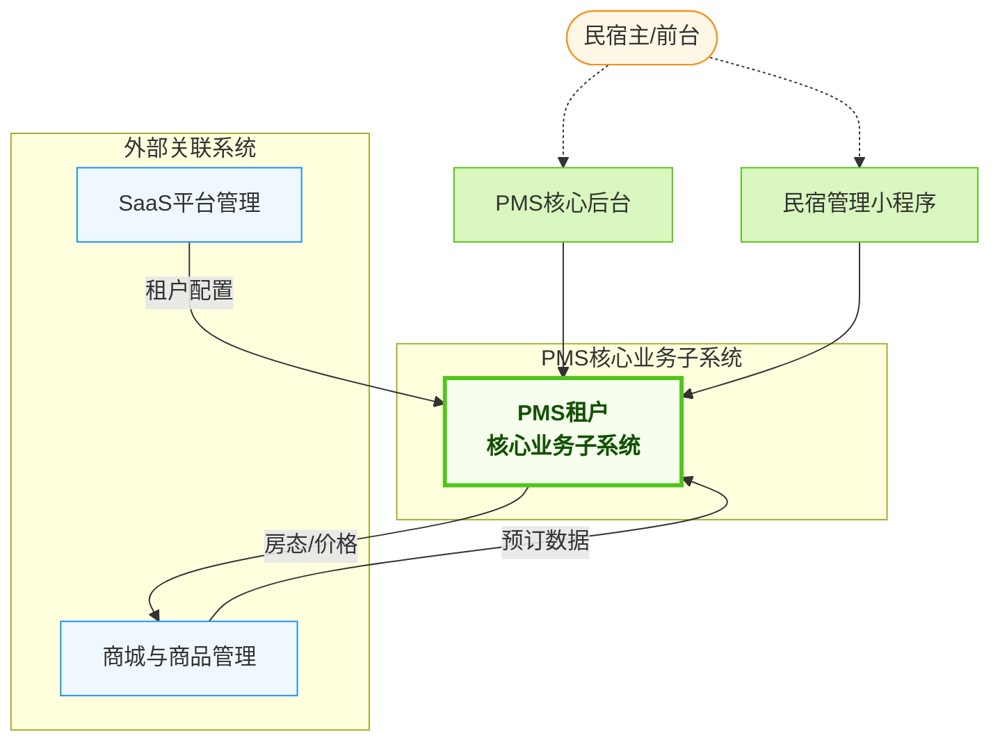
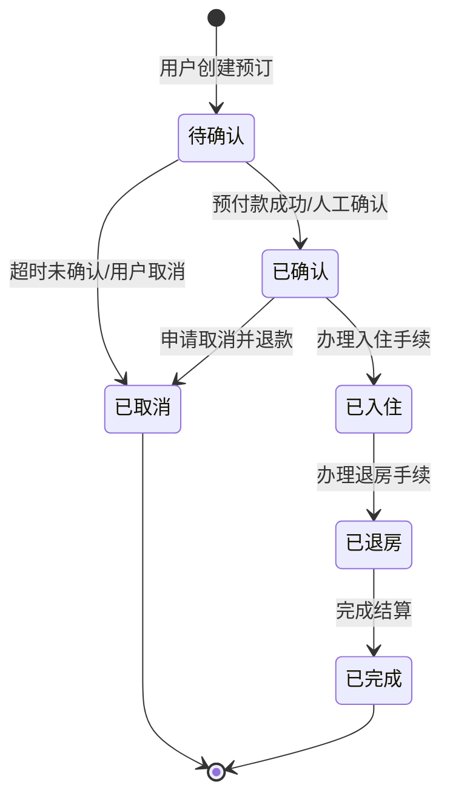
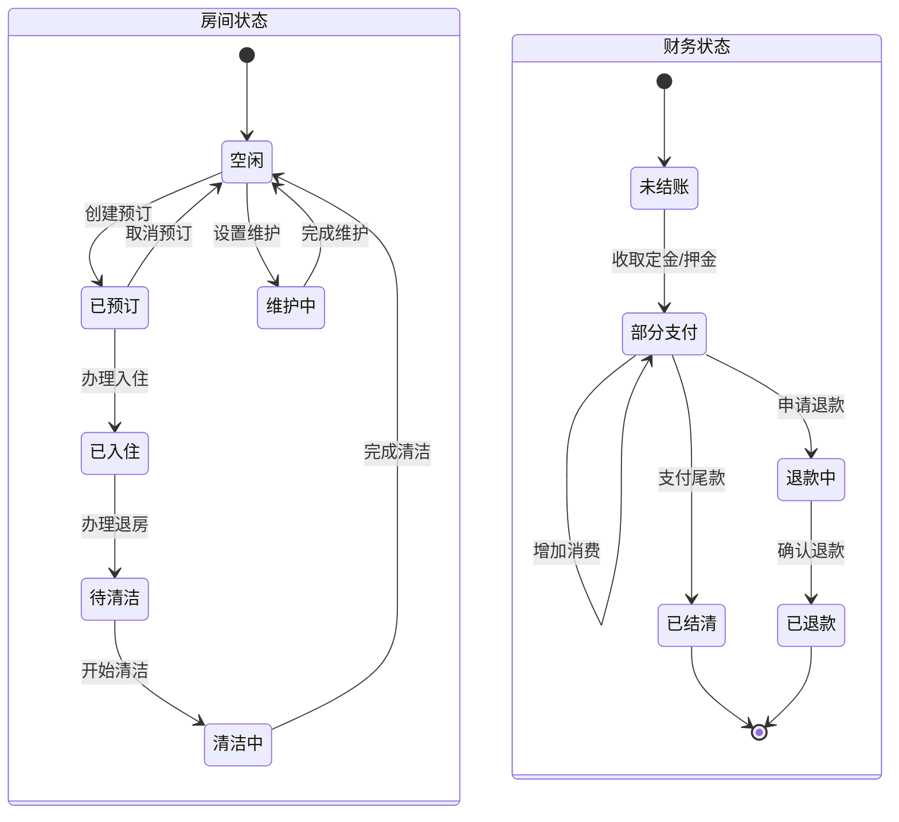
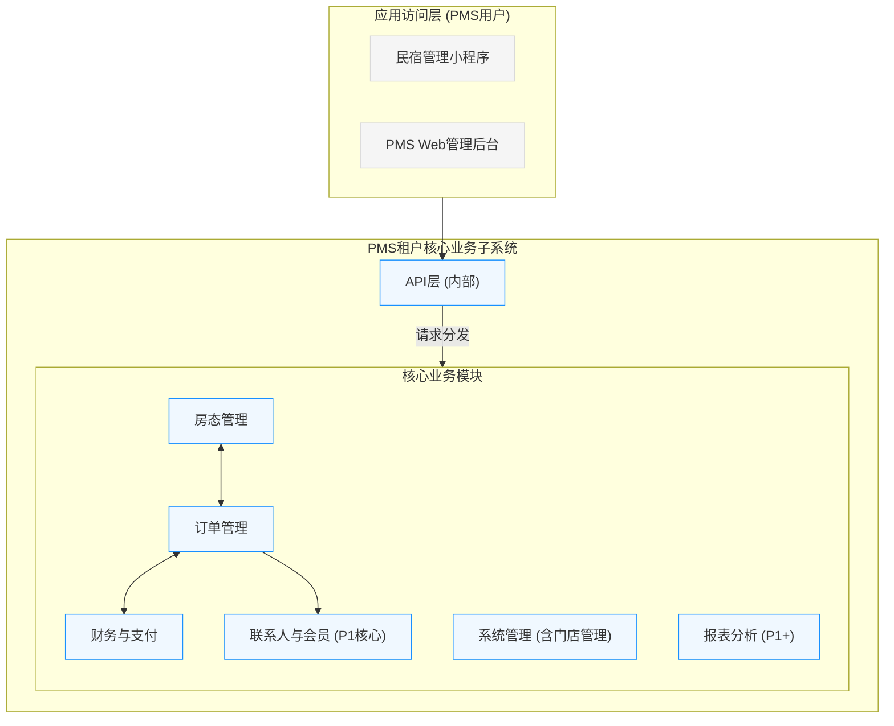
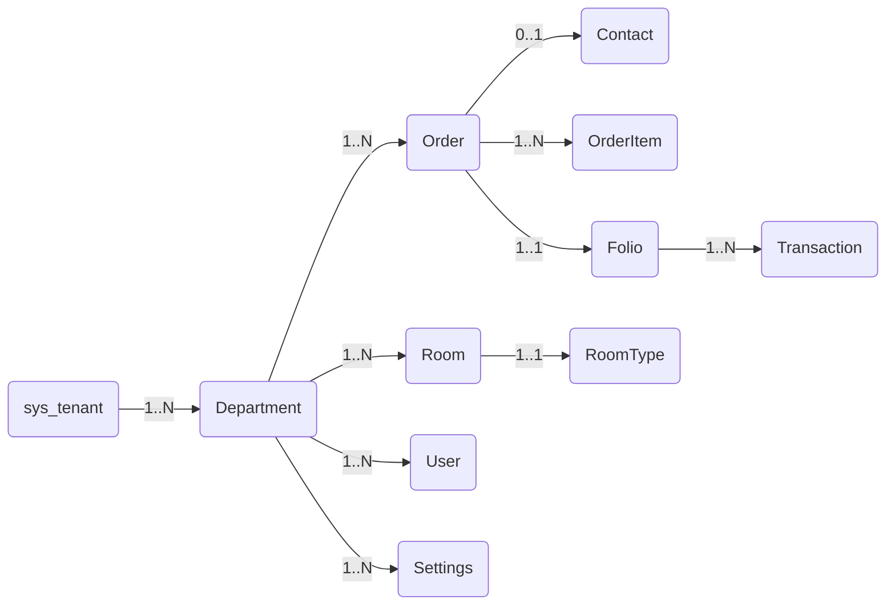
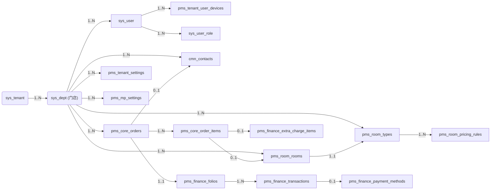

# 云宿居 PMS 系统 - 核心功能需求 (PMS内部聚焦)

## 1. 引言

### 1.1 文档目的与范围

本文档定义了"云宿居"民宿 Property Management System (PMS) 的核心功能需求，**重点聚焦于PMS租户核心业务子系统（以下简称PMS核心模块）的内部功能**。它旨在明确该子系统的核心功能范围和关键业务流程。

本文档是PMS核心模块后续详细设计和开发工作的基础。

### 1.2 目标读者

产品经理、架构师、开发工程师、测试工程师。

### 1.4 术语表

| 术语    | 全称                       | 描述                                                          |
| ------- | -------------------------- | ------------------------------------------------------------- |
| PMS     | Property Management System | 民宿/酒店属性管理系统，管理房间、预订、联系人、账务等核心业务 |
| Folio   | Folio                      | 客户账单，用于记录联系人在店期间所有费用和付款的详细清单      |
| Tenant  | Tenant                     | 租户，指使用本SaaS化PMS系统的单个民宿运营方                   |
| Dept    | Department                 | 部门，在本系统中表示租户下的门店/分店                         |
| Contact | Contact                    | 联系人，指系统中统一管理的客户信息，包括预订人、实际入住人等  |

### 1.5 优先级定义

*   **[P0]**: MVP 阶段必须实现的核心功能。
*   **[P1]**: 重要功能，MVP 后第一个主要版本包含。
*   **[P2]**: 次要或完善性功能，后续迭代实现。
*   **[P3]**: 未来规划或可选功能。

## 2. 核心设计原则 (适用于PMS内部)

1.  **核心稳固**: 保持PMS核心功能（房态、订单、账务、联系人）的极简和稳定。
2.  **数据为基**: 确保PMS核心数据结构设计合理，易于内部功能扩展。
3.  **安全隐私**: PMS内部数据处理需考虑数据安全和隐私保护。
4.  **门店为中心**: 所有业务数据以门店（部门）为归属单位，支持一个租户下多个门店的业务模型。

## 3. 系统架构概览 (PMS视角)

PMS租户核心业务子系统是整个云宿居平台的核心，负责处理民宿日常运营的核心业务流程。



## 4. PMS租户核心业务子系统 (PMSTenantCoreSubsystem)

**目标:** 为民宿租户提供稳定、高效的核心运营管理能力。
**主要用户:** 民宿主/管理员、前台员工。

#### 4.2.1 房态管理 [P0]
* **功能:**
    * **网格日历视图:** 直观展示房间占用情况（已预订、已入住、清洁中、维护锁定）。
    * **今日状态列表:** 按预抵、在住、预离分类展示当日订单/房间。
    * **清洁状态管理:** 手动标记房间清洁状态 (待清洁/清洁中/已干净)。
    * **快捷操作:** 在房态图上可快速创建预订、登记入住/退房、标记房间清洁状态、设置房间临时锁定/解锁。支持拖动修改预订的入住日期或房间。
* **关键数据:**
    * `pms_room_types` (room_type_id:BIGINT:pk, dept_id:BIGINT, name:VARCHAR(255), default_price:DECIMAL(10,2), capacity:INT, amenities:JSON, description:TEXT, images_json:JSON, status:VARCHAR(50))
    * `pms_room_rooms` (room_id:BIGINT:pk, dept_id:BIGINT, room_type_id:BIGINT, room_number:VARCHAR(50), floor:VARCHAR(50), room_status:VARCHAR(50), cleaning_status:VARCHAR(50), description:TEXT, status:VARCHAR(50)) 
    * `pms_room_locks` (lock_id:BIGINT:pk, dept_id:BIGINT, room_id:BIGINT, start_datetime:DATETIME, end_datetime:DATETIME, reason:TEXT, lock_type:VARCHAR(50))

#### 4.2.2 订单管理 [P0, P1, P2]
*   **目标:** 高效、准确地管理所有来源的预订订单。
*   **[P0] 核心订单生命周期管理:**
    *   功能: 手动创建订单、接收外部系统订单、订单详情查看与编辑、核心状态管理（待确认、已确认、已入住、已退房、已取消、未入住）、关联联系人与房间、生成账单基础、房态联动。
    *   库存策略: `pending_confirmation` 状态不锁硬库存。`confirmed` 状态锁定库存。
    *   关键数据:
        *   `pms_core_orders` (order_id:BIGINT:pk, dept_id:BIGINT, contact_id:BIGINT, primary_contact_name:VARCHAR(100), primary_contact_phone:VARCHAR(50), pms_room_id:BIGINT, room_type_id:BIGINT, channel_id:BIGINT, check_in_date:DATE, check_out_date:DATE, num_adults:INT, num_children:INT, estimated_arrival_time:TIME, total_amount:DECIMAL(10,2), paid_amount:DECIMAL(10,2), due_amount:DECIMAL(10,2), currency:VARCHAR(3), order_status:VARCHAR(50), order_source:VARCHAR(50), notes:TEXT, cancelled_at:DATETIME, cancellation_reason:TEXT)
        *   `pms_core_order_items` (order_item_id:BIGINT:pk, order_id:BIGINT, dept_id:BIGINT, pms_room_id:BIGINT, product_id:BIGINT, product_type:VARCHAR(50), description:VARCHAR(255), quantity:INT, unit_price:DECIMAL(10,2), total_price:DECIMAL(10,2), service_date:DATE, notes:TEXT)
        *   `pms_core_channels` (channel_id:BIGINT:pk, dept_id:BIGINT, name:VARCHAR(100), channel_type:VARCHAR(50), description:TEXT, status:VARCHAR(50))
    *   状态流转图:
        ```mermaid
        stateDiagram-v2
            [*] --> pending_confirmation: 创建订单
            pending_confirmation --> confirmed: 确认订单
            pending_confirmation --> cancelled: 取消订单
            confirmed --> checked_in: 办理入住
            confirmed --> cancelled: 取消订单
            confirmed --> no_show: 未按时入住
            checked_in --> checked_out: 办理退房
            checked_in --> extended: 延长入住
            extended --> checked_out: 办理退房
            checked_out --> [*] : 订单完成
            cancelled --> [*] : 订单取消
            no_show --> [*] : 订单标记为No Show
        ```
*   **[P1] 增强功能:** 订单修改（日期、房型等）、款项管理（预付款、押金）、取消与退款细则、基础支付记录（如手动录入）、自动化通知（预订成功、入住提醒）、订单备注与标签。
*   **[P2] 实用订单工具:** 简版团体预订、等候名单、订单报表、发票管理。

#### 4.2.3 财务与支付 (Folio Management) [P0]
* **功能:** 账单管理(Folio)、交易流水、附加消费管理、收款方式与记录、退款处理、账单生成与查询。
* **关键数据:**
    * `pms_finance_folios` (folio_id:BIGINT:pk, dept_id:BIGINT, order_id:BIGINT, total_charges:DECIMAL(10,2), total_payments:DECIMAL(10,2), total_refunds:DECIMAL(10,2), balance:DECIMAL(10,2), folio_status:VARCHAR(50), notes:TEXT, closed_at:DATETIME)
    * `pms_finance_transactions` (transaction_id:BIGINT:pk, folio_id:BIGINT, dept_id:BIGINT, transaction_type:VARCHAR(50), amount:DECIMAL(10,2), description:VARCHAR(255), payment_method_id:BIGINT, payment_gateway_txn_id:VARCHAR(255), transaction_time:DATETIME, related_order_item_id:BIGINT, notes:TEXT, is_void:BOOLEAN, voided_at:DATETIME, voided_reason:TEXT)
    * `pms_finance_payment_methods` (payment_method_id:BIGINT:pk, dept_id:BIGINT, name:VARCHAR(100), method_type:VARCHAR(50), details_json:JSON, status:VARCHAR(50))
    * `pms_finance_extra_charge_items` (item_id:BIGINT:pk, dept_id:BIGINT, name:VARCHAR(255), default_price:DECIMAL(10,2), category:VARCHAR(100), is_taxable:BOOLEAN, description:TEXT, status:VARCHAR(50))

#### 4.2.4 联系人与会员管理 [P1] (P0阶段依赖`cmn_contacts`部分字段)
* **功能 (P0涉及):** 订单关联联系人时，使用/创建`cmn_contacts`记录。
* **关键数据 (P0使用部分):**
    * `cmn_contacts` (contact_id:BIGINT:pk, dept_id:BIGINT, contact_type:VARCHAR(50), full_name:VARCHAR(255), phone_number:VARCHAR(50), email:VARCHAR(255), id_type:VARCHAR(50), id_number_encrypted:VARCHAR(255), gender:VARCHAR(20), contact_status:VARCHAR(50))
* **[P1] 功能:** 统一联系人档案、证件管理、联系人标签[P2]、联系人偏好[P2]、会员信息管理。

#### 4.2.5 会员营销 (储值、等级、权益) [P2]
* **功能:** 储值管理、会员等级定义与升级、会员权益定义与关联。

#### 4.2.6 租户级系统管理 [P0]
* **功能:**
    * **员工管理:** 租户管理员管理内部员工账号。
    * **角色与权限:** 租户管理员定义内部角色 [MVP: 预设固定角色]。
    * **基础设置:** 民宿信息、Logo等；房型管理；房间管理；基础定价策略 (`pms_room_types.default_price`, `pms_room_pricing_rules`表)；支付方式管理 (`pms_finance_payment_methods`)；附加消费项目 (`pms_finance_extra_charge_items`)。
    * **门店管理:** 在一个租户下管理多个门店，每个门店对应一个sys_dept记录。
    * **租户特定配置:** 管理租户全局及各门店特定的配置。
* **关键数据:**
    * `pms_tenant_settings` (setting_id:BIGINT:pk, tenant_id:VARCHAR(20), dept_id:BIGINT, setting_group:VARCHAR(100), setting_key:VARCHAR(100), setting_value:TEXT, value_type:VARCHAR(50), description:TEXT, is_sensitive:BOOLEAN)
      * 特殊说明: 保留tenant_id字段，当dept_id为NULL时表示租户全局配置，当dept_id有值时表示特定门店配置。主要存储PMS业务相关的配置项。
    * `pms_mp_settings` (setting_id:BIGINT:pk, tenant_id:VARCHAR(20), dept_id:BIGINT, setting_key:VARCHAR(100), setting_value:TEXT, value_type:VARCHAR(50), description:TEXT)
      * 特殊说明: 保留tenant_id字段，当dept_id为NULL时表示租户级小程序配置，当dept_id有值时表示特定门店的小程序配置。主要存储民宿管理小程序的界面和功能配置。
    * `pms_tenant_user_devices` (id:BIGINT:pk, user_id:BIGINT, device_type:VARCHAR(50), device_token:VARCHAR(512), app_version:VARCHAR(50), last_login_at:DATETIME, status:VARCHAR(50))
    * `pms_room_pricing_rules` (rule_id:BIGINT:pk, dept_id:BIGINT, name:VARCHAR(255), room_type_id:BIGINT, date_range_start:DATE, date_range_end:DATE, days_of_week_json:JSON, min_length_of_stay:INT, max_length_of_stay:INT, price_adjustment_type:VARCHAR(50), adjustment_value:DECIMAL(10,2), priority:INT, status:VARCHAR(50))

##### 4.2.6.1 员工管理
* **功能:** 民宿租户管理员管理本民宿的员工账号、分配角色。用户登录后，若关联多个租户或部门，提供切换租户和部门(门店)功能。

#### 4.2.7 简易报表与分析 [P1]
* **功能:** 核心运营报表 (总营收、入住率、ADR、RevPAR)、渠道来源分析、会员统计、消费分析。
* **特点:** 支持门店级和租户级统计分析。

#### 4.2.8 民宿管理小程序 (Owner We App) [P0]
* **技术:** 前端使用 Uni-App
* **功能:** 房态查看、订单提醒、日程查看（今日预抵/预离）、状态处理 (简单入住/退房操作)、数据概览（核心收支数据）。
* **特点:** 支持门店切换功能。

#### 4.2.9 PMS核心管理后台 [P0]
* **描述:** 提供独立的Web管理后台界面，完成所有PMS核心业务操作。

## 5. 关键业务场景模型图 (PMS内部)

### 5.1 订单状态图 - 房间预订生命周期



### 5.2 PMS核心业务状态图



### 5.3 PMS租户核心业务子系统组件图



## 6. 系统角色与权限概述 (PMS相关用户)

1.  **民宿租户管理员 (Tenant Admin):**
    *   用户实体: 关联到 `sys_user` 表。
    *   关联: 通过 `sys_user_role` 表关联到租户及相关角色。
    *   操作平台: PMS核心后台 (Web), 民宿管理小程序 (Uni-App)。
    *   核心职责: 管理其名下一个或多个民宿门店的完整运营，包括房型房间、订单、财务、员工、租户级系统设置等。
2.  **门店管理员 (Store Manager):**
    *   用户实体: 关联到 `sys_user` 表。
    *   关联: 通过 `sys_user_role` 表和 `sys_dept` 表关联到特定门店与角色。
    *   操作平台: PMS核心后台 (Web), 民宿管理小程序 (Uni-App)。
    *   核心职责: 管理特定门店的日常运营。
3.  **民宿前台/员工 (Tenant Staff):**
    *   用户实体: 关联到 `sys_user` 表。
    *   关联: 通过 `sys_user_role` 表和 `sys_dept` 表关联到门店及相关角色。
    *   操作平台: PMS核心后台 (Web), 民宿管理小程序 (Uni-App)。
    *   核心职责: 根据分配的权限执行日常操作，如订单处理、房态更新、联系人入住退房、账务录入等。

## 7. 实施策略与演进路径 (PMS P0重点)

### 7.1 MVP阶段 (PMS核心功能)
- **房态管理:** 基础房型、房间定义和日历视图。
- **订单管理:** 手动录单、接收外部订单（简化接口）、入住、退房基本流程。
- **财务与支付:** 基础账单 (Folio)、交易流水、手动收款/支付记录。
- **租户级系统管理:** 员工账号、门店管理、基础设置（房型、房间、基础价格、支付方式、附加消费项目）。
- **民宿管理小程序:** 房态查看和简单操作（入住/退房）。

## 8. 版本历史
- v2.8 (原始文档版本) - 本文档基于此裁剪和聚焦。
- v3.0 (最新版本) - 修改为"部门作为门店"的数据模型，业务表只关联sys_dept。

## 附录 (PMS内部核心实体)

### 附录A 概念性 E-R 图 (PMS核心)



### 附录B 实体关系图 (PMS核心及关联)


