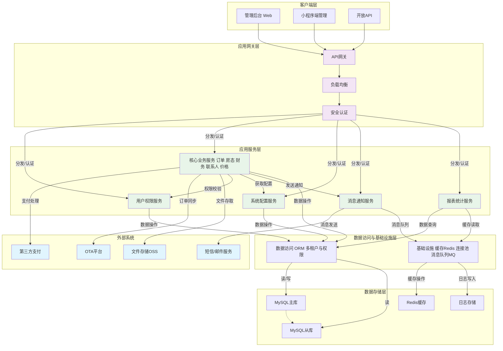
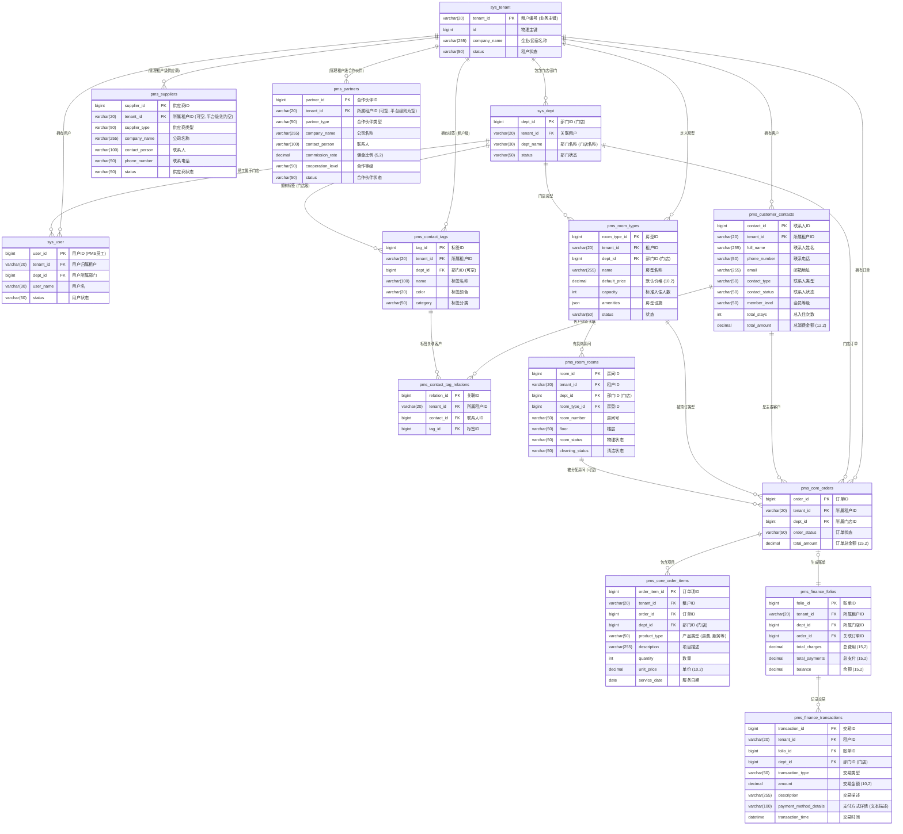
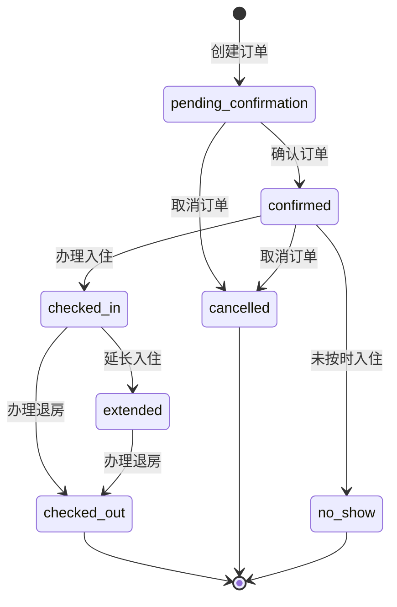
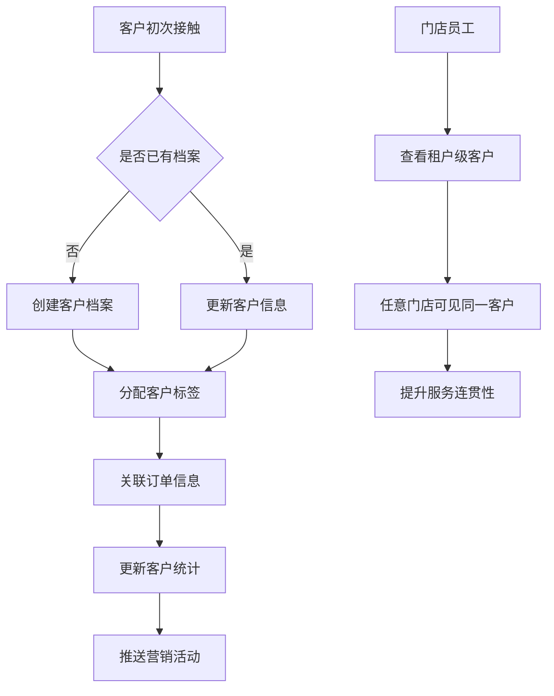
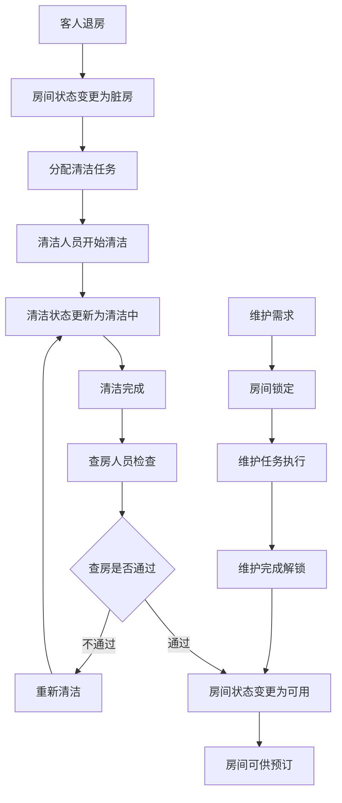
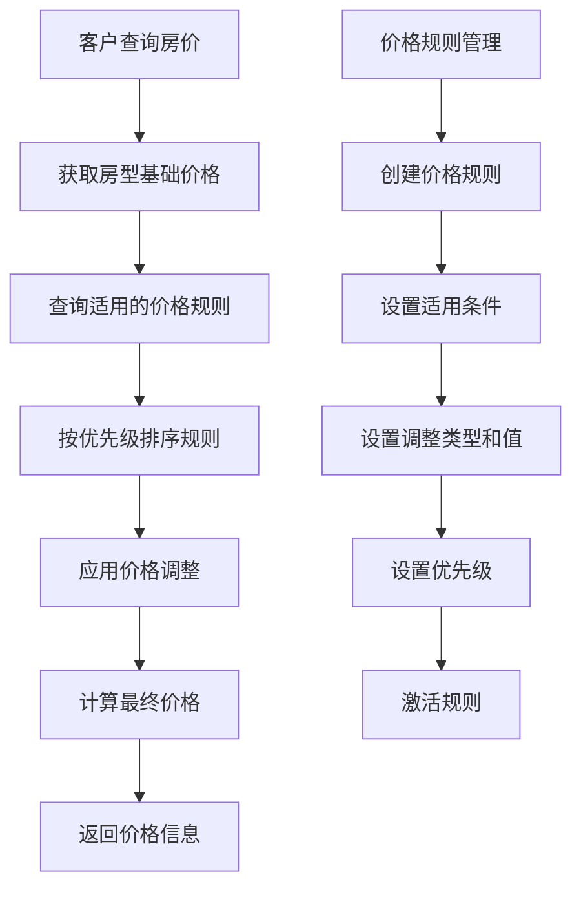
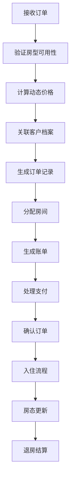
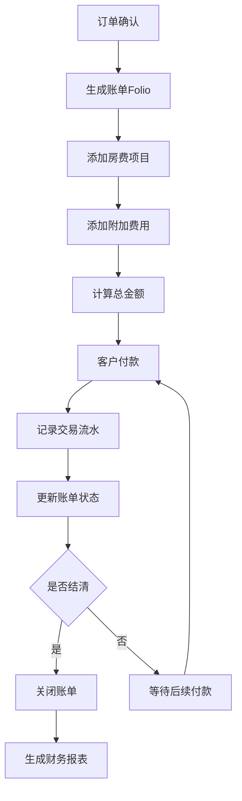
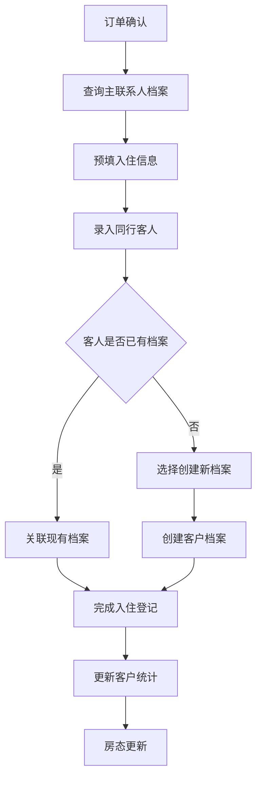
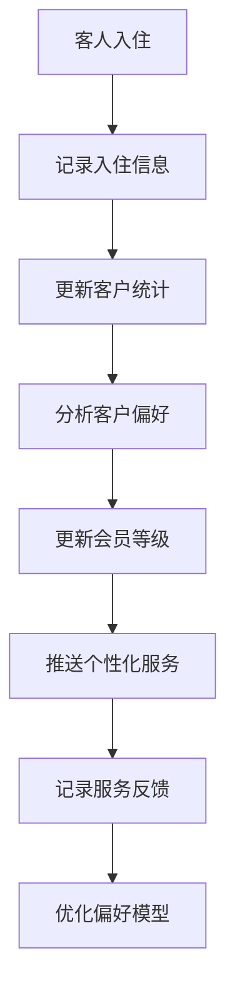

# 云宿居 PMS 系统需求规格说明书 (完整版 v4.3)

**快速导航：**
- [1. 项目概述](#1-项目概述)
- [2. 术语表](#2-术语表)
- [3. 系统架构](#3-系统架构)
- [4. 数据模型设计](#4-数据模型设计)
- [5. 核心功能模块](#5-核心功能模块)
- [6. 联系人管理](#6-联系人管理)
- [7. 房态管理](#7-房态管理)
- [8. 价格管理](#8-价格管理)
- [9. 订单管理](#9-订单管理)
- [10. 财务管理](#10-财务管理)
- [11. 系统配置管理](#11-系统配置管理)
- [12. 业务流程设计](#12-业务流程设计)
- [13. 接口设计规范](#13-接口设计规范)
- [14. 用户界面设计](#14-用户界面设计)
- [15. 非功能性需求](#15-非功能性需求)
- [16. 技术实现要求](#16-技术实现要求)
- [17. 部署与运维](#17-部署与运维)

## 1. 项目概述

### 1.1 项目背景
"云宿居"是一个面向中小型民宿经营者的 SaaS PMS（Property Management System）解决方案。基于若依框架构建，支持多租户架构，为民宿业主提供房间管理、订单处理、客户管理、财务结算等核心功能。

### 1.2 核心特色
- **多租户架构**: 单实例支持多个民宿品牌或经营者
- **门店级权限**: 支持连锁民宿的分店管理
- **客户信息共享**: 租户内客户信息在各门店间共享，提升服务体验
- **移动优先**: 支持小程序和H5，适配民宿日常运营场景

### 1.3 系统目标
- **提升运营效率**: 自动化房态管理、动态定价、智能配置
- **优化客户体验**: 租户级客户档案共享、个性化服务
- **增强收益管理**: 动态定价策略、多渠道管理、收益分析
- **保障数据安全**: 多层级权限控制、数据加密、审计追踪

### 1.4 适用范围
- **目标用户**: 中小型民宿经营者、连锁民宿品牌、民宿管理公司
- **业务规模**: 支持1-1000间房的民宿运营管理
- **地域范围**: 主要面向中国大陆地区，支持多语言扩展

### 1.5 核心用户角色
- **民宿主/管理员**: 系统的主要管理者，负责整体运营决策和系统配置
- **前台员工**: 日常操作人员，负责订单处理、入住退房、客户服务等

### 1.6 功能优先级策略
本系统采用分阶段开发策略，按优先级划分功能实现：
- **P0 (核心功能)**: 系统基础运营必需功能，第一阶段实现
- **P1 (重要功能)**: 提升运营效率的重要功能，第二阶段实现  
- **P2 (增强功能)**: 优化用户体验的增强功能，第三阶段实现
- **P3 (扩展功能)**: 面向未来的扩展功能，后续版本实现

## 2. 术语表

| 术语                       | 定义                   | 说明                                       |
| -------------------------- | ---------------------- | ------------------------------------------ |
| **租户(Tenant)**           | SaaS平台的独立客户单位 | 通常是一个民宿品牌或管理公司               |
| **门店(Department/Store)** | 租户下的具体经营场所   | 在系统中对应sys_dept表，表示具体的民宿分店 |
| **联系人(Contact)**        | 客户联系人信息         | 包括个人客人、企业联系人、代理商联系人等   |
| **客人(Guest)**            | 实际入住的客户         | 是联系人的一种类型，特指入住客户           |
| **房型(Room Type)**        | 标准化的房间类型定义   | 如标准间、豪华间、套房等                   |
| **房间(Room)**             | 具体的物理房间         | 有唯一房间号，属于某个房型                 |
| **订单(Order)**            | 预订记录               | 包含入住信息、客户信息、房间信息等         |
| **账单(Folio)**            | 财务账单               | 记录订单的费用明细和支付情况               |
| **渠道(Channel)**          | 订单来源渠道           | 如官网、OTA平台、电话预订等                |

**重要说明**: 在PMS系统中，`sys_dept` 表的记录代表**门店/分店**，而非传统意义上的部门。这是基于民宿行业的业务特点做出的设计决策。

## 3. 系统架构

### 4.1 总体架构



### 4.2 技术架构
- **后端框架**: Spring Boot + MyBatis-Plus + 若依框架
- **前端技术**: Vue3 + Element Plus + TypeScript
- **数据库**: MySQL 8.0 + Redis 6.0
- **消息队列**: RabbitMQ (可选)
- **文件存储**: 阿里云OSS / 本地存储
- **部署方式**: Docker + Kubernetes

### 4.3 多租户架构设计

#### 4.3.1 多层级权限控制
```
Level 1: 多租户拦截器 (自动)
├── 自动添加: WHERE tenant_id = #{currentTenantId}
└── 确保: 租户间数据完全隔离

Level 2: 门店级权限控制 (业务层)
├── 业务层添加: AND dept_id = #{currentDeptId}
└── 确保: 同租户不同门店数据隔离

Level 3: 租户级共享 (标准拦截器)
├── 适用表: 联系人信息、联系人标签
├── 拦截器自动添加: WHERE tenant_id = #{currentTenantId}
└── 确保: 租户内所有门店可见，租户间隔离

Level 4: 全局共享 (特殊处理)
├── 适用表: 系统配置、字典数据等
└── 确保: 全局数据对所有租户可见
```

#### 4.3.2 数据隔离策略
- **租户级隔离**: 联系人信息在租户内共享，所有门店都可以查看和使用
- **门店级隔离**: 订单、房间、财务等核心业务数据按门店隔离
- **标签灵活性**: 联系人标签支持门店级和租户级两种模式

## 4. 数据模型设计

### 5.1 核心实体关系图 (E-R图)


*注意：此E-R图为核心业务实体的概览。详细的表结构、字段定义、约束及索引设计，请参考最新的《PMS数据模型设计文档》。*

### 5.2 数据表分类

以下为PMS系统核心业务相关的数据表分类。详细的表结构和字段定义请参考《PMS数据模型设计文档》。

#### 5.2.1 若依基础表 (继承)
| 表名       | 说明                                     | 数据隔离 |
| ---------- | ---------------------------------------- | -------- |
| sys_tenant | 租户信息表                               | 全局     |
| sys_dept   | 部门表 (在本系统中作为**门店/分店**使用) | 租户级   |
| sys_user   | 用户信息表 (PMS系统员工)                 | 租户级   |
| sys_role   | 角色信息表                               | 租户级   |
*其他若依基础表按原框架定义使用。*

#### 5.2.2 客户管理表
| 表名                      | 说明                             | 数据隔离      |
| ------------------------- | -------------------------------- | ------------- |
| pms_customer_contacts     | 存储客户核心档案信息             | 租户级共享    |
| pms_contact_tags          | 定义客户标签，支持租户级和门店级 | 租户级/门店级 |
| pms_contact_tag_relations | 客户与标签的关联关系             | 租户级        |

#### 5.2.3 房间管理表 
| 表名           | 说明                                   | 数据隔离 |
| -------------- | -------------------------------------- | -------- |
| pms_room_types | 定义房型基础信息、价格、设施等         | 门店级   |
| pms_room_rooms | 管理具体的物理房间及其当前状态         | 门店级   |
| pms_room_locks | 记录房间的临时锁定信息（如维护、清洁） | 门店级   |

#### 5.2.4 价格管理表
| 表名                   | 说明                         | 数据隔离 |
| ---------------------- | ---------------------------- | -------- |
| pms_room_pricing_rules | 定义房价的动态调整规则和策略 | 门店级   |

#### 5.2.5 订单管理表
| 表名                 | 说明                                 | 数据隔离 |
| -------------------- | ------------------------------------ | -------- |
| pms_core_orders      | 存储客户预订的核心订单信息           | 门店级   |
| pms_core_order_items | 存储订单中的具体项目，如房费、服务费 | 门店级   |
| pms_core_channels    | 定义订单的来源渠道信息               | 门店级   |

#### 5.2.6 财务管理表
| 表名                           | 说明                               | 数据隔离 |
| ------------------------------ | ---------------------------------- | -------- |
| pms_finance_folios             | 管理客户在店期间的账务信息（账单） | 门店级   |
| pms_finance_transactions       | 记录所有财务相关的交易流水明细     | 门店级   |
| pms_finance_payment_methods    | 定义系统支持的支付方式             | 门店级   |
| pms_finance_extra_charge_items | 定义订单中可添加的附加费用项目     | 门店级   |

#### 5.2.7 合作方管理表
| 表名          | 说明                                  | 数据隔离     |
| ------------- | ------------------------------------- | ------------ |
| pms_suppliers | 存储供应商信息 (如清洁服务、物料供应) | 全局或租户级 |
| pms_partners  | 存储合作伙伴信息 (如旅行社、OTA平台)  | 全局或租户级 |
*全局共享数据通过 `tenant_id IS NULL` 实现，租户级数据则记录对应 `tenant_id`。*

#### 5.2.8 系统配置表
| 表名                    | 说明                                     | 数据隔离      |
| ----------------------- | ---------------------------------------- | ------------- |
| pms_tenant_settings     | 存储租户级或门店级的各项业务配置参数     | 租户级/门店级 |
| pms_mp_settings         | 存储小程序相关的配置信息                 | 租户级/门店级 |
| pms_tenant_user_devices | 存储用户登录过的设备信息，用于消息推送等 | 租户级        |

### 5.3 核心枚举值定义

系统中使用的各类业务状态和类型枚举值（例如：订单状态、客户类型、房间清洁状态等），其详细定义、可选值及完整列表请参考最新的《PMS数据模型设计文档》中的相应章节（通常在第5节"核心业务枚举值定义"）。

在本文档后续的功能描述中，会根据上下文需要提及关键的枚举值及其业务含义，但《PMS数据模型设计文档》是枚举定义的唯一权威来源，以确保信息的一致性和准确性。

## 6. 联系人管理

### 6.1 业务背景
联系人管理是PMS系统的核心模块，负责管理所有与业务相关的联系人信息，包括客户、供应商、合作伙伴等。采用租户级共享模式，确保租户内所有门店都能访问和使用客户联系人信息。

### 6.2 客户联系人核心功能
#### 6.2.1 基础联系人管理 [P0]
- **联系人档案**: 创建和维护客户基本信息（姓名、电话、邮箱等）。
- **订单关联**: 将联系人与其历史订单关联。
- **简单搜索**: 支持按姓名、电话等关键信息搜索联系人。

#### 6.2.2 会员体系 [P1]
- **会员等级**: 建立基础的会员等级体系。
- **积分系统**: 实现积分累积和兑换机制。
- **会员权益**: 为不同等级会员提供差异化权益。

#### 6.2.3 高级会员功能 [P2]
- **个性化服务**: 记录客户偏好，提供个性化服务。
- **会员营销**: 针对不同会员群体进行精准营销。
- **客户分析**: 提供客户价值分析和行为分析。

### 6.3 客户联系人数据模型与规则

#### 6.3.1 功能概述
- **关联数据表**: `pms_customer_contacts` (主表), `pms_contact_tags`, `pms_contact_tag_relations`
- **数据权限**: 客户联系人信息（`pms_customer_contacts`）为租户级共享，使用标准多租户拦截器。标签（`pms_contact_tags`）支持租户级和门店级。
- **业务范围**: 管理所有类型的客户联系人信息，包括其基本档案、会员信息、标签关联等。
*详细的表结构、字段定义、约束及索引设计，请参考最新的《PMS数据模型设计文档》。*

#### 6.3.2 核心字段设计
核心业务字段的描述保留在功能需求中，例如：
- **联系人类型 (`contact_type`)**: 用于区分不同类型的联系人，如散客、团队负责人、企业联系人等。具体枚举值参见数据模型文档。
- **联系人状态 (`contact_status`)**: 标识联系人的当前状态，如活跃、不活跃、黑名单。具体枚举值参见数据模型文档。
- **会员等级 (`member_level`)**: 记录联系人的会员级别。
- **证件号码 (`id_number_encrypted`)**: 存储加密后的客户证件号码，确保数据安全。
- 其他关键业务字段将在后续功能点中结合描述。

#### 6.3.3 业务规则
1. **唯一性约束**: 同一租户内，有效的手机号码 (`phone_number`) 应唯一。若系统配置要求，有效的、未作废的证件号码 (`id_number_encrypted`) 在同一租户内也应唯一。
2. **数据共享**: 客户联系人核心信息在租户内所有门店间共享。
3. **隐私保护**: 客户的证件号码、银行卡信息（如果涉及）等敏感数据必须加密存储，并遵循最小权限原则进行访问和展示（如脱敏显示）。
4. **状态管理**: 支持联系人的多种状态，并可能影响其相关业务操作（例如，黑名单客户可能无法创建新订单）。
5. **会员体系**: 支持多级会员等级，会员等级可与特定权益或价格策略关联。

### 6.4 联系人标签管理

#### 6.4.1 功能概述
- **关联数据表**: `pms_contact_tags` (标签定义表), `pms_contact_tag_relations` (客户与标签关联表)
- **数据权限**: 标签可以定义为租户级（`dept_id` 为 NULL）或门店级（`dept_id` 有效）。查询客户关联的标签时，会合并其可访问的租户级标签和所属门店的门店级标签。
- **灵活性**: 支持多种标签分类（如客户等级、偏好、来源等），并允许自定义标签颜色以增强可视化区分。
*详细的表结构、字段定义、约束及索引设计，请参考最新的《PMS数据模型设计文档》。*

#### 6.4.2 核心字段设计
- **标签名称 (`name`)**: 标签的显示名称，应简洁明了。
- **标签分类 (`category`)**: 用于对标签进行分组管理，便于筛选和应用。具体枚举值参见数据模型文档。
- **部门ID (`dept_id`)**: 用于区分租户级标签和门店级标签。

#### 6.4.3 标签关联管理
- 主要通过 `pms_contact_tag_relations` 表实现客户与标签的多对多关联。
- 创建关联时需校验标签的有效性和客户的可访问性（租户一致，门店标签需匹配或为租户级）。

## 7. 房态管理

### 7.1 核心功能与操作

#### 7.1.1 房态管理核心 [P0]
- **功能描述:**
    - **网格日历视图**: 直观展示房间在选定日期范围内的占用情况（已预订、已入住、清洁中、维护锁定）。
    - **今日状态列表**: 按预抵、在住、预离分类展示当日订单/房间。
    - **清洁状态管理**: 手动标记房间清洁状态（待清洁/清洁中/已干净）。
    - **快捷操作**: 在房态图上可快速创建预订、登记入住/退房、标记房间清洁状态、设置房间临时锁定/解锁。
- **核心操作:**
    - **查询房态**: 用户可按日期范围查看房态日历，不同状态房间用不同颜色标记。
    - **修改房间清洁状态**: 更新房间清洁状态，影响房态图显示。
    - **设置房间维护/锁定**: 设置房间维护或锁定状态，记录原因和时间范围。

### 7.2 房型管理
**数据表**: `pms_room_types`
**数据隔离**: 门店级隔离

**房型管理功能**:
- 房型定义、价格设置、设施配置
- 容量管理、图片上传、详细描述
- 床型信息、房间面积、设施标签

### 7.3 房间管理
**数据表**: `pms_room_rooms`
**数据隔离**: 门店级隔离

**房间管理功能**:
- 房间编号、楼层、当前状态
- 房间状态：可用/占用中/维护中/暂停服务
- 清洁状态：已清洁/待清洁/清洁中/已查房

### 7.4 实时房态监控
**数据表**: `pms_room_rooms`, `pms_room_locks`
**数据隔离**: 门店级隔离

**实时房态监控功能**:
- 房间状态实时显示：可用、占用中、维护中、暂停服务
- 清洁状态跟踪：已清洁、待清洁、清洁中、已查房
- 房态变更历史记录和审计

### 7.5 房间锁定管理
**数据表**: `pms_room_locks` (ER图中的定义)
**数据隔离**: 门店级隔离

**锁定类型**:
- 锁定类型：手动锁定、维护锁定、自动锁定、员工自用、清洁锁定
- 锁定时间段：开始时间、结束时间、锁定原因
- 批量锁定操作：支持多房间同时锁定

### 7.6 清洁流程管理
**清洁管理功能**:
- 清洁任务分配和跟踪
- 清洁标准检查清单
- 查房流程和质量控制
- 清洁人员工作量统计

### 7.7 维护计划管理
**维护管理功能**:
- 定期维护计划制定
- 维护任务分配和跟踪
- 维护成本记录和分析
- 设备保养提醒

## 8. 价格管理

### 8.1 动态定价规则
**数据表**: `pms_room_pricing_rules`
**数据隔离**: 门店级隔离

**基础价格设置**:
- 基础价格设置：房型默认价格
- 季节性价格调整：淡旺季价格策略
- 周末/节假日价格：特殊日期价格规则
- 连住优惠：最小/最大入住天数限制
- **价格调整类型**: 具体的调整类型（如固定价格覆盖、百分比折扣等）

### 8.2 价格规则管理
**价格规则功能**:
- 规则优先级设置：数字越大优先级越高
- 适用日期范围：开始日期、结束日期
- 适用星期设置：支持特定星期几
- 房型适用范围：全部房型或特定房型

### 8.3 价格计算引擎
**价格计算功能**:
- 多规则叠加计算
- 实时价格查询API
- 价格变更历史记录
- 收益分析和报表

### 8.4 价格计算历史追踪 [P0]
**数据表**: `pms_pricing_calculations`
**数据隔离**: 门店级隔离

**价格计算历史功能**:
- **计算过程记录**: 完整记录每次价格计算的过程和结果。
- **规则应用详情**: 记录哪些价格规则被应用，以及具体的调整金额。
- **价格审计**: 提供价格计算的完整审计轨迹，便于问题排查。
- **历史价格查询**: 支持查询历史某个时间点的价格计算结果。
- **价格趋势分析**: 基于历史计算数据分析价格变化趋势。

### 8.5 特殊日期价格管理 [P1]
**数据表**: `pms_special_date_pricing`
**数据隔离**: 门店级隔离

**特殊日期价格功能**:
- **节假日价格**: 支持国家法定节假日、传统节日的特殊定价。
- **活动日价格**: 支持本地活动、会展、赛事等特殊事件的定价。
- **日期类型管理**: 区分不同类型的特殊日期，如节假日、活动日、促销日等。
- **批量设置**: 支持批量设置连续日期的特殊价格。
- **优先级控制**: 特殊日期价格具有更高的优先级，覆盖常规价格规则。

### 8.6 高级价格规则 [P2]
**价格规则增强功能**:
- **渠道差异化定价**: 不同预订渠道可设置不同的价格策略。
- **客人数量定价**: 根据入住客人数量调整价格。
- **提前预订优惠**: 根据提前预订天数给予不同程度的优惠。
- **规则组合策略**: 支持多个价格规则的智能组合和冲突处理。
- **动态库存定价**: 根据剩余库存情况动态调整价格。
- **会员专享价格**: 为不同等级会员提供专属价格。

### 8.7 价格策略分析 [P2]
**价格分析功能**:
- **收益优化建议**: 基于历史数据和市场情况提供价格优化建议。
- **竞争对手价格监控**: 监控竞争对手的价格变化趋势。
- **价格弹性分析**: 分析价格变化对预订量的影响。
- **最优价格推荐**: 基于算法模型推荐最优价格策略。

## 9. 订单管理

### 9.1 订单核心功能

#### 9.1.1 核心订单生命周期管理 [P0]
- **功能描述:** 高效、准确地管理所有来源的预订订单，覆盖从订单创建到完成的整个生命周期。订单状态的详细定义 (如 `pending_confirmation`, `confirmed` 等) 
- **手动创建订单**: 支持前台为散客或电话预订创建订单。
- **接收商城订单**: 通过API自动接收来自C端商城H5的预订订单。
- **订单详情查看与编辑**: 查看订单的全部信息，允许在特定规则下修改部分信息。
- **核心状态管理**: 管理订单的基本状态流转：待确认、已确认、已入住、已退房、已取消、未入住。
- **关联联系人与房间**: 将订单与联系人档案和具体房号关联。
- **生成账单基础**: 为每个订单生成初始账单框架。
- **房态联动**: 订单的创建、确认、取消、入住、退房应实时更新PMS核心房态图。

#### 9.1.2 订单状态流转图


#### 9.1.3 订单状态历史追踪 [P0]
- **状态变更记录**: 完整记录订单状态的每次变更，包括变更时间、操作人、变更原因。
- **操作审计**: 追踪所有订单相关的关键操作，确保业务流程的可追溯性。
- **状态回滚支持**: 在特殊情况下支持订单状态的回滚操作。
- **变更通知**: 订单状态变更时自动通知相关人员。

#### 9.1.4 订单时间管理 [P0]
- **关键时间点记录**: 记录订单确认时间、实际入住时间、实际退房时间、取消时间等。
- **预计到达时间**: 支持客人预约到达时间，便于前台安排接待。
- **时间差异分析**: 分析计划时间与实际时间的差异，优化运营流程。
- **超时提醒**: 对超时未入住、超时未退房等情况进行自动提醒。

#### 9.1.5 入住客人信息管理 [P1]
- **主客人信息**: 记录订单主要联系人的详细信息。
- **同行客人管理**: 支持记录同行入住客人的基本信息和证件信息。
- **客人类型区分**: 区分成人、儿童、婴儿等不同类型客人。
- **证件信息加密**: 客人证件信息采用加密存储，确保数据安全。
- **入住登记**: 支持快速办理多人入住登记手续。
- **客人档案关联**: 支持将入住客人与租户级客户档案关联，实现客户信息积累和复用。
- **智能档案匹配**: 基于姓名、电话、证件号等信息智能匹配现有客户档案。
- **新档案创建**: 对于新客人，支持在入住登记时同步创建客户档案。

#### 9.1.6 客人与联系人关联管理 [P0]
- **主客人关联**: 订单主客人必须关联到客户联系人档案，用于客户关系维护。
- **同行客人选择性关联**: 同行客人可选择关联现有档案或创建新档案。
- **临时客人支持**: 支持不关联档案的临时入住客人，仅记录基本入住信息。
- **档案信息同步**: 客人信息变更时可选择同步更新客户档案。
- **统计数据更新**: 入住完成后自动更新客户档案的入住次数、消费金额等统计信息。

#### 9.1.7 订单管理增强功能 [P1]
- **订单修改**: 允许修改已确认订单的关键信息，系统需重新校验库存和价格。
- **款项管理**: 处理预付款、押金、部分付款的记录和跟踪。
- **取消与退款**: 支持更细致的取消政策配置，并根据政策处理退款流程。
- **基础支付集成**: 对接主流支付网关，支持在线支付扫码收款或记录线下收款。
- **自动化通知**: 通过短信或微信模板消息，发送订单状态相关的自动化通知。
- **订单备注与标签**: 支持为订单添加内部备注和自定义标签。
- **特殊要求处理**: 记录和处理客人的特殊要求，如房间偏好、服务需求等。

#### 9.1.8 实用订单工具与基础渠道对接 [P2]
- **简版团体预订管理**: 支持为团体设置统一联系人并关联多个订单。
- **等候名单**: 当房型在特定日期满房时，允许客人加入等候名单。
- **Channel Manager单向订单接收**: 通过与第三方Channel Manager对接，实现单向自动接收来自OTA的订单。
- **订单报表**: 提供多维度订单分析报表。
- **发票管理**: 支持为订单生成和管理发票信息。

### 9.2 订单处理 (详细定义)
**数据表**: `pms_core_orders`, `pms_core_order_items`, `pms_core_channels`, `pms_order_status_history`, `pms_order_guests`
**数据隔离**: 门店级隔离

**订单处理功能**:
- 订单创建、修改、取消、确认
- 入住/退房流程管理
- 客户信息关联（关联到租户级共享的客户档案）
- 房间分配与变更
- 订单状态历史追踪
- 入住客人信息管理

### 9.3 订单来源渠道管理
**数据表**: `pms_core_channels` (ER图中的定义)
**数据隔离**: 门店级隔离 (通常渠道定义可能是租户级或全局，但这里按订单关联的门店)

**渠道类型与配置**:
- **渠道类型**: 具体的渠道类型 (如 OTA, 直接预订等) 参见 [5.3.4 订单相关枚举](#534-订单相关枚举) 中 `pms_core_channels.channel_type` 的定义。
- **渠道配置**: 携程、飞猪、官网直订、电话预订、现场步入
- **渠道管理**: 渠道佣金设置和统计、渠道性能分析

### 9.4 订单项目管理
**数据表**: `pms_core_order_items` (ER图中的定义)
**数据隔离**: 门店级隔离

**订单项目功能**:
- 房晚费用、附加服务费用
- 项目描述、数量、单价、服务日期
- 费用调整和优惠处理

### 9.5 库存管理与房态联动 [P1]
**数据表**: `pms_room_inventory_snapshot`
**数据隔离**: 门店级隔离

**库存管理功能**:
- **实时库存查询**: 快速查询指定日期范围内的房型可用性。
- **库存快照**: 定期生成房型库存快照，提升查询性能。
- **超售保护**: 防止房间超售，确保库存准确性。
- **房态实时同步**: 订单状态变更时实时更新房间状态和库存。
- **可用性预测**: 基于历史数据预测未来库存紧张情况。

## 10. 财务管理

### 10.1 财务核心功能

#### 10.1.1 基础财务管理 [P0]
- **功能描述:** 为民宿提供完整的财务管理能力，确保收入准确记录和账务清晰。
- **账单(Folio)管理**: 为每个联系人/订单创建和维护详细的费用清单。
- **交易记录**: 记录所有收入和支出交易，包括房费、押金、额外消费等。
- **基础支付方式**: 支持现金、银行卡、微信支付、支付宝等常见支付方式。
- **简单对账**: 提供基础的收入汇总和对账功能。

#### 10.1.2 增强财务功能 [P1]
- **多币种支持**: 支持多种货币的收费和汇率转换。
- **发票管理**: 生成和管理各类发票。
- **财务报表**: 提供收入、支出、利润等基础财务报表。
- **预付款和押金管理**: 详细管理预付款、押金的收取和退还。

#### 10.1.3 高级财务工具 [P2]
- **成本核算**: 支持房间成本、运营成本的核算。
- **收益管理**: 提供ADR、RevPAR等关键指标分析。
- **税务管理**: 支持税务计算和申报辅助功能。

### 10.2 账单管理 (详细定义)
**数据表**: `pms_finance_folios`
**数据隔离**: 门店级隔离

**账单管理功能**:
- 自动生成订单账单、费用明细
- 支持额外费用添加、调整
- 账单状态：Refer to section [5.3.5 财务相关枚举](#535-财务相关枚举) for `pms_finance_folios.folio_status` values.

### 10.3 支付管理 (详细定义)
**数据表**: `pms_finance_payment_methods`
**数据隔离**: 门店级隔离 (支付方式定义通常是租户级或全局，但这里指门店可用的支付方式关联)

**支付管理功能**:
- 多种支付方式：Refer to section [5.3.5 财务相关枚举](#535-财务相关枚举) for `pms_finance_payment_methods.method_type` values.
- 支付记录、退款处理
- 押金管理、预付款处理

### 10.4 附加费用管理 (详细定义)
**数据表**: `pms_finance_extra_charge_items`
**数据隔离**: 门店级隔离

**附加费用功能**:
- 费用项目定义：项目名称、默认单价、费用类别 (Refer to section [5.3.5 财务相关枚举](#535-财务相关枚举) for `pms_finance_extra_charge_items.category` values)
- 税费设置：是否应税、税率配置
- 费用统计和分析

### 10.5 交易流水管理 (详细定义)
**数据表**: `pms_finance_transactions`
**数据隔离**: 门店级隔离

**交易流水功能**:
- 交易类型：Refer to section [5.3.5 财务相关枚举](#535-财务相关枚举) for `pms_finance_transactions.transaction_type` values.
- 支付网关集成：支付宝、微信支付接口
- 交易作废和冲销处理
- 财务对账和报表

## 11. 系统配置管理

### 11.1 系统管理核心功能

#### 11.1.1 基础系统管理 [P0]
- **功能描述:** 为租户提供系统配置和管理能力。
- **用户账号管理**: 管理租户内部员工账号和权限。
- **基础设置**: 配置民宿基本信息、营业时间等。
- **角色权限**: 基础的角色权限管理。

#### 11.1.2 增强管理功能 [P1]
- **高级权限控制**: 更细粒度的权限控制。
- **系统日志**: 查看系统操作日志。
- **数据备份**: 提供数据备份和恢复功能。

### 11.2 租户级配置管理 (详细定义)
**数据表**: `pms_tenant_settings`
**数据隔离**: 租户级和门店级配置

**租户级配置功能**:
- 配置分组：预订规则、财务参数、界面外观、业务流程
- 配置项管理：键值对存储、数据类型支持 (`value_type`)
- 敏感配置保护：加密存储 (`is_sensitive` field), 访问控制
- 配置继承：租户级配置、门店级覆盖 (通过 `dept_id` 可空实现)

### 11.3 小程序配置 (详细定义)
**数据表**: `pms_mp_settings`
**数据隔离**: 租户级和门店级配置 (通过 `dept_id` 可空实现)

**小程序配置功能**:
- 主题颜色、品牌标识、功能开关
- 支付配置、通知配置、地图配置
- 客户端版本管理、功能权限控制

### 11.4 设备管理 (详细定义)
**数据表**: `pms_tenant_user_devices`
**数据隔离**: 租户级

**设备管理功能**:
- 用户设备注册：iOS, Android, 微信小程序, Web (来自 `device_type`)
- 推送令牌管理 (`device_token`), 设备状态跟踪
- 设备登录历史 (`last_login_time`), 安全审计
- 多设备登录控制

### 11.5 配置项示例
```yaml
预订规则配置:
  - max_advance_booking_days: 365  # 最大提前预订天数
  - min_advance_booking_hours: 2   # 最小提前预订小时
  - allow_same_day_booking: true   # 允许当日预订
  - auto_confirm_booking: false    # 自动确认预订

财务参数配置:
  - default_currency: CNY          # 默认货币
  - tax_rate: 0.06                # 税率
  - deposit_percentage: 0.3        # 押金比例
  - cancellation_fee_rate: 0.1     # 取消费率

界面外观配置:
  - theme_color: "#409EFF"         # 主题色
  - logo_url: "/images/logo.png"   # 品牌标识
  - welcome_message: "欢迎入住"     # 欢迎语
```

### 11.6 配置模板管理 (新增功能)
**数据表**: 扩展 `pms_tenant_settings` 和 `pms_mp_settings`
**数据隔离**: 租户级

**配置模板功能**:
- 预定义配置模板：快速部署标准配置方案
- 模板分类管理：按业务场景分类（经济型、标准型、豪华型）
- 模板应用机制：一键应用模板到租户或门店
- 模板导入导出：支持配置方案的备份和迁移
- 模板版本管理：支持模板的版本控制和回滚

### 11.7 系统监控与审计 (新增功能)
**数据表**: 利用系统日志表和配置变更记录
**数据隔离**: 租户级

**监控功能**:
- 配置变更监控：实时监控配置项的变更情况
- 用户行为监控：跟踪用户的配置操作行为
- 性能监控：监控配置加载和应用的性能指标
- 安全审计：记录敏感配置的访问和修改日志
- 报警管理：配置异常变更的自动报警机制

### 11.8 配置继承与覆盖机制 (详细定义)
**实现方式**: 通过 `dept_id` 字段的空值处理

**继承规则**:
- 租户级配置：`dept_id` 为 NULL，作为默认配置
- 门店级配置：`dept_id` 非空，覆盖租户级配置
- 查询优先级：门店级配置 > 租户级配置 > 系统默认配置
- 配置合并：支持部分覆盖，未设置的项目继承上级配置

**覆盖策略**:
```yaml
配置查询逻辑:
  1. 查询门店级配置 (dept_id = 当前门店ID)
  2. 如果不存在，查询租户级配置 (dept_id IS NULL)
  3. 如果仍不存在，使用系统默认值
  4. 返回最终配置值

配置设置逻辑:
  1. 门店级设置：直接设置 dept_id = 门店ID
  2. 租户级设置：设置 dept_id = NULL
  3. 删除门店级配置：恢复继承租户级配置
```

### 11.9 敏感配置安全管理 (详细定义)
**安全机制**: 通过 `is_sensitive` 字段标识

**安全功能**:
- 加密存储：敏感配置值使用AES加密存储
- 访问控制：敏感配置需要特殊权限才能查看和修改
- 操作审计：所有敏感配置的操作都记录详细日志
- 脱敏显示：前端显示时对敏感信息进行脱敏处理
- 权限分级：不同角色对敏感配置有不同的访问权限

**敏感配置示例**:
```yaml
支付配置:
  - wechat_app_secret: "加密存储的微信小程序密钥"
  - alipay_private_key: "加密存储的支付宝私钥"
  - payment_callback_token: "加密存储的支付回调令牌"

第三方接口配置:
  - sms_api_key: "加密存储的短信服务API密钥"
  - email_smtp_password: "加密存储的邮件服务密码"
  - map_api_secret: "加密存储的地图服务密钥"
```

### 11.10 用户设备管理详细功能 (详细定义)
**数据表**: `pms_tenant_user_devices`
**数据隔离**: 租户级

**设备注册与管理**:
- 自动设备注册：用户登录时自动注册设备信息
- 设备信息收集：设备类型、设备名称、操作系统版本、应用版本
- 设备状态管理：活跃、不活跃、过期、阻止等状态控制
- 多设备支持：同一用户可在多个设备上登录

**推送令牌管理**:
- 令牌自动更新：设备令牌变更时自动更新
- 推送开关控制：用户可控制是否接收推送通知
- 推送历史记录：记录推送消息的发送和接收状态
- 批量推送支持：支持按设备类型、用户群体批量推送

**安全审计功能**:
- 登录历史记录：记录每次登录的时间、IP地址、位置信息
- 异常登录检测：检测异常登录行为并发出警告
- 设备锁定机制：可远程锁定或解锁特定设备
- 登录统计分析：提供用户登录行为的统计分析

### 11.11 小程序配置管理详细功能 (详细定义)
**数据表**: `pms_mp_settings`
**数据隔离**: 租户级和门店级

**主题配置管理**:
- 颜色主题：主色调、辅助色、背景色、文字色
- 品牌元素：Logo、品牌名称、Slogan、品牌介绍
- 界面布局：首页布局、菜单样式、按钮样式
- 多主题支持：支持预设主题和自定义主题

**功能开关管理**:
- 业务功能：在线预订、在线支付、客房服务、意见反馈
- 营销功能：优惠券、积分系统、会员等级、推荐奖励
- 社交功能：分享功能、评价系统、客服聊天
- 高级功能：人脸识别、语音助手、AR看房

**支付配置管理**:
- 支付方式：微信支付、支付宝、银联支付、现金支付
- 支付参数：商户号、密钥配置、回调地址
- 支付流程：支付超时时间、重试机制、退款策略
- 支付安全：支付验证、风控规则、异常监控

**通知配置管理**:
- 通知类型：预订确认、入住提醒、退房提醒、活动通知
- 通知渠道：小程序消息、短信通知、邮件通知
- 通知时机：提前通知时间、重复提醒设置
- 通知模板：消息模板管理、个性化内容设置

## 12. 业务流程设计

### 12.1 客户管理流程



### 12.2 房态管理流程



### 12.3 动态定价流程


### 12.4 订单处理流程



### 12.5 财务结算流程



### 12.6 入住登记优化流程



### 12.7 客户档案维护流程



## 13. 接口设计规范

### 13.0 通用约定

#### 13.0.1 标准成功响应结构
所有查询类（GET）和操作成功类（POST, PUT, DELETE 无特定返回内容时）的API在成功时，应返回如下结构体：
```json
{
  "code": 0, // 0 表示成功，其他业务错误码见下文
  "message": "操作成功", // 或 "查询成功"
  "data": {
    // 对于列表查询，通常包含 list 和 total/page/size
    // 对于单个对象查询或创建/更新操作，直接是对象本身或其ID
  }
}
```

#### 13.0.2 标准错误响应结构
当发生业务逻辑错误、参数校验失败、权限不足或服务器内部错误时，API应返回统一的错误结构体：
```json
{
  "code": 10001, // 具体业务错误码，非0
  "message": "具体的错误描述信息", // 例如 "参数校验失败：名称不能为空"
  "details": [ // 可选，用于提供更详细的错误点，例如多字段校验失败
    {"field": "fieldName", "message": "错误详情"}
  ]
}
```
**通用HTTP状态码约定:**
- `200 OK`: GET请求成功，PUT/PATCH部分更新成功。
- `201 Created`: POST请求成功创建资源。
- `204 No Content`: DELETE请求成功，响应体中无内容。
- `400 Bad Request`: 请求参数校验失败、请求体格式错误。
- `401 Unauthorized`: 未认证或认证无效。
- `403 Forbidden`: 已认证但无权限访问该资源。
- `404 Not Found`: 请求的资源不存在。
- `422 Unprocessable Entity`: 请求格式正确，但由于含有语义错误，无法响应。（例如，尝试创建一个已存在的唯一资源）
- `500 Internal Server Error`: 服务器内部发生未预期错误。

#### 13.0.3 分页参数约定
- `page` (integer, optional, default: 1): 请求的页码，从1开始。
- `size` (integer, optional, default: 10): 每页返回的记录数量，建议服务端限制最大值 (如100)。

#### 13.0.4 日期时间格式
- 所有API请求和响应中的日期时间格式统一使用 ISO 8601 格式，例如: `YYYY-MM-DDTHH:mm:ssZ` (UTC时间) 或 `YYYY-MM-DD HH:mm:ss` (带时区信息，具体由后端统一确定并在此明确)。推荐使用UTC时间。

### 13.1 客户管理API

#### 13.1.1 查询客户联系人列表
```http
GET /api/pms/customer-contacts
```
**描述**: 查询当前租户下的客户联系人列表，支持分页和多种条件筛选。多租户拦截器自动添加 `tenant_id` 过滤。
**权限**: `pms:customerContacts:list` (示例权限点)

**查询参数**:
- `page` (integer, optional, default: 1): 页码。
- `size` (integer, optional, default: 10): 每页数量。
- `contactType` (string, optional): 联系人类型 (枚举值参考《PMS数据模型设计文档》中 `pms_customer_contacts.contact_type` 定义)。
- `contactStatus` (string, optional): 联系人状态 (枚举值参考《PMS数据模型设计文档》中 `pms_customer_contacts.contact_status` 定义)。
- `memberLevel` (string, optional): 会员等级 (枚举值参考《PMS数据模型设计文档》中 `pms_customer_contacts.member_level` 定义)。
- `fullName` (string, optional, maxLength: 255): 联系人姓名 (模糊查询)。
- `phoneNumber` (string, optional, maxLength: 50): 联系电话 (精确或模糊查询)。
- `idNumber` (string, optional): 证件号码 (精确查询, 后端需处理加密匹配)。 （**注意隐私和安全风险，仅在必要且有权限时提供此查询方式**）
- `tagId` (long, optional): 包含指定标签ID的联系人。
- `sortBy` (string, optional, enum: `createTime`, `lastStayDate`, `totalAmount`): 排序字段。
- `sortOrder` (string, optional, enum: `asc`, `desc`, default: `desc`): 排序顺序。

**成功响应 (200 OK)**:
```json
{
  "code": 0,
  "message": "查询成功",
  "data": {
    "list": [
{
  "contactId": 1001,
        "tenantId": "T001",
        "contactType": "individual_guest",
        "fullName": "张三",
        "phoneNumber": "13800138000",
        "email": "zhangsan@example.com",
        "gender": "male", // 枚举值参考 PMS数据模型.md 5.1节
        "dateOfBirth": "1990-01-01",
        "idType": "ID_CARD", // 枚举值
        "idNumberMasked": "340***********1234", // 脱敏显示
        "nationalityCountryCode": "CHN",
        "addressProvince": "安徽省",
        "addressCity": "合肥市",
        "addressDistrict": "蜀山区",
        "addressDetail": "望江西路xxx号",
        "postalCode": "230000",
        "contactStatus": "active",
        "memberLevel": "gold",
        "totalStays": 5,
        "totalAmount": 2500.00,
        "lastStayDate": "2023-10-01",
        "remarks": "重要客户",
        "createTime": "2023-01-15T10:30:00Z",
        "updateTime": "2023-10-02T08:00:00Z",
        "tags": [
          {"tagId": 1, "name": "常客", "color": "#FF0000", "category": "contact_level"},
          {"tagId": 5, "name": "喜欢安静房间", "color": "#00FF00", "category": "contact_preference"}
        ]
      }
    ],
    "total": 120,
    "page": 1,
    "size": 10
  }
}
```

#### 13.1.2 创建客户联系人
```http
POST /api/pms/customer-contacts
```
**描述**: 创建一个新的客户联系人档案。
**权限**: `pms:customerContacts:add`

**请求体 (application/json)**: (字段参考 `pms_customer_contacts` 表定义，非所有字段都可创建，例如 `totalStays` 等统计字段后端自动处理)
```json
{
  "contactType": "individual_guest",                   // (string, required, 枚举值参考《PMS数据模型设计文档》中 pms_customer_contacts.contact_type 定义)
  "fullName": "李四",                                  // (string, required, minLength: 1, maxLength: 255)
  "phoneNumber": "13900139000",                      // (string, optional, unique in tenant, valid mobile format)
  "email": "lisi@example.com",                       // (string, optional, valid email format, maxLength: 255)
  "gender": "female",                                // (string, optional, 枚举值参考《PMS数据模型设计文档》中 pms_customer_contacts.gender 定义)
  "dateOfBirth": "1995-05-15",                       // (string, optional, format: YYYY-MM-DD)
  "idType": "ID_CARD",                               // (string, optional, enum, e.g., ID_CARD, PASSPORT)
  "idNumber": "34012319950515123X",                  // (string, optional, valid for idType, backend encrypts)
  "nationalityCountryCode": "CHN",                   // (string, optional, ISO 3166-1 alpha-3 code)
  "addressProvince": "北京市",                        // (string, optional, maxLength: 100)
  "addressCity": "北京市",                            // (string, optional, maxLength: 100)
  "addressDistrict": "朝阳区",                       // (string, optional, maxLength: 100)
  "addressDetail": "建国路xx号",                      // (string, optional, maxLength: 500)
  "postalCode": "100000",                            // (string, optional, valid postal code format)
  "memberLevel": "silver",                           // (string, optional, 枚举值参考《PMS数据模型设计文档》中 pms_customer_contacts.member_level 定义)
  "remarks": "希望高楼层",                             // (string, optional, maxLength: 1000)
  "tagIds": [1, 5]                                   // (array of long, optional): 创建时直接关联的标签ID
}
```
*注：`idNumber` 由前端传递明文，后端负责加密存储。电话号码在租户内应唯一（如果非空）。*

**成功响应 (201 Created)**:
```json
{
  "code": 0,
  "message": "客户联系人创建成功",
  "data": {
    "contactId": 1002 // 新创建的联系人ID
    // 可以考虑返回完整创建的资源，或至少关键信息
    // "contactId": 1002,
    // "fullName": "李四",
    // "contactType": "individual_guest",
    // ...
  }
}
```

#### 13.1.3 查询单个客户联系人详情
```http
GET /api/pms/customer-contacts/{contactId}
```
**描述**: 根据联系人ID查询其详细信息。
**权限**: `pms:customerContacts:view` 或 用户为该联系人本人 (需特定逻辑)

**路径参数**:
- `contactId` (long, required): 客户联系人ID。

**成功响应 (200 OK)**:
```json
{
  "code": 0,
  "message": "查询成功",
  "data": { // 结构同 13.1.1 查询列表中的单项，但可能包含更多详情字段
    "contactId": 1001,
    "tenantId": "T001",
    "contactType": "individual_guest",
    "fullName": "张三",
    "phoneNumber": "13800138000",
    "email": "zhangsan@example.com",
    "wechatOpenid": "wxopenid...", // 示例，若有
    "wechatUnionid": "wxunionid...", // 示例，若有
    "gender": "male",
    "dateOfBirth": "1990-01-01",
    "idType": "ID_CARD",
    "idNumberEncrypted": "xxxxxxx", // 后端存储的加密串，不直接返回给不具备权限的前端
    "idNumberMasked": "340***********1234", // 脱敏显示给前端
    "nationalityCountryCode": "CHN",
    "addressProvince": "安徽省",
    "addressCity": "合肥市",
    "addressDistrict": "蜀山区",
    "addressDetail": "望江西路xxx号",
    "postalCode": "230000",
    "contactStatus": "active",
    "memberLevel": "gold",
    "totalStays": 5,
    "totalAmount": 2500.00,
    "lastStayDate": "2023-10-01",
    "remarks": "重要客户",
    "createDept": 103, // 创建部门ID
    "createBy": 1, // 创建人用户ID
    "createTime": "2023-01-15T10:30:00Z",
    "updateBy": 2,
    "updateTime": "2023-10-02T08:00:00Z",
    "tags": [
      {"tagId": 1, "name": "常客", "color": "#FF0000", "category": "contact_level", "isSystem": false, "sortOrder": 1},
      {"tagId": 5, "name": "喜欢安静房间", "color": "#00FF00", "category": "contact_preference", "isSystem": false, "sortOrder": 2}
    ],
    "historicalOrders": [ // 简要历史订单信息，可分页
        {"orderId": 9001, "orderStatus": "checked_out", "checkInDate": "2023-10-01", "totalAmount": 500.00, "deptId": 103, "deptName": "黄山路店"}
    ]
  }
}
```

#### 13.1.4 更新客户联系人信息
```http
PUT /api/pms/customer-contacts/{contactId}
```
**描述**: 更新指定ID的客户联系人信息。
**权限**: `pms:customerContacts:edit`

**路径参数**:
- `contactId` (long, required): 要更新的客户联系人ID。

**请求体 (application/json)**: (字段同创建，但所有字段可选，仅提供需要修改的字段)
```json
{
  "fullName": "李四新",
  "phoneNumber": "13900139001",
  "email": "lisi.new@example.com",
  "memberLevel": "platinum",
  "remarks": "更新备注信息"
  // 不允许直接修改 tenantId, contactId, createTime 等系统控制字段
}
```
**成功响应 (200 OK)**:
```json
{
  "code": 0,
  "message": "客户联系人更新成功",
  "data": {
    "contactId": 1002 // 更新后的联系人ID，或返回完整更新后的对象
  }
}
```

#### 13.1.5 删除客户联系人
```http
DELETE /api/pms/customer-contacts/{contactId}
```
**描述**: 删除（逻辑删除）指定ID的客户联系人。
**权限**: `pms:customerContacts:delete`

**路径参数**:
- `contactId` (long, required): 要删除的客户联系人ID。

**成功响应 (204 No Content)**: (无响应体)

**业务规则**:
- 删除前检查该联系人是否有未完成的订单或未结清的账务。若有，根据策略可能禁止删除或提示用户。
- 逻辑删除，`del_flag` 置为 '1'。

#### 13.1.6 为客户批量添加标签
```http
POST /api/pms/customer-contacts/{contactId}/tags
```
**描述**: 为指定的客户联系人批量添加一个或多个标签。
**权限**: `pms:customerContacts:manageTags`

**路径参数**:
- `contactId` (long, required): 客户联系人ID。

**请求体 (application/json)**:
```json
{
  "tagIds": [3, 7] // (array of long, required, non-empty): 要添加的标签ID列表
}
```
**成功响应 (200 OK)**:
```json
{
  "code": 0,
  "message": "标签添加成功"
  // "data": {"addedCount": 2, "existingCount": 0} // 可选返回操作详情
}
```
**业务规则**:
- 标签ID必须是当前租户下有效的（租户级或客户所属门店的门店级标签）。
- 如果客户已有关联的标签，则忽略。

#### 13.1.7 从客户批量移除标签
```http
DELETE /api/pms/customer-contacts/{contactId}/tags
```
**描述**: 从指定的客户联系人批量移除一个或多个标签。
**权限**: `pms:customerContacts:manageTags`

**路径参数**:
- `contactId` (long, required): 客户联系人ID。

**请求体 (application/json)**:
```json
{
  "tagIds": [1, 5] // (array of long, required, non-empty): 要移除的标签ID列表
}
```
**成功响应 (200 OK)**:
```json
{
  "code": 0,
  "message": "标签移除成功"
  // "data": {"removedCount": 2} // 可选返回操作详情
}
```

---
### 13.2 联系人标签API (示例待细化)
```http
# 客户标签查询 (支持门店级和租户级)
GET /api/pms/contact-tags?deptId=103&category=contact_level
# 查询指定门店的标签，包含门店级和租户级标签

# 创建客户标签
POST /api/pms/contact-tags
# ...请求体包含 name, color, category, deptId (可选，门店级)

# 更新客户标签
PUT /api/pms/contact-tags/{tagId}

# 删除客户标签
DELETE /api/pms/contact-tags/{tagId}
```

### 13.3 房态管理API (示例待细化)

```http
# 房态实时查询 (日历视图/列表视图)
GET /api/pms/room-status?deptId=103&date=2024-01-01&viewType=calendar&startDate=...&endDate=...
# 返回指定门店指定日期范围的房态信息

# 房间锁定
POST /api/pms/room-locks
{
  "roomId": 201, // (long, required)
  "deptId": 103, // (long, required)
  "lockType": "maintenance", // (string, required, enum)
  "startDatetime": "2024-01-01T14:00:00Z", // (datetime, required)
  "endDatetime": "2024-01-01T18:00:00Z", // (datetime, required, must be after startDatetime)
  "reason": "空调维修" // (string, optional, maxLength: 500)
}

# 解锁房间 (删除房间锁定记录或更新其状态)
DELETE /api/pms/room-locks/{lockId}

# 清洁状态更新
PUT /api/pms/rooms/{roomId}/cleaning-status
{
  "cleaningStatus": "cleaning_in_progress", // (string, required, enum)
  "cleanerId": 1001 // (long, optional, 关联 sys_user.user_id)
}
```
### 13.4 价格管理API (示例待细化)

```http
# 价格查询 (计算特定房型在某时段的价格)
GET /api/pms/pricing/calculate?deptId=103&roomTypeId=101&checkInDate=2024-01-01&checkOutDate=2024-01-03&guests=2&channelCode=DIRECT
# 返回动态计算后的价格信息，包括明细

# 价格规则管理
GET /api/pms/pricing-rules?deptId=103&roomTypeId=101&status=active
POST /api/pms/pricing-rules
{
  "deptId": 103, // (long, required if not tenant-level rule)
  "name": "周末特价", // (string, required, maxLength: 100)
  "roomTypeId": 101, // (long, optional, null for all room types in dept/tenant)
  "dateRangeStart": "2024-01-01", // (date, required)
  "dateRangeEnd": "2024-12-31", // (date, required, must be after start)
  "daysOfWeekJson": "[6,7]", // (json array of int [1-7], optional)
  "priceAdjustmentType": "percentage_discount_from_base", // (string, required, enum)
  "adjustmentValue": 15.00, // (decimal, required, e.g., 15.00 for 15%)
  "minLOS": 1, // (int, optional, min length of stay)
  "maxLOS": null, // (int, optional, max length of stay)
  "priority": 10, // (int, required, higher value means higher priority)
  "status": "active" // (string, required, enum: active, inactive)
}
PUT /api/pms/pricing-rules/{ruleId}
DELETE /api/pms/pricing-rules/{ruleId}

```
### 13.5 订单管理API (示例待细化)

```http
# 订单查询 (门店级隔离)
GET /api/pms/orders?deptId=103&orderStatus=confirmed&checkInDate=2024-01-01
# 多租户拦截器 + 门店级权限控制

# 创建订单 (关联租户级客户)
POST /api/pms/orders
{
  "deptId": 103, // (long, required)
  "contactId": 1001, // (long, required, 关联租户级共享的客户)
  "roomTypeId": 201, // (long, required)
  "checkInDate": "2024-01-01", // (date, required)
  "checkOutDate": "2024-01-03", // (date, required, must be after checkInDate)
  "numAdults": 2, // (int, required, min: 1)
  "numChildren": 0, // (int, optional, default: 0)
  "channelId": 4, // (long, required, 渠道信息)
  "orderSource": "direct_phone", // (string, optional, enum from 5.3.4)
  "totalAmountCalculated": 1200.00, // (decimal, optional, 前端可预计算，后端需再校验和计算)
  "notes": "客人要求安静房间" // (string, optional)
}

# 获取订单详情
GET /api/pms/orders/{orderId}?deptId=103

# 修改订单状态 (例如：确认订单、取消订单、办理入住、办理退房)
PUT /api/pms/orders/{orderId}/status
{
  "deptId": 103, // (long, required)
  "orderStatus": "checked_in", // (string, required, enum)
  "assignedRoomId": 301, // (long, optional, required if checking in)
  "notes": "客人已入住301房间" // (string, optional)
}

# 修改订单信息 (例如：修改联系人、延住)
PUT /api/pms/orders/{orderId}
# ...请求体包含可修改的订单字段
```

### 13.6 财务管理API (示例待细化)

```http
# 账单查询
GET /api/pms/finance/folios?deptId=103&orderId=123&folioStatus=open
# 查询指定门店的开放账单

# 获取账单详情
GET /api/pms/finance/folios/{folioId}?deptId=103

# 添加账单项目 (手动添加费用)
POST /api/pms/finance/folios/{folioId}/items
{
  "deptId": 103,
  "description": "额外早餐", // (string, required)
  "quantity": 1, // (int, required)
  "unitPrice": 50.00, // (decimal, required)
  "productType": "extra_service", // (string, required)
  "serviceDate": "2024-01-02" // (date, required)
}


# 记录交易 (收款、退款等)
POST /api/pms/finance/transactions
{
  "deptId": 103, // (long, required)
  "folioId": 1001, // (long, required)
  "transactionType": "payment", // (string, required, enum from 5.3.5)
  "amount": 500.00, // (decimal, required, positive for payment/charge, negative for refund)
  "paymentMethodId": 1, // (long, required if type is payment/refund)
  "description": "房费支付 - 支付宝", // (string, required)
  "paymentGatewayTxnId": "ALIPAY_TXN_12345" // (string, optional)
}

# 获取支付方式列表
GET /api/pms/finance/payment-methods?deptId=103&status=active

# 获取附加费用项目列表
GET /api/pms/finance/extra-charge-items?deptId=103&category=food_beverage
```

## 14. 用户界面设计

### 14.1 客户管理页面

**客户列表页面**:
- 支持按客户类型、状态、标签筛选
- 显示客户基本信息、最近入住时间、消费金额
- 支持批量操作：添加标签、状态变更

**客户详情页面**:
- 客户基础信息编辑
- 标签管理：添加/移除标签，支持颜色显示
- 住宿历史：显示在租户内所有门店的住宿记录
- 消费统计：总消费、入住次数、平均消费

### 14.2 房态管理页面

**房态总览页面**:
- 房间状态可视化：网格布局显示所有房间状态
- 颜色编码：可用(绿色)、占用(红色)、维护(黄色)、锁定(灰色)
- 实时更新：房态变更自动刷新
- 快速操作：点击房间快速变更状态

### 14.3 价格管理页面

**价格规则管理**:
- 规则列表：显示所有价格规则及状态
- 规则创建向导：分步骤创建复杂规则
- 规则优先级拖拽排序
- 规则效果预览：显示规则应用后的价格变化

### 14.4 订单管理页面

**订单列表**:
- 按门店筛选，显示当前门店订单
- 客户信息显示：关联租户级客户档案
- 支持快速操作：房间分配、状态变更

## 15. 非功能性需求

### 15.1 性能要求
- **响应时间**: 页面加载时间 < 3秒，API响应时间 < 500ms
- **并发用户**: 支持1000个并发用户同时在线
- **数据处理**: 支持单租户10万条订单记录的快速查询
- **房态更新**: 房间状态变更实时推送延迟 < 1秒

### 15.2 可用性要求
- **系统可用性**: 99.5%以上的系统可用性
- **故障恢复**: 系统故障后5分钟内恢复服务
- **数据备份**: 每日自动备份，支持7天内数据恢复
- **容灾机制**: 支持异地容灾，RTO < 4小时，RPO < 1小时

### 15.3 安全性要求
- **数据加密**: 敏感数据AES-256加密存储
- **传输安全**: HTTPS/TLS 1.3加密传输
- **访问控制**: 基于RBAC的细粒度权限控制
- **审计日志**: 完整的操作审计日志，保存180天

### 15.4 兼容性要求
- **浏览器兼容**: 支持Chrome 80+、Firefox 75+、Safari 13+、Edge 80+
- **移动设备**: 支持iOS 12+、Android 8.0+
- **数据库**: MySQL 8.0+、Redis 6.0+
- **API兼容**: RESTful API，支持JSON格式

## 16. 技术实现要求

### 16.1 数据库设计
- 所有PMS业务表含 `tenant_id` 字段，支持多租户拦截器
- 客户相关表使用 `customer_contacts` 术语，体现业务准确性
- 索引设计优先考虑 `(tenant_id, dept_id, 业务字段)` 复合索引

### 16.2 缓存策略
- 客户标签缓存：租户级标签缓存，减少数据库查询
- 房间状态缓存：实时更新房间可用性
- 价格规则缓存：缓存活跃的价格规则，提升计算性能
- 权限数据缓存：用户权限和门店信息缓存
- 配置缓存：系统配置信息缓存，支持热更新

### 16.3 性能优化
- 客户查询优化：使用复合索引支持多条件查询
- 标签关联优化：批量查询客户标签关系
- 房态查询优化：房间状态查询使用索引优化
- 价格计算优化：规则引擎缓存和并行计算
- 分页查询：所有列表页面支持分页和排序

### 16.4 多租户拦截器配置
```yaml
# application.yml
tenant:
  enable: true
  excludes:
    # 若依系统表
    - sys_menu
    - sys_tenant
    - sys_tenant_package
    - sys_role_dept
    - sys_role_menu
    - sys_user_post
    - sys_user_role
    - sys_client
    - sys_oss_config
    # PMS供应商合作伙伴表 (支持全局共享，需从标准拦截器中排除，业务层处理 tenant_id IS NULL 或特定 tenant_id)
    - pms_suppliers
    - pms_partners
```

### 16.5 权限控制最佳实践
1. **联系人信息**: 直接查询，让多租户拦截器自动处理（`tenant_id` 过滤）。
2. **联系人标签**: 业务层添加 `(dept_id = #{currentDeptId} OR dept_id IS NULL)` 条件，结合多租户拦截器实现门店级和租户级标签的查询。
3. **订单等门店级数据**: 多租户拦截器自动处理 `tenant_id`，业务代码中需额外添加 `dept_id` 过滤。
4. **供应商与合作伙伴**: 由于支持平台级共享（`tenant_id` IS NULL）和租户级数据，这些表已从标准多租户拦截器中排除。业务层查询时需手动处理 `tenant_id` 条件，例如 `WHERE (tenant_id IS NULL OR tenant_id = #{currentTenantId})`。

## 17. 部署与运维

### 17.1 移动端支持

#### 17.1.1 小程序 (核心管理功能)
  - 移动端房态总览与状态变更 (清洁, 维护, 占用等)
  - 客户信息快速查询与核心信息编辑
  - 订单创建、查看、修改与核心处理 (如分配房间, 办理入住/退房)
  - 日常清洁与维护任务分配与状态更新
  - 基础价格查看 (价格调整可能仍需后台)
  - 接收重要系统通知与告警

### 17.2 安全与合规

#### 17.2.1 数据安全
- 租户间数据完全隔离
- 客户隐私信息加密存储（身份证号等）
- 操作日志记录和审计
- 敏感配置加密存储

#### 17.2.2 权限控制
- 基于角色的访问控制
- 门店级数据权限隔离
- API接口权限验证
- 配置修改权限控制

### 17.3 监控与运维
- **系统监控**: CPU、内存、磁盘、网络监控
- **应用监控**: 接口响应时间、错误率、吞吐量
- **业务监控**: 订单量、房态变更、支付成功率
- **日志管理**: 集中化日志收集、分析、告警

### 17.4 部署架构
- **容器化部署**: Docker + Kubernetes
- **负载均衡**: Nginx + Keepalived
- **数据库集群**: MySQL主从复制 + Redis集群
- **文件存储**: 阿里云OSS / MinIO

---

**版本历史:**
- v1.0 - 初始版本，基本功能需求
- v2.0 - 增加多租户和权限控制需求
- v3.0 - 联系人管理重构，采用标准化表结构和权限模型
- v4.0 - 完整版需求文档，整合所有功能模块和技术要求
- v4.1 - 订单管理和价格管理功能增强，补充状态追踪、时间管理、客人信息、价格历史、特殊日期价格等高级功能
- v4.2 - 客人信息管理优化，增强客人与联系人档案的关联管理，完善入住登记和客户档案维护流程
- v4.3 - 系统配置管理模块完善，新增配置模板管理、系统监控、敏感配置安全管理、用户设备管理等功能

**重要变更说明 (v4.3):**
- **系统配置管理功能完善**: 新增配置模板管理、系统监控与审计、配置继承与覆盖机制、敏感配置安全管理等高级功能
- **用户设备管理**: 新增用户设备注册、推送令牌管理、安全审计、多设备支持等功能
- **小程序配置管理**: 新增主题配置、功能开关、支付配置、通知配置等小程序专项管理功能
- **配置安全增强**: 支持敏感配置加密存储、访问控制、操作审计、脱敏显示等安全机制
- **配置继承机制**: 完善租户级和门店级配置的继承与覆盖逻辑，支持灵活的配置管理策略
- **系统监控功能**: 新增配置变更监控、用户行为监控、性能监控、安全审计、报警管理等监控功能

**重要变更说明 (v4.2):**
- **客人信息管理优化**: 完善 `pms_order_guests` 表设计，支持与客户档案的智能关联
- **入住登记流程优化**: 支持主联系人自动关联、同行客人档案匹配、新档案创建等功能
- **客户档案维护**: 增强客户信息同步、统计更新、偏好分析等功能
- **数据一致性保障**: 通过关联查询避免数据冗余，确保客户信息的一致性和准确性

**重要变更说明 (v4.1):**
- **订单管理功能增强**: 新增订单状态历史追踪、订单时间管理、入住客人信息管理、库存管理与房态联动等功能模块
- **价格管理功能完善**: 新增价格计算历史追踪、特殊日期价格管理、高级价格规则、价格策略分析等功能模块
- **数据表补充**: 新增 `pms_order_status_history`、`pms_order_guests`、`pms_pricing_calculations`、`pms_special_date_pricing`、`pms_room_inventory_snapshot` 等数据表支持
- **功能优先级调整**: 重新评估和调整各功能模块的优先级，确保核心功能优先实现
- **业务流程优化**: 完善订单生命周期管理和价格计算流程，提升系统的业务支撑能力
