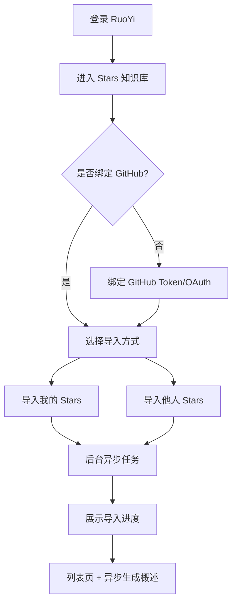
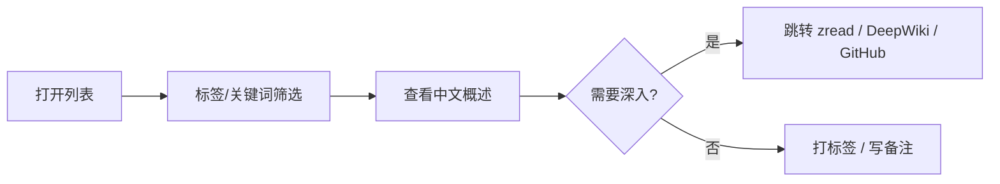

# PRD：GitHub Stars 知识库模块

| 属性 | 值 |
|------|-----|
| **产品名称** | GitHub Stars 知识库（Stars Library） |
| **模块代号** | `stars-library` |
| **所属平台** | RuoYi-Vue-Plus |
| **版本** | v1.0 MVP |
| **状态** | Draft |
| **作者** | Product Discovery |
| **最后更新** | 2026-05-22（v1.1 需求澄清） |

---

## 1. 概述

### 1.1 背景

开发者在 GitHub 上长期积累 Stars（几十到几千不等），但 GitHub 原生 Stars 列表存在明显短板：

- 缺少自定义分类与标签，难以按「场景 / 技术栈」检索
- 大量英文仓库无 description 或描述过于简略
- 收藏后缺少「中文概述」与「收藏理由」，导致重复搜索、重复 clone
- 无法便捷导入「他人的 Stars 清单」作为 curated list 参考

### 1.2 产品定位

在 RuoYi-Vue-Plus 中新增 **`stars-library` 业务模块**，为每个登录用户提供：

1. **导入** — 自己的 GitHub Stars 或任意公开用户的 Stars 列表
2. **组织** — 大模型自动生成**分类与标签**；用户可编辑、追加自定义标签与备注
3. **理解** — **DeepSeek** 大模型自动生成中文项目概述（可编辑）
4. **探索** — 一键跳转 GitHub / zread.ai / DeepWiki 做深度了解
5. **前端** — 独立 **Vue3 + TypeScript + Element Plus + Vite** 应用，**PC + H5** 响应式访问

### 1.3 MVP 边界

| 范围内 | 范围外（Non-goals） |
|--------|---------------------|
| 公开 Stars 导入（自己 / 他人） | 私有仓库 |
| 用户级数据隔离（多租户） | 团队共享清单 / 协作标签 |
| 标签 + 搜索 + 分页列表 | zread MCP 内嵌查询 |
| LLM 中文概述 + **自动分类/标签**（DeepSeek，异步） | DeepWiki 自托管 |
| Vue3 + TS + Element Plus + Vite 前端（PC + H5） | 原生 App / 小程序 |
| 外链 zread / DeepWiki | 自动同步 Stars 变更（Webhook） |
| GitHub OAuth / PAT 绑定 | 导出 / 对外 API（P1） |

---

## 2. 问题陈述

> **我们相信**：RuoYi 平台中的开发者用户，在管理 GitHub Stars 时难以在 30 秒内定位并理解目标项目，因为 GitHub 原生列表缺少自定义分类、中文概述和场景化检索；当 Stars 规模从几十增长到上千时，这一痛点显著加剧。

### 2.1 成功指标

| 指标 | 基线（GitHub 原生） | MVP 目标 | 测量方式 |
|------|---------------------|----------|----------|
| 找项目耗时 | 5–15 分钟 | **≤ 30 秒** | 用户自报 + 埋点 |
| 概述覆盖率 | ~0%（中文） | **≥ 80%** 已导入仓库 | `summary_status=done / total` |
| 概述可用率 | — | **≥ 80%** 无需大改（人工抽检 ≥4/5） | 抽样 50 条 |
| 导入成功率 | — | **≥ 99%**（1000 条规模） | 任务监控 |
| 列表查询 P95 | — | **≤ 500ms** | APM |

---

## 3. 用户画像

### Persona A：重度 Star 收藏家

- **角色**：全栈 / 后端开发者，Stars 500–3000+
- **痛点**：「想不起来搜什么」，只记得场景不记得 repo 名
- **期望**：标签筛选 + 中文概述，30 秒判断是否深入

### Persona B：技术选型参考者

- **角色**：Tech Lead / 架构师
- **痛点**：想参考某大神的 Stars 清单，手动 fork 成本高
- **期望**：输入 GitHub 用户名一键导入，按标签浏览 curated list

### Persona C：轻度用户

- **角色**：Stars 50 以内
- **痛点**：英文 README 阅读成本高
- **期望**：导入后自动有中文一句话概述

---

## 4. 用户流程

### 4.1 首次使用



### 4.2 日常使用



---

## 5. 功能需求

### 5.1 GitHub 账号绑定（P0）

| ID | 需求 | 优先级 |
|----|------|--------|
| FR-01 | 用户可绑定 GitHub Personal Access Token（`public_repo` + `read:user` 范围） | P0 |
| FR-02 | Token 加密存储，仅用于拉取 Stars；用户可随时解绑/更新 | P0 |
| FR-03 | 绑定后可显示 GitHub 用户名与头像 | P1 |

> **说明**：MVP 采用 PAT 绑定，实现成本低；P1 可升级为 GitHub OAuth App。

### 5.2 Stars 导入（P0）

| ID | 需求 | 优先级 |
|----|------|--------|
| FR-10 | **导入我的 Stars**：使用绑定 Token 调用 `GET /user/starred`，支持分页全量导入 | P0 |
| FR-11 | **导入他人 Stars**：输入 GitHub 用户名，调用 `GET /users/{username}/starred`（公开 API） | P0 |
| FR-12 | 导入为**异步任务**，展示进度（总数 / 已处理 / 失败数） | P0 |
| FR-13 | 去重：以 `owner/repo` 为唯一键，同一用户重复导入不重复插入 | P0 |
| FR-14 | 增量导入：再次「同步我的 Stars」仅新增/更新，不删除用户已打标签的记录 | P0 |
| FR-15 | 导入来源记录：`self` / `{username}` | P0 |
| FR-16 | 处理 GitHub API rate limit：OAuth/PAT 5000/h；遇 403 暂停并提示 | P0 |

### 5.3 仓库列表与检索（P0）

| ID | 需求 | 优先级 |
|----|------|--------|
| FR-20 | 分页列表，默认按导入时间倒序；支持按 Star 数、更新时间、语言排序 | P0 |
| FR-21 | 关键词搜索：匹配 repo 名、owner、description、中文概述、备注 | P0 |
| FR-22 | 标签筛选：多选 AND/OR（MVP 默认 OR） | P0 |
| FR-23 | 按导入来源筛选（我的 / 某用户） | P0 |
| FR-24 | 按概述状态筛选：待生成 / 生成中 / 已完成 / 失败 | P1 |
| FR-25 | 卡片展示：名称、owner、语言、Star 数、标签、中文概述摘要、外链 | P0 |

### 5.4 标签管理（P0）

| ID | 需求 | 优先级 |
|----|------|--------|
| FR-30 | 用户可创建 / 编辑 / 删除自定义标签（名称 + 可选颜色） | P0 |
| FR-31 | 单条或批量为仓库打标签 | P0 |
| FR-32 | 系统预设标签 taxonomy（可选用，不强制）：`AI/RAG`、`Java`、`参考实现`、`待评估` 等 | P1 |
| FR-33 | 标签使用次数统计 | P2 |

### 5.5 备注与收藏理由（P0/P1）

| ID | 需求 | 优先级 |
|----|------|--------|
| FR-40 | 每条用户-仓库关系可填写「收藏理由 / 备注」（纯文本，≤500 字） | P0 |
| FR-41 | 备注纳入全文搜索 | P0 |

### 5.6 AI 中文概述（P0）

| ID | 需求 | 优先级 |
|----|------|--------|
| FR-50 | 导入完成后，**异步队列**触发概述生成任务 | P0 |
| FR-51 | 输入：repo 名、description、README 前 3000 字符（GitHub API `readme`）、主要语言 | P0 |
| FR-52 | 输出结构：`one_liner`（≤50 字）+ `summary`（≤200 字，3 行以内）+ `category`（主分类，1 个）+ `tags`（≤5 个标签） | P0 |
| FR-52a | **导入时自动应用** AI 生成的分类与标签：自动创建不存在的标签；分类写入 `stars_user_repo.category` | P0 |
| FR-52b | 用户可修改/删除 AI 标签，可覆盖 AI 分类；修改后标记 `classification_source=manual` | P0 |
| FR-53 | 用户可手动编辑概述；编辑后标记 `summary_source=manual` | P0 |
| FR-54 | 单条「重新生成概述」 | P0 |
| FR-55 | 批量「为选中项重新生成」 | P1 |
| FR-56 | 失败重试（最多 3 次，指数退避） | P0 |
| FR-57 | 概述生成限流：每用户并发 ≤3，全局可配置 | P0 |

### 5.7 深度探索外链（P0）

| ID | 需求 | 优先级 |
|----|------|--------|
| FR-60 | 跳转 GitHub 仓库页 | P0 |
| FR-61 | 跳转 `https://zread.ai/{owner}/{repo}` | P0 |
| FR-62 | 跳转 DeepWiki（`https://deepwiki.com/{owner}/{repo}` 或配置项） | P0 |

### 5.8 管理后台（P0）

| ID | 需求 | 优先级 |
|----|------|--------|
| FR-70 | RuoYi 菜单：「Stars 知识库」→ 列表 / 导入 / 标签管理 | P0 |
| FR-71 | 权限：`stars:repo:list`、`stars:repo:import`、`stars:tag:edit` 等 | P0 |
| FR-72 | 数据按 `user_id` 隔离（非 admin 仅看自己的） | P0 |

---

## 6. 非功能需求

| ID | 类别 | 要求 |
|----|------|------|
| NFR-01 | 规模 | 单用户支持 **5000** 条 Stars 记录；列表 P95 ≤ 500ms |
| NFR-02 | 导入 | 1000 条 Stars 全量导入 ≤ 10 分钟（含 GitHub API 限流等待） |
| NFR-03 | 概述 | 单条概述生成 P95 ≤ 30s（含 LLM 调用） |
| NFR-04 | 安全 | GitHub Token AES 加密；日志脱敏；仅服务端调用 GitHub API |
| NFR-05 | 可用性 | 概述生成失败不影响列表浏览；降级展示 description |
| NFR-06 | 可观测 | 导入任务、概述任务 Prometheus 指标（参考 `ai-structured` AiMetrics） |
| NFR-07 | 合规 | 遵守 GitHub API Terms；README 内容仅用于生成概述，不对外传播 |

---

## 7. 技术方案

### 7.1 模块结构

```
ruoyi-modules/stars-library/
├── controller/          # REST API
├── domain/              # Entity, Bo, Vo
├── mapper/              # MyBatis-Plus
├── service/             # 业务逻辑
├── github/              # GitHub API Client
├── ai/                  # 概述生成（Spring AI ChatClient）
├── messaging/           # Kafka 消费者/生产者（异步任务）
└── config/              # 配置类
```

- 在 `ruoyi-modules/pom.xml` 注册子模块
- 在 `ruoyi-admin/pom.xml` 引入依赖
- 复用 `ai-structured` 的 Spring AI 配置模式（`ChatClient` + 结构化输出）

### 7.2 技术栈

| 层 | 选型 |
|----|------|
| 后端 | Java 17, Spring Boot 3, MyBatis-Plus |
| 异步 | Kafka（与 `ai-structured` 一致）或 Redis 延迟队列（二选一，推荐 Kafka） |
| AI | Spring AI `ChatClient` + **DeepSeek**（`deepseek-chat`，概述与分类/标签共用） |
| 缓存 | Redis（概述结果、GitHub 响应短期缓存） |
| 前端 | 独立仓库 **`stars-web`**：Vue3 + TypeScript + Element Plus + Vite；响应式布局支持 **PC + H5** |
| DB | MySQL 8 |

### 7.3 数据模型

```sql
-- GitHub 绑定
CREATE TABLE stars_github_account (
    id            BIGINT PRIMARY KEY,
    user_id       BIGINT NOT NULL UNIQUE COMMENT 'RuoYi 用户 ID',
    github_login  VARCHAR(100),
    access_token  VARCHAR(500) COMMENT 'AES 加密',
    token_scope   VARCHAR(200),
    bind_time     DATETIME,
    update_time   DATETIME
);

-- 仓库全局缓存（跨用户共享元数据，减少 GitHub API 调用）
CREATE TABLE stars_repo (
    id              BIGINT PRIMARY KEY,
    full_name       VARCHAR(200) NOT NULL UNIQUE COMMENT 'owner/repo',
    owner           VARCHAR(100) NOT NULL,
    repo_name       VARCHAR(100) NOT NULL,
    description     TEXT,
    language        VARCHAR(50),
    stargazers_count INT DEFAULT 0,
    html_url        VARCHAR(500),
    readme_snippet  TEXT COMMENT 'README 前 3000 字符缓存',
    github_updated_at DATETIME,
    create_time     DATETIME,
    update_time     DATETIME
);

-- 用户-仓库关系（核心表）
CREATE TABLE stars_user_repo (
    id              BIGINT PRIMARY KEY,
    user_id         BIGINT NOT NULL,
    repo_id         BIGINT NOT NULL,
    import_source   VARCHAR(50) NOT NULL COMMENT 'self | {github_username}',
    note            VARCHAR(500) COMMENT '收藏理由/备注',
    category        VARCHAR(50) COMMENT 'AI/手动主分类',
    classification_source VARCHAR(20) COMMENT 'ai|manual',
    summary_one_liner VARCHAR(100) COMMENT '中文一句话',
    summary_text    VARCHAR(500) COMMENT '中文概述',
    summary_status  VARCHAR(20) DEFAULT 'pending' COMMENT 'pending|processing|done|failed|manual',
    summary_source  VARCHAR(20) COMMENT 'ai|manual',
    import_time     DATETIME,
    UNIQUE KEY uk_user_repo (user_id, repo_id)
);

-- 标签
CREATE TABLE stars_tag (
    id          BIGINT PRIMARY KEY,
    user_id     BIGINT NOT NULL,
    name        VARCHAR(50) NOT NULL,
    color       VARCHAR(20),
    UNIQUE KEY uk_user_tag (user_id, name)
);

-- 用户-仓库-标签
CREATE TABLE stars_user_repo_tag (
    user_repo_id BIGINT NOT NULL,
    tag_id       BIGINT NOT NULL,
    PRIMARY KEY (user_repo_id, tag_id)
);

-- 导入任务
CREATE TABLE stars_import_job (
    id            BIGINT PRIMARY KEY,
    user_id       BIGINT NOT NULL,
    job_type      VARCHAR(20) COMMENT 'self_sync | import_user',
    source_login  VARCHAR(100) COMMENT '他人导入时的 username',
    status        VARCHAR(20) COMMENT 'pending|running|done|failed|partial',
    total_count   INT DEFAULT 0,
    processed_count INT DEFAULT 0,
    failed_count  INT DEFAULT 0,
    error_message TEXT,
    start_time    DATETIME,
    end_time      DATETIME
);
```

### 7.4 API 设计（REST）

| Method | Path | 说明 |
|--------|------|------|
| POST | `/stars/github/bind` | 绑定 GitHub Token |
| DELETE | `/stars/github/unbind` | 解绑 |
| GET | `/stars/github/status` | 绑定状态 |
| POST | `/stars/import/self` | 导入/同步我的 Stars |
| POST | `/stars/import/user/{login}` | 导入他人 Stars |
| GET | `/stars/import/jobs` | 导入任务列表 |
| GET | `/stars/import/jobs/{id}` | 任务进度 |
| GET | `/stars/repos` | 分页列表（含筛选） |
| GET | `/stars/repos/{id}` | 详情 |
| PUT | `/stars/repos/{id}` | 更新备注/概述 |
| POST | `/stars/repos/{id}/regenerate-summary` | 重新生成概述 |
| POST | `/stars/repos/batch-tags` | 批量打标 |
| GET/POST/PUT/DELETE | `/stars/tags` | 标签 CRUD |

### 7.5 AI 概述生成

**Prompt 模板（示意）：**

```
你是技术项目分析助手。根据以下 GitHub 仓库信息，用中文输出 JSON：
- one_liner: 一句话说明项目做什么（≤50字）
- summary: 3行以内概述，包含技术栈、适用场景（≤200字）
- category: 主分类（从预设 taxonomy 中选 1 个，或给出最接近的）
- tags: 最多5个中文标签（技术栈、场景、领域）

预设 taxonomy：AI/RAG、后端框架、前端组件、DevOps、数据库、工具库、学习参考、待评估

仓库：{full_name}
Description：{description}
Language：{language}
README 摘要：
{readme_snippet}
```

**实现要点：**

- 使用 `ChatClient` + `.entity(RepoSummary.class)` 结构化输出（参考 `ai-structured`）
- Kafka Topic：`stars.summary.request` / `stars.summary.result`
- Consumer 调用 LLM，更新 `stars_user_repo.summary_*`
- README 获取：`GET /repos/{owner}/{repo}/readme`，Base64 解码，截断 3000 字符
- 缓存：同一 `repo_id` 的 README 24h 内不重复拉取

### 7.6 GitHub API 集成

| 场景 | API | 认证 |
|------|-----|------|
| 我的 Stars | `GET /user/starred?per_page=100&page=n` | 用户 PAT |
| 他人 Stars | `GET /users/{login}/starred?per_page=100&page=n` | 可选 PAT（提高限额） |
| README | `GET /repos/{owner}/{repo}/readme` | 无认证或 PAT |
| Rate limit | `GET /rate_limit` | — |

**限流策略：**

- 导入任务分页拉取，间隔 100ms
- 遇 `403` / `429`：读取 `Retry-After`，任务暂停后自动续跑
- 未绑定 Token 导入他人列表：使用服务端共享 Token（配置项），并提示用户绑定以提高限额

---

## 8. 界面要点（前端）

### 8.1 技术栈与响应式

| 项 | 要求 |
|----|------|
| 框架 | Vue 3 + TypeScript + Vite |
| UI | Element Plus（含移动端适配组件） |
| 布局 | 响应式：PC 侧边栏 + 宽列表；H5 底部 Tab + 卡片流 |
| 断点 | `<768px` 手机布局；`≥768px` PC 布局 |
| 认证 | 对接 RuoYi 后端 JWT / Sa-Token |
| 仓库 | 独立前端项目 `stars-web/`（与 `ruoyi-admin` API 分离部署或同域代理） |

### 8.2 页面清单

| 页面 | PC | H5 | 功能 |
|------|----|----|------|
| **Stars 列表** | ✓ | ✓ | 卡片/表格视图、分类/标签筛选、搜索、排序 |
| **导入中心** | ✓ | ✓ | 绑定 GitHub、导入我的/他人、任务进度 |
| **仓库详情** | ✓ | ✓ | 概述、AI 分类/标签（可编辑）、备注、外链 |
| **标签管理** | ✓ | 简化版 | CRUD |

### 8.2 列表卡片信息架构

```
┌─────────────────────────────────────────────────┐
│ owner/repo                          ★ 12.3k    │
│ [Java] [AI/RAG] [参考实现]                       │
│ 一句话：基于 Spring AI 的 RAG 示例项目…           │
│ 概述：提供文档切片、向量检索…（可展开）            │
│ 备注：收藏于 2025-03，用于工单分类参考             │
│ [GitHub] [Zread] [DeepWiki] [编辑] [重新生成]    │
└─────────────────────────────────────────────────┘
```

---

## 9. 权限设计

| 权限标识 | 说明 |
|----------|------|
| `stars:repo:list` | 查看自己的 Stars 列表 |
| `stars:repo:query` | 查看详情 |
| `stars:repo:edit` | 编辑备注/概述 |
| `stars:repo:import` | 触发导入 |
| `stars:tag:list` | 查看标签 |
| `stars:tag:edit` | 管理标签 |
| `stars:github:bind` | 绑定 GitHub |

默认赋予普通用户角色上述权限；Admin 可查看统计仪表盘（P2）。

---

## 10. 风险与反模式

| 风险 | 影响 | 缓解 |
|------|------|------|
| GitHub API 限流 | 大列表导入失败 | PAT 绑定 + 任务续跑 + 进度透明 |
| LLM 概述质量不稳定 | 用户不信任 | 可编辑 + 重新生成 + 展示 description 兜底 |
| 导入即全量 AI 调用 | 成本爆炸 | 异步队列 + 限流；优先概述无 description 的仓库 |
| README 过大/非文本 | 生成失败 | 截断 + 降级仅用 description |
| **反模式：先做完美分类体系** | 用户不愿维护 | MVP 允许自由标签，不做强制 taxonomy |
| **反模式：同步 GitHub 双向写** | 复杂度高 | MVP 只读导入，不写回 GitHub |

---

## 11. 里程碑

| 阶段 | 周期 | 交付 |
|------|------|------|
| **M1 基础** | 2 周 | 模块骨架、数据表、GitHub 导入（自己+他人）、列表分页 |
| **M2 组织** | 1 周 | 标签 CRUD、批量打标、搜索筛选 |
| **M3 智能** | 2 周 | Kafka 异步概述、LLM 集成、编辑/重生成 |
| **M4 体验** | 1 周 | 导入进度、外链、前端 polish、权限菜单 |
| **合计** | **~6 周** | MVP 上线 |

---

## 12. 用户故事（P0 实施清单）

### US-01：绑定 GitHub

- **As a** 开发者
- **I want to** 绑定 GitHub Token
- **so that** 系统能导入我的 Stars 列表

**Acceptance Criteria：**
- **Given** 我已登录 RuoYi
- **When** 我在导入中心提交有效 PAT
- **Then** 系统加密存储 Token 并显示 GitHub 用户名
- **And** 无效 Token 返回明确错误提示

### US-02：导入我的 Stars

- **As a** 已绑定 GitHub 的用户
- **I want to** 一键导入我的全部 Stars
- **so that** 我能在平台内统一管理

**Acceptance Criteria：**
- **Given** 我已绑定 GitHub，Stars 数量为 N
- **When** 我点击「同步我的 Stars」
- **Then** 创建异步任务并展示进度
- **And** 完成后列表显示 N 条记录（去重）
- **And** 每条记录触发概述生成任务

### US-03：导入他人 Stars

- **As a** 技术选型者
- **I want to** 输入 GitHub 用户名导入其公开 Stars
- **so that** 我能参考 curated list

**Acceptance Criteria：**
- **Given** 目标用户 Stars 为公开
- **When** 我输入用户名并确认导入
- **Then** 系统拉取全部公开 Stars 并标记来源
- **And** 私有或不存在用户返回友好错误

### US-04：标签筛选

- **As a** 重度 Star 用户
- **I want to** 为仓库打标签并按标签筛选
- **so that** 我能按场景快速定位项目

**Acceptance Criteria：**
- **Given** 列表中有 500+ 仓库
- **When** 我选择标签「AI/RAG」
- **Then** 列表仅显示含该标签的仓库
- **And** P95 响应 ≤ 500ms

### US-05：中文概述

- **As a** 中文用户
- **I want to** 看到 AI 生成的中文项目概述
- **so that** 我无需读英文 README 即可判断是否深入

**Acceptance Criteria：**
- **Given** 仓库已导入且 README 可获取
- **When** 概述任务完成
- **Then** 卡片显示一句话 + 三行概述
- **And** 我可编辑并保存
- **And** 失败时显示「生成失败，点击重试」

### US-06：深度探索

- **As a** 开发者
- **I want to** 从列表一键跳转 zread / DeepWiki
- **so that** 我能进一步理解代码结构

**Acceptance Criteria：**
- **Given** 我在仓库卡片或详情页
- **When** 我点击 Zread / DeepWiki 按钮
- **Then** 新标签页打开对应 URL

---

## 13. 配置项

```yaml
stars:
  github:
    api-base: https://api.github.com
    page-size: 100
    request-interval-ms: 100
  summary:
    kafka:
      request-topic: stars.summary.request
      consumer-group: stars-summary-consumer
    max-concurrent-per-user: 3
    readme-max-chars: 3000
    retry-max: 3
  deep-link:
    zread-template: "https://zread.ai/{owner}/{repo}"
    deepwiki-template: "https://deepwiki.com/{owner}/{repo}"
```

---

## 14. 开放问题

| # | 问题 | 建议 |
|---|------|------|
| Q1 | PAT vs GitHub OAuth App | MVP 用 PAT；P1 升级 OAuth |
| Q2 | Kafka vs Redis Queue | 与 `ai-structured` 统一用 Kafka |
| Q3 | 概述模型选型 | ✅ **DeepSeek**（`deepseek-chat`） |
| Q4 | 前端仓库位置 | ✅ 独立 **`stars-web`**（Vue3 + TS + Element Plus + Vite，PC + H5） |
| Q5 | AI 分类/标签 | ✅ 导入时 DeepSeek 自动生成并应用，用户可编辑 |

---

## 15. 附录

### A. 参考模块

- `ruoyi-modules/ai-structured` — Spring AI、Kafka 异步、ChatClient 模式
- `ruoyi-modules/ruoyi-demo` — CRUD、MyBatis-Plus 标准结构

### B. GitHub API 文档

- [List repositories starred by the authenticated user](https://docs.github.com/en/rest/activity/starring#list-repositories-starred-by-the-authenticated-user)
- [List repositories starred by a user](https://docs.github.com/en/rest/activity/starring#list-repositories-starred-by-a-user)

### C. 下一步

- `/user-story` — 拆分 M1 开发任务与测试用例
- `/plan-roadmap` — 排期与依赖
- OpenSpec change — 创建 `stars-library` 变更提案

### D. 工程文档

| 文档 | 说明 |
|------|------|
| [OpenSpec: stars-library](../../openspec/changes/stars-library/) | 变更提案、设计、规格与任务清单 |
| [实现计划: 2026-05-22-stars-library](../superpowers/plans/2026-05-22-stars-library.md) | 分阶段实现计划与里程碑 |
